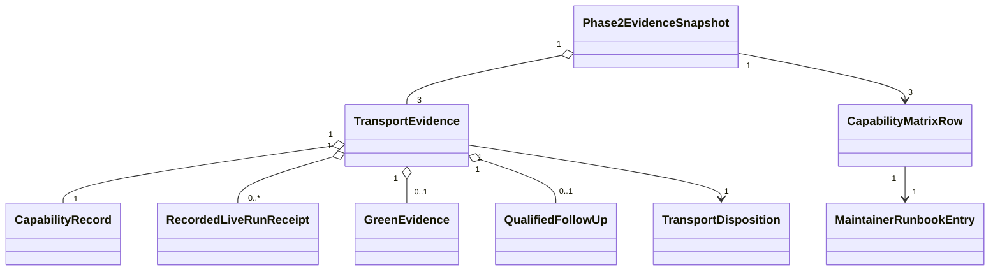

# Domain Entities — phase2-live-e2e-evidence

## 入力とモデル境界

本モデルは [unit-of-work.md](../../../inception/units-generation/unit-of-work.md)、[unit-of-work-story-map.md](../../../inception/units-generation/unit-of-work-story-map.md)、[requirements.md](../../../inception/requirements-analysis/requirements.md)、[components.md](../../../inception/application-design/components.md)、[component-methods.md](../../../inception/application-design/component-methods.md)、[services.md](../../../inception/application-design/services.md) を具体化する。

新しいDB、service、queue、daemonは導入しない。entityは既存registryとappend-only JSONL ledgerをparseしたimmutable value、およびmarker-fenced Markdown matrix／runbookへの決定的projectionである。

## Core entities

| Entity | Key attributes | Invariants | Lifecycle |
|---|---|---|---|
| `Phase2TransportKey` | adapter ID | `kimi-print|kiro-acp|kiro-tui`のclosed set | declared |
| `CapabilityRecord` | adapter ID、status、opt-in key、version、follow-up URL | adapter ID/opt-in一意、statusとIssue整合 | registered → validated |
| `RecordedLiveRunReceipt` | receipt ID、adapter ID、journey、SHA、version、outcome、cleanup、timestamp | schema valid、identity一意、sanitized | appended → parsed → admitted/rejected |
| `GreenEvidence` | adapter ID、receipt ID、SHA、version、journey、timestamp | PASS＋cleanup closed＋provenance完全 | admitted → latest/non-latest |
| `QualifiedFollowUp` | adapter ID、Issue URL、blocker digest、seam、re-entry、AC | Kiroのみ、Issue URL必須、sanitized | drafted → published → linked |
| `TransportDisposition` | adapter ID、connected/follow-up-linked | exactly one branch、evidenceは自身のtransport | unresolved → resolved |
| `CapabilityMatrixRow` | disposition、green fieldsまたはIssue fields、opt-in | branchごとの必須field完全 | projected |
| `Phase2EvidenceSnapshot` | revision SHA、3 rows、regression/build checks | 全row resolved、SHA整合 | collecting → valid/invalid |
| `MaintainerRunbookEntry` | trigger、opt-in、auth、cost、SKIP、rerun | transport別、live起動なしでrender可能 | projected |

## Value objects

### Validated revision

`ValidatedRevision`は40桁lowercase hexadecimal SHAである。receipt、matrix snapshot、実行workspace HEADが同一である場合だけ正式greenへ採用する。dirty treeまたはHEAD不一致は検証用draftとして表示できるがlatest greenを更新しない。

### Evidence identity

`EvidenceIdentity`はadapter ID、journey ID、recordedAt、Git SHA、outcome codeから決定的にdigest化する。同一identityでpayloadが異なる場合はconflictとしてprojection全体を拒否する。

### Sanitized evidence reference

`SanitizedEvidenceReference`はkind、SHA-256 digest、source enumだけを持つ。raw prompt、raw stdout/stderr、secret、source pathをfieldとして表現しない。bounded summaryが必要な場合も共通sanitizer済み定型文だけを使う。

### Disposition

`TransportDisposition`は次のdiscriminated unionとする。

- `Connected`: `status="supported"`と自身の`GreenEvidence`を必須とし、follow-up URLを持たない。
- `FollowUpLinked`: `status="unsupported"|"unverified"`、自身の`QualifiedFollowUp`を必須とし、green evidenceを持たない。Kiro ACP/TUIだけが生成可能。

曖昧な`measured-only`、greenとfollow-upの併存、別adapter evidenceはconstructorで拒否する。

## Aggregate boundaries

### `TransportEvidence` aggregate

rootは`Phase2TransportKey`で、1つのcapability record、自身のreceipt collection、任意follow-upを所有する。

- receiptはadapter ID一致後にだけcollectionへ入る。
- valid PASS receipt群から`recordedAt`降順、同時刻は`receiptId`辞書順でlatest greenを1つ選ぶ。
- KimiはConnectedへしか遷移できない。
- ACP/TUIはConnectedまたはFollowUpLinkedへ遷移できるが相互evidenceを参照しない。
- invalid ledger lineが1つでもあればaggregateをresolvedへしない。

### `Phase2EvidenceSnapshot` aggregate

Kimi、ACP、TUIの3つの`TransportEvidence`をexactly once所有する。

- 3行すべてresolvedになるまでmatrix finalizationを禁止する。
- snapshot revisionと全Connected green SHAの整合を検証する。
- Codex/Claude/Pi contract regression、matrix check、build、source-only checkの結果を保持する。
- failed checkが1つでもあればfinal snapshotとPhase 2 complete projectionを生成しない。

## Relationships

## State transitions

| Current | Event | Guard | Next |
|---|---|---|---|
| registered | parse ledger | 全line schema/identity valid | collecting |
| collecting | own green selected | supported＋PASS＋cleanup closed＋provenance | connected |
| collecting | Issue linked | Kiro＋non-supported＋qualified Issue | follow-up-linked |
| collecting | malformed/conflict | invalid lineまたはstatus矛盾 | invalid |
| all transports resolved | project matrix | exactly 3 rows | projected |
| projected | verification green | regressions＋matrix＋build＋source-only＋SHA整合 | final |
| projected | any check red | failure evidence retained | invalid |

## Projection algorithm

1. Registryをparseし、IDとopt-in keyの重複、supported completeness、non-supportedのIssue有無を検証する。
2. Ledger全lineをparseし、schema、adapter、identity、canonical outcome、cleanup、provenanceを検証する。1件でもinvalidなら停止する。
3. transportごとに自身のadmitted PASS receiptだけからlatest greenを選ぶ。
4. registry status、latest green、qualified Issueから`TransportDisposition`を構築する。
5. Kimi/ACP/TUIがexactly once揃うことを確認し、canonical registry順でmatrix rowをrenderする。
6. marker-fenced tracked matrixとbyte比較し、checkまたはupdateを行う。
7. transport別runbook entryを同じcapability metadataからrenderする。
8. 既存Codex/Claude/Pi回帰、matrix check、build、source-only check、revision整合を`Phase2EvidenceSnapshot`へ集約する。
9. 全check greenの場合だけfinal snapshotをPhase 2完了証跡として採用する。

## Persistence projection

- JSONL ledgerはappend-only正本であり、本Unitは既存receiptを書き換えない。
- capability matrixとrunbookはregistry/ledger/Issue metadataから再生成可能なprojectionである。
- Connected rowだけがgreen SHAを表示し、FollowUpLinked rowはIssue URLを表示する。
- failure/skip/timeout/cleanup errorは診断対象として保持できるがlatest greenを上書きしない。
- matrix driftやinvalid evidenceを手編集で補正せず、正本入力またはrendererを修正して再生成する。

## Upstream traceability

| Entity / invariant | Source |
|---|---|
| 3 transport exact set、independent evidence | FR-01、FR-13、FR-21 |
| Kimi Connected only、Kiro two-branch disposition | FR-08、FR-14、FR-15 |
| cleanup-closed PASS、closed taxonomy | FR-18、FR-20 |
| runbook projection | FR-22 |
| sanitized evidence、regression、provenance | NFR-01、NFR-05、NFR-07、NFR-08 |
