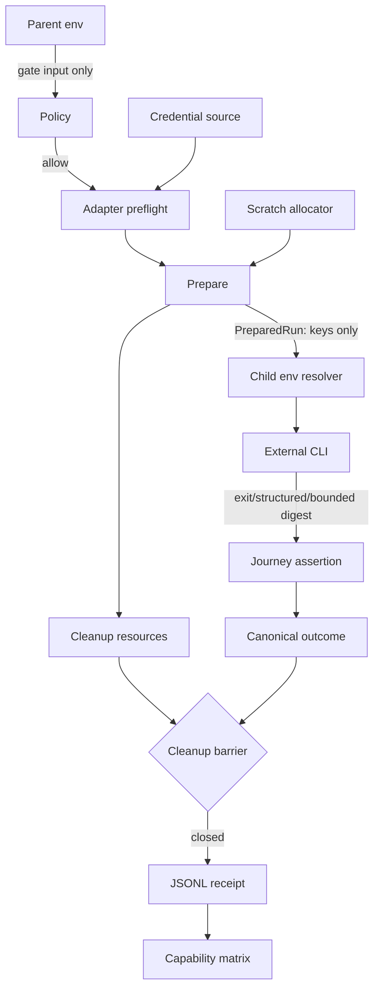

# Component Dependency — live E2E Phase 2

## 入力と依存原則

依存は [requirements.md](../requirements-analysis/requirements.md)、[architecture.md](../../../../../codekb/amadeus/architecture.md)、[component-inventory.md](../../../../../codekb/amadeus/component-inventory.md) の既存方向を維持する。adapter implementationがcommon portへ依存し、common kernelはKimi/Kiro legacy driverをimportしない。

## Dependency matrix

`→`は行componentが列componentへ依存することを表す。

| From / To | C1 Kernel | C2 Registry | C3 Kimi | C4 ACP | C5 TUI | C6 Mechanics | C7 Journey | C8 Tests |
|---|---:|---:|---:|---:|---:|---:|---:|---:|
| C1 Kernel | — | → |  |  |  |  |  |  |
| C2 Registry |  | — |  |  |  |  |  |  |
| C3 Kimi | → | → | — |  |  | → |  |  |
| C4 ACP | → | → |  | — |  | → |  |  |
| C5 TUI | → | → |  |  | — | → |  |  |
| C6 Mechanics |  |  |  |  |  | — |  |  |
| C7 Journey | → |  |  |  |  |  | — |  |
| C8 Tests | → | → | → | → | → | → | → | — |

禁止方向:

- C1→C3/C4/C5/C6（kernelのharness固有化）
- C6→C1（legacy mechanicsへのpolicy/lifecycle逆流）
- C4↔C5（未実証のKiro共通抽象や相互依存）
- production component→C8（test fixture逆依存）

## Data flow

secret値、raw prompt、full stdout/stderr、source auth/config pathはledger/matrix方向へ流さない。`PreparedRun.environmentKeys`はkey名だけを保持し、値は実行直前の`resolveEnvironment`で解決する。

## Shared resources

| Resource | Owner | Registration | Release | PASS condition |
|---|---|---|---|---|
| scratch root/home/project | allocator + adapter | allocate前/作成時 | cleanup | cleaned |
| Kimi credential symlink/config | C3 | 作成前planned、成功時created | unlink/remove | released |
| ACP child/process group | C4 | spawn前planned | cancel→terminate→reap | descendant 0 |
| tmux socket/server/session | C5 | start前planned | kill-server | private server absent |
| ledger lock/temp file | C1 ledger | append時 | atomic rename/unlock | append success or recoverable error |

## Change propagation

- Common contract変更は全adapter/testへ波及するため、本Intentでは既存contractを拡張せずadapter追加を優先する。
- Kimi mechanics変更はC3とKimi journeyだけへ閉じる。
- Kiro ACP/TUIのauth seamはそれぞれC4/C5へ閉じ、両方で実証された同一変更理由が現れるまで共有helperへ昇格しない。
- Registry union/matrix列追加はC2、C8、documentation projectionへ波及するが、外部runtime APIではないため同一Intent内で一括更新する。

