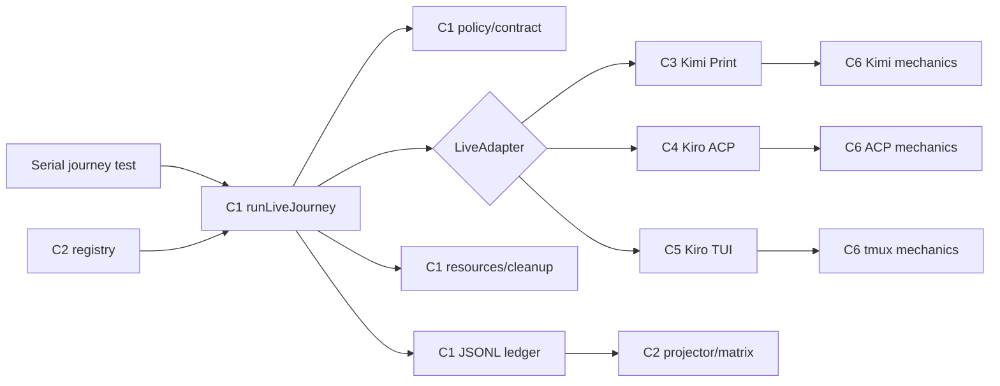

# Components — live E2E Phase 2

## 入力と設計方針

本設計は [requirements.md](../requirements-analysis/requirements.md)、Brownfieldの [architecture.md](../../../../../codekb/amadeus/architecture.md)、[component-inventory.md](../../../../../codekb/amadeus/component-inventory.md) を入力とする。既存の `tests/harness/live-e2e/` をハーネス中立kernelとして維持し、Kimi print、Kiro ACP、Kiro TUIの差分をtransport別adapterへ閉じ込める。

新しい常駐service、AWS resource、UI、永続DBは追加しない。実行はBun test process内の短命orchestrationであり、永続面は既存JSONL ledgerとcapability matrixだけである。

## コンポーネント一覧

| ID | Component | 配置 | 所有責務 | 公開面 |
|---|---|---|---|---|
| C1 | Common Live Kernel | `tests/harness/live-e2e/{adapter,policy,lifecycle,contract,resources,ledger}.ts` | gate、preflight順序、scratch、timeout、assert、cleanup barrier、canonical outcome、receipt | `LiveAdapter`、`LiveJourney`、`runLiveJourney` |
| C2 | Capability Registry/Projector | `tests/harness/live-e2e/{registry,projector,project-matrix}.ts` | transport能力の正本、follow-up link、最終green SHA投影 | `LiveCapability`、`LIVE_CAPABILITIES`、matrix commands |
| C3 | Kimi Print Adapter | `tests/harness/live-e2e/kimi.ts` | Kimi preflight、scratch `KIMI_CODE_HOME`、credential binding、`kimi -p`、bounded evidence、cleanup | `KimiPrintAdapter`、Kimi allocator/credential source |
| C4 | Kiro ACP Adapter | `tests/harness/live-e2e/kiro-acp.ts` | ACP JSON-RPC起動、structured tool anchor、abort/cancel、子孫process cleanup | `KiroAcpAdapter` |
| C5 | Kiro TUI Adapter | `tests/harness/live-e2e/kiro-tui.ts` | private tmux identity、scratch home/env、disk/state anchor、pane evidence上限、kill/cleanup | `KiroTuiAdapter` |
| C6 | Transport Mechanics | 既存 `kimi-print-drive.ts`、`kiro-acp-drive.ts`、`tui-drive.ts` から抽出/再利用 | CLI固有protocol・入出力。gate、ledger、共通cleanup判定は所有しない | adapterから注入可能なprocess/ACP/tmux port |
| C7 | Journey Definitions | `tests/harness/live-e2e/journeys/` または各serial test近傍 | prompt、timeout、retry、決定的assertion | `LiveJourney` instances |
| C8 | Contract/Adapter Test Kits | `tests/unit/`、`tests/integration/` のlive-e2e領域 | fake executable、env漏洩注入、resource failure、contract適合 | 既存testing support + transport fixtures |

## 境界と所有権

- C1はハーネス固有binary名、認証path、ACP JSON-RPC、tmux commandを知らない。
- C3〜C5は`LiveAdapter`の各phaseを実装するが、opt-in/GHA判定、outcome code選択、ledger append順序を変更しない。
- C6はtransport mechanicsだけを所有する。旧`skipReason`やambient `process.env`展開はadapter移行後の正規経路に残さない。
- C2はconnectedかfollow-up-linkedかを表現する。adapter実装が成立しないtransportも、`status !== supported`と`followUpIssue`で追跡する。
- C7はモデル出力完全一致を禁止し、exit/schema/file/state/toolのbounded anchorだけを宣言する。

## Component diagram

## Security and UX perspective

信頼境界はparent process、source auth/config、scratch environment、child process、durable receiptの間に置く。source pathとsecretをchild/diagnostic/ledgerへ出さず、credential-bearing resourceをcleanup barrierへ登録する。AWS側の追加責務はなく、cloud credential storeも導入しない。

UIは存在しないが、CLI利用者が失敗を判別できることをUX要件として扱う。canonical code、adapter ID、phase、bounded diagnosticを一貫表示し、skip・timeout・failureを色や自由文だけに依存させない。

## Review — Iteration 1

- **Verdict:** READY
- **Reviewer:** amadeus-architecture-reviewer-agent
- **Date:** 2026-08-04T11:49:34Z
- **Iteration:** 1
- **Scope decision:** none

5成果物は責務境界、transport別interface、依存方向、実行・cleanup・ledger順序、supported判定、ADRのトレードオフまで整合しており、具体的な循環依存、解決不能な参照、要求違反は確認されなかった。実装可能性を阻害するBLOCKERはない。

### Findings

- FOLLOW-UP | services.mdの「retry 0、負荷時1回」は、負荷判定条件、再試行対象となるエラー分類、同一journey内でのresource解放とledger記録の扱いを明文化すると、transportごとの実装差と重複receiptを防げる。
- FOLLOW-UP | component-methods.mdのcleanup barrier優先規則について、実行失敗とcleanup失敗が同時発生した場合のcanonical outcome、ledgerへ残すprimary/secondary error、matrix投影結果を具体例で固定すると、adapter間で失敗分類が分岐しない。
- NIT | C3/C4/C5がC2全体へ依存する表現はregistry契約への依存なのかprojector実装への依存なのかを区別すると、runtime adapterからmatrix投影への不要な結合を避けやすい。
