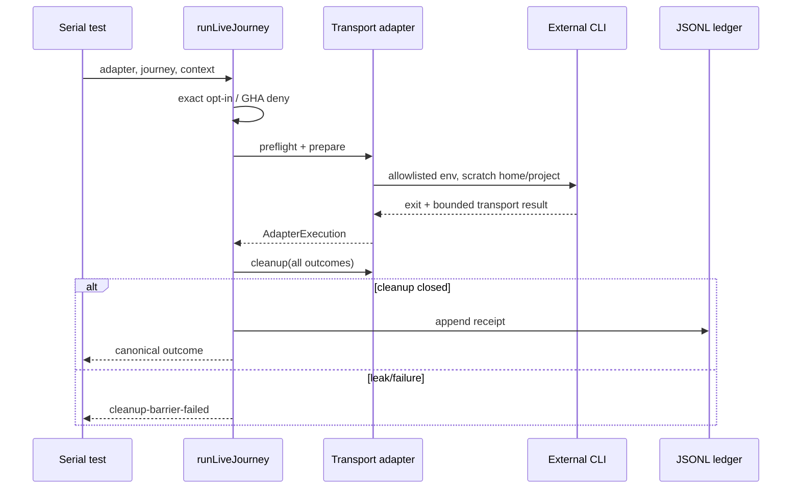

# Services — live E2E Phase 2

## 入力とサービス境界

[requirements.md](../requirements-analysis/requirements.md)、[architecture.md](../../../../../codekb/amadeus/architecture.md)、[component-inventory.md](../../../../../codekb/amadeus/component-inventory.md) は、本リポジトリが常駐serviceを持たないBun/TypeScriptモノレポであることを示す。本Intentでもnetwork service、AWS managed service、database、queue、daemonを追加しない。

ここでいうserviceはprocess内のapplication serviceとしての`runLiveJourney`だけである。transport adapterは外部CLIを短命childとして起動するportであり、独立deployable serviceではない。

## In-process orchestration service

| Service | Trigger | Orchestration | Lifetime | Scale |
|---|---|---|---|---|
| Live Journey Runner | serial Bun test / explicit local command | gate→preflight→scratch→prepare→execute→assert→cleanup→ledger | 1 journey | 常に直列、水平scaleなし |
| Matrix Projector | explicit render/update/check | registry + ledger read→Markdown projection | 1 command | 単一process |
| Capability Probe | Kiro設計/実装時の明示実測 | transport probe→evidence→connected/follow-up ruling | 一時的 | transportごとに直列 |

## Communication contracts

- Runner→Adapter: TypeScript interfaceによる同期request/async result。network RPCは使わない。
- ACP Adapter→Kiro CLI: child stdio上のJSON-RPC。structured tool updateをbounded evidenceへ変換する。
- TUI Adapter→tmux/Kiro CLI: run-private tmux socket/sessionとscratch filesystem。正規assertionはdisk/state、paneは診断のみ。
- Kimi Adapter→Kimi CLI: child process `kimi -p`。scratch cwd/homeとallowlisted envを渡す。
- Runner→Ledger: cleanup barrier成功後のappend-only JSONL。skipは既存契約どおりdurable ledgerへ書かない。
- Projector→Docs: registry/ledgerからmarker-fenced matrixを決定的生成する。

## Lifecycle

## Scaling, cost, and availability

live journeyは外部課金・rate limit・local credentialへ依存するため並列化しない。availability SLOは設定せず、binary/auth不足をcanonical SKIPで表す。retryは既定0、負荷起因と明示判定した場合のみ1回とし、同時実行によるthroughput向上を目標にしない。

AWS platform perspectiveではcloud resourceが存在しないため、IAM、VPC、multi-AZ、FinOps stackは非適用である。コスト制御はexact opt-in、短いprompt、直列実行、receiptによる実行追跡で行う。

