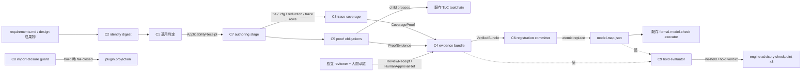

# Application Design: コンポーネント依存関係

`components.md` の C1〜C8 と既存コンポーネント間の依存・通信・データフローを定義する。上流は `inception/requirements-analysis/requirements.md`、`codekb/amadeus/architecture.md` の value chain 断面、`codekb/amadeus/component-inventory.md`、`application-design-questions.md` の Q1〜Q4 回答である。

## 依存マトリクス

行が依存元、列が依存先。`→` は同期呼出し（関数 or child process）、`(file)` はファイル契約経由の読取。

| 依存元 \ 依存先 | C1 | C2 | C3 | C4 | C5 | C6 | C8 | C9 | 既存TLC toolchain | model-map | evidence store |
|---|---|---|---|---|---|---|---|---|---|---|---|
| C1 ApplicabilityJudge | — | 型のみ | | | | | | | | (file)読 | |
| C2 IdentityDigest | | — | | | | | | | | | |
| C3 TraceCoverage | | → | — | | | | | | | | |
| C4 EvidenceBundle | | → | | — | | | | | | | (file)書 |
| C5 ProofObligations | | → | | | — | | | | → child | | |
| C6 RegistrationCommitter | | → | | → verify | | — | | | | (file)書 atomic | (file)読 |
| C7 AuthoringStage | (file)読 receipt | → | → | → build | → | → commit | | | | | |
| C8 ImportClosureGuard | | | | | | | — | | | | |
| C9 AuthoringHoldEvaluator | (file)読 receipt | → | | → verify/read | | | | — | | (file)読 | (file)読 |
| engine advisory checkpoint（既存機構） | | | | | | | | → formal_checks | | | |
| S5 projection（既存+C8） | | | | | | | → | | | | |
| 既存 executor（無変更） | | | | | | | | | → child | (file)読 | (file)読（bundle 参照経由） |

- C2 は葉（他コンポーネントへ依存しない pure module）。全コンポーネントの identity 語彙を一元供給し、identity 定義の重複実装を防ぐ（NFR-004）。C1 の C2 依存は**型依存のみ**（`ApplicabilityInput.subjectIdentity` は算出済み `AggregateDigest` を値で受け取り、digest 計算の呼出し主体は checkpoint / C7 側 — レビュー iteration 1 の NIT 対応）。
- 循環依存はない（`memory/phases/inception.md` § Software Design Principles: 循環依存を作らない）。依存方向は「工程の下流 → 判定の核」に揃え、referee（C2/C3/C5/C9)は進行を知らない。
- C7（stage）だけが複数コンポーネントを束ねる。束ねの所有を 1 箇所に限定することで、`services.md` の orchestration 方針と一致させる。C9 は engine advisory checkpoint（既存機構）だけから起動される停止系 referee であり、C7 の進行系束ねとは独立している。

## データフロー

テキスト代替: requirements/design 成果物 → C2 が identity digest 化 → C1 が適用判定 receipt を発行 → C7 authoring stage がモデル成果物を作成し、C3（coverage）と C5（proof、TLC は child process）の referee を通す → 独立レビューと人間承認を加えて C4 が content-addressed evidence（full bundle または terminal route receipt）を確定 → C6 が model-map.json を atomic replace → 既存 executor が登録済みモデルを実行する。C9 は model-map と evidence store を読んで hold verdict を計算し、既存 engine advisory checkpoint（requirements-analysis / functional-design / build-and-test）が hold を fail-closed 強制する。C8 は build 時に plugin projection の import closure を検査する（実行時 value chain の外側）。

`codekb/amadeus/architecture.md` の「要求からexecutorまで」図の破線（現行断線: 要求→executor が未配線）を、この実線フローが充足する。

## 通信パターンの分類

| パターン | 適用箇所 | 理由 |
|---|---|---|
| 同期 pure 関数呼出し | C1→C2、C3→C2、C4→C2、C6→C4 | 決定性と単体テスト容易性（NFR-001、NFR-006） |
| 同期 child process | C5→TLC toolchain | 既存 executor 契約の無変更再利用（FR-013） |
| ファイル契約（読） | C1→model-map、C7→ApplicabilityReceipt、executor→model-map/bundle | 工程間の疎結合。receipt が工程の境界物 |
| ファイル契約（atomic 書） | C4→evidence store、C6→model-map | 部分状態の観測不能性（FR-010、Q3） |
| イベント/非同期 | （不使用） | 再現性と監査性を優先（NFR-001、NFR-002） |

## 共有リソース

| リソース | 書き手 | 読み手 | 保護 |
|---|---|---|---|
| `specs/tla/model-map.json` | C6 のみ（authoring 経路で） | C1、C9、既存 executor、completeness sensor | atomic rename + rename 直前の再読込差分検査（lost update 拒否）。書き手を C6 に単一化 |
| evidence store（`specs/tla-evidence/` 配下 — 既存 advisory 監視 glob `specs/tla/**` の外。レイアウト詳細は Functional Design） | C4 のみ | C6、C9、監査者、既存 sensor（参照検証） | content-addressed（同一内容=同一パス）+ 一時領域確定。full bundle と terminal route receipt の両 kind を収容 |
| `specs/tla/**` モデル本体 | C7（author/revise 経路で） | 既存 executor、activation advisory | 既存 hash 通知機構は無変更（evidence を glob 外に置くことで観測挙動も不変） |
| `plugins/formal-model-check/plugin.json` | 手動編集（新 tool 群 + 欠落 2 module の manifest 追記）+ C8 が検査 | projection、compose | C8 の fail-closed 検査が drift を恒久防止 |
| record dir（questions / receipt / memory） | conductor | reviewer、監査者 | 既存 stage protocol の audit 規律 |

書き手の単一化（model-map=C6、bundle=C4）により、`codekb/amadeus/component-inventory.md` の state integrity 節が示す「複数の書き手が同一定義を重複実装して乖離する」既知の欠陥クラスをこの feature に持ち込まない。

## 変更影響の閉じ込め

- **既存互換（FR-013、AC-008）**: 依存マトリクスで既存 executor / TLC toolchain / model-map schema / completeness sensor への「変更」辺はゼロ。増えるのは読取・child 呼出しの辺のみ。`FormalElection` / `MirrorLifecycle` の source byte identity と verdict identity に触れる経路がないことが、この表から機械的に確認できる。
- **C8 の独立性**: C8 は他の C 群へ依存せず、value chain にも参加しない（build 時のみ）。よって authoring 工程の失敗と projection guard の失敗は独立に診断できる（NFR-006 の診断可能性）。

## 上流トレーサビリティ

- `inception/requirements-analysis/requirements.md`（FR-006、FR-010、FR-011、FR-013、NFR-001〜NFR-006）
- `inception/application-design/application-design-questions.md`（Q1〜Q4）
- `codekb/amadeus/architecture.md`（現行断線の図と保護境界）
- `codekb/amadeus/component-inventory.md`（既存コンポーネントの健全性と書き手重複の教訓）
- team-practices: `memory/phases/inception.md`（循環依存禁止、変更の制御としてのモジュール設計）、`memory/project.md`、`memory/team.md`
