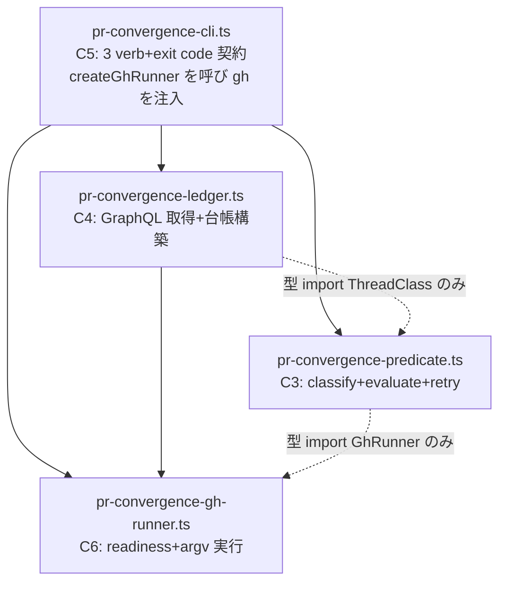

# Logical Components: convergence-toolchain(U2)

上流入力(consumes 全数): business-logic-model

business-logic-model の処理フロー(status / report / override)を、plugin tools 4ファイルの論理構成へ落とす。CLI/ファイル境界の決定的実行であり、常駐サービス向けの cache・horizontal scaling・circuit breaker は適用しない(cid:nfr-design:c1 — fail-closed のファイル境界契約へ置換)。

## 論理構成(4ファイル・依存方向)

テキストフォールバック: CLI(C5)は createGhRunner(C6)を呼んで `gh` 値を生成し、述語(C3)の resolveMergeable と台帳(C4)の fetchAllReviewThreads へ**値として注入**する — よって CLI→RUNNER(値生成)、LEDGER→RUNNER(GhRunner 型+GhError 型の import)、PRED→RUNNER(**GhRunner 型 import のみ** — C3 は gh を生成せず受け取るだけで、実行時依存は注入経由)、**LEDGER→PRED(ThreadClass 型 import のみ — 申告改訂 E-PCP-CGDEV 2026-08-05 2-0: ThreadLedger.count(cls: ThreadClass) の型付けに必要な型結合。PRED→RUNNER 型のみ辺の既習形)**。CLI→PRED、CLI→LEDGER は従来どおり。core への import なし(BR-U2-11)。この全辺集合(6本)で循環なし(RUNNER は葉、PRED は RUNNER の型のみを参照)。

**PrState の所有(E-PCP-CGDEV 解釈の確定)**: C6(RUNNER)は raw な `{mergeable, mergeStateStatus}` 文字列の取得(`fetchRawPrState`)までを所有し、型付き `PrState` は C3(PRED)の `MergeStateStatus.parse` が生成する — RUNNER の葉性と ADR-2 の「parse は C3 に1定義」が同時に成立(FD domain-entities の C6 所有記載はこの解釈で読み替える)。

**override の audit emit 経路(E-PCP-CGDEV 裁定 A)**: plugin tools は core を import できないため、C5 の override verb は host の `amadeus-log.ts decision` verb を**外部プロセス spawn**(gh と同じプロセス境界)で呼び、override 事実(PR 番号・unit・reason・humanTurnId)を構造化した decision テキストとして DECISION_RECORDED イベントに記録する。spawn 失敗は override 全体の失敗(loud fail — 記録なき前進を作らない)。override 専用イベントの新設は engine 変更のためスコープ外とし、必要性が実運用で確認されたら別 Issue 起票する。

## 信頼性設計(nfr-design ガードレールの CLI 適用)

| 面 | 設計 |
|---|---|
| 決定性 | 述語・分類は純関数(同一入力→同一 verdict)。retry はタイミングシーム注入で決定的テスト(ADR-4) |
| fail-closed | gh 障害 = exit 2(部分台帳を返さない)。parse 失敗 = throw。レポートは converged 時のみ書込 |
| 冪等性 | report verb の再実行は同一 verdict なら同一レポートを再生成(上書き安全 — 生成時刻のみ変化)。override の再実行は新しい HUMAN_TURN を要求 |
| 観測性 | verdict は stdout JSON(機械集計値 — 工程(5)の収束通知の一次ソース)。exit code 3値契約(0/1/2)がテスト文言の導出元 |
| 埋め込み fallback 禁止 | GraphQL 応答・レポート様式の既定値をコードへ二重保持しない — fixture と型が単一ソース(nfr-design:c3) |

## 配置とパッケージング境界

- 4ファイルは `plugins/pr-convergence/tools/` 直下(TOOLS_DIR_PREFIX 契約)。import 閉包は U3 の plugin.json が全数宣言(NFR-4 — U2 は閉包に入る新規 import を作らない責務を持つ)
- テスト配置: 純関数 = tests/unit(fs 非依存)、CLI/E2E = tests/integration(fs-tests-integration-first)。tNNN は t444 以降(NFR-5)
