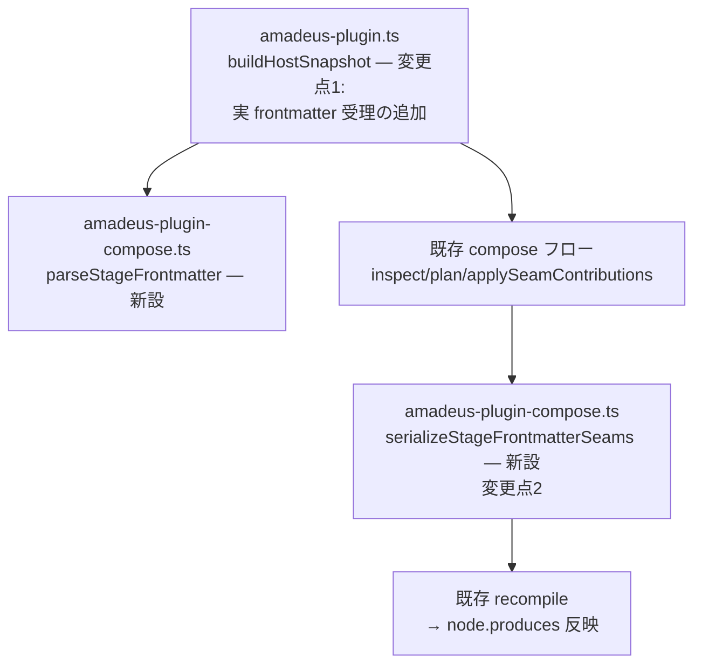

# Logical Components: seam-bridge(U1)

上流入力(consumes 全数): business-logic-model

business-logic-model の install/drop フローを core 2ファイルの論理構成へ落とす。CLI/ファイル境界の決定的実行であり、常駐サービス向けパターンは適用しない(cid:nfr-design:c1)。

## 論理構成(変更2ファイル・既存機構への結線)

テキストフォールバック: buildHostSnapshot(変更点1)が parseStageFrontmatter(新設)を呼び実ステージを HostStage 化 → 既存 compose フロー(inspect/plan/merge/台帳)→ serializeStageFrontmatterSeams(新設、変更点2)が produces のみ書換え → 既存 recompile。新設2関数は amadeus-plugin-compose.ts に置き(seam 語彙の正本と同居)、変更は既存フローへの結線点2箇所のみ。

## 信頼性設計

| 面 | 設計 |
|---|---|
| 決定性 | parse/serialize は純関数(バイト列→バイト列)。同一入力→byte-identical 出力(BR-U1-1) |
| fail-closed | parse 失敗・往復不一致・対象外 seam は typed error で中止(書きかけファイルを残さない — 書込は検証後の1回) |
| 原子性 | serialize 検証(再 parse 照合)→ 書込 の順。compose 全体の失敗は既存 rollback snapshot が復元 |
| 可逆性 | drop は seam 台帳の base から serialize — install 前と byte-identical(BR-U1-9、cmp 機械確認) |
| 埋め込み fallback 禁止 | frontmatter 様式の既定値・テンプレートをコードへ持たない — 原本バイト(raw+seamSpans)が唯一のソース(nfr-design:c3) |

## 配置とテスト境界

- 新設2関数+型は `packages/framework/core/tools/amadeus-plugin-compose.ts`(全ハーネス dist へ投影 — NFR-6 の `bun run build` 再生成対象)。repo-only の scripts/ パストークンをコメントに書かない(c1-1569-shipped-comment-vocab)
- テスト配置: parse/serialize 純関数 = tests/unit(バイト fixture 駆動)、compose E2E = tests/integration。実ステージ全数往復スイープ(BR-U1-1)は corpus 検査として integration。tNNN t444+(NFR-5)
