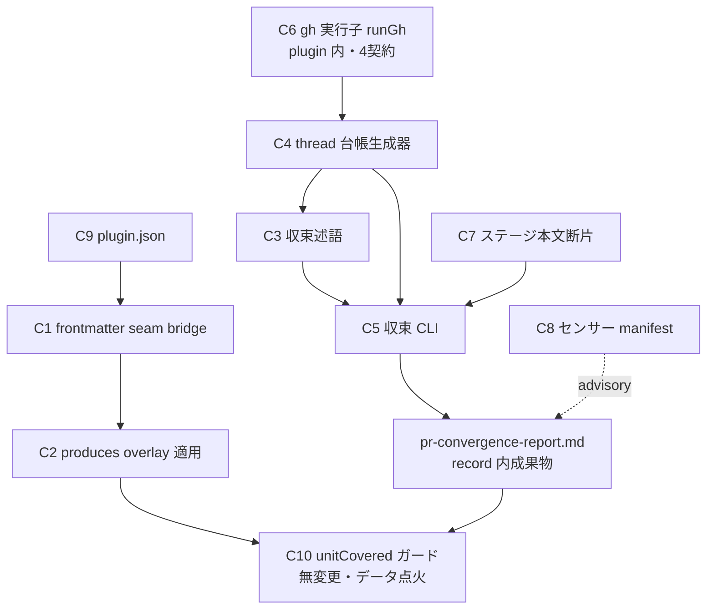

# Component Dependency: PR 収束 opt-in プラグイン

上流入力(consumes 全数): requirements、architecture、component-inventory

測定 ref: observed = origin/main `8409c2039c52`

## 依存グラフ

テキストフォールバック: C9(manifest)→ C1(parse/serialize)→ C2(overlay 適用)→ C10(既存ガードがデータ点火)。C6(gh 実行子)→ C4(台帳)→ C3(述語)→ C5(CLI)→ レポート → C10。C7(工程断片)は C5 の使用手順を規定。C8 はレポートへ advisory 検査。C6 は plugin 内実装(ADR-6 — core gateway の import はしない。同一4契約をテストで固定)。

## 依存の方向規律

- plugin tools(C3/C4/C5/C6)は相互 import のみ(C5 → C3, C4 / C4 → C6)。core への import なし(ADR-6 の構造裁定。import 閉包は C9 が宣言 — NFR-4)
- core 側変更(C1/C2/C8)は plugin に依存しない(core → plugin の参照ゼロを維持 — 既存境界)
- C10 への「依存」はコード依存でなくデータ依存(produces リスト+レポートファイル実在)— ガード1定義所有の要
- 循環なし(C9→C1→C2→C10 / C4→C3→C5 の2系統+C7・C8 の葉)

## ビルド順序の含意(delivery-planning へ)

1. C8(センサー manifest)は plugin stage frontmatter の `sensors:` 宣言より**先に core へ着地**する必要がある(compile の未知 id loud 拒否 — ADR-5)
2. C1/C2(compose 拡張)は C9 の seam 宣言を受理する前提 — walking-skeleton Bolt の対象(scope-document のシーケンシング方針を維持)
3. C3/C4/C5 は C1 と並行実装可能(ファイル非交差)
