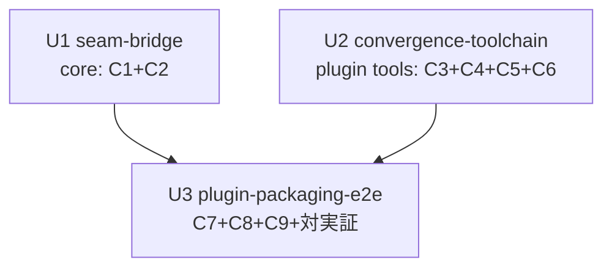

# Unit of Work 依存関係

上流入力(consumes 全数): components、component-methods、services、component-dependency、decisions、requirements

## Edge Block(parseBoltDag 用 — 機械可読正本)

```yaml
units:
  - name: seam-bridge
    kind: library
    depends_on: []
  - name: convergence-toolchain
    kind: library
    depends_on: [seam-bridge]
  - name: plugin-packaging-e2e
    kind: packaging
    depends_on: [seam-bridge, convergence-toolchain]
```

【plan 是正 2026-08-05(approve ガードの Approved exit (a) — 実行順序制約の記録)】convergence-toolchain へ `depends_on: [seam-bridge]` を追加し bolt_dag を直列化した。理由: 本セッションは Claude Code の worktree 隔離ガード下にあり、engine 管理の swarm 並行 fan-out(SWARM_STARTED→SWARM_COMPLETED のライフサイクル)が構造的に成立しない(E-PCP-CGBLK 裁定 2-0 = swarm referee 不使用の isolation worktree 経路。§13 persist 済み cid 追補参照)。U1/U2 に論理依存はない(編集面非交差 — 実装も isolation worktree ×2 で並行に行われた)が、engine の bolt_dag が宣言する「並行 batch」は engine 管理 fan-out の実行約束であり、本環境ではその約束を果たせないため宣言を実行形(直列)へ整合させる。論理 topology の記録は本節の従前記述(U1 ∦ U2 非交差)が保持する。

## 依存グラフ(Mermaid)



テキストフォールバック: U1(seam-bridge)と U2(convergence-toolchain)は依存なしで並行実装可能。U3(plugin-packaging-e2e)は U1・U2 の両方に依存する統合点。

## 依存の根拠

- U3 → U1: compose の E2E(install で produces overlay が compiled graph へ到達)は U1 の frontmatter seam bridge が前提(component-dependency の C9→C1→C2→C10 系列)
- U3 → U2: plugin.json の tools 宣言と import 閉包検査(NFR-4)は U2 の4ファイル実体が前提(component-dependency の C6→C4→C3→C5 系列)
- U1 ∦ U2: 編集面がファイル単位で非交差(core tools vs plugins/)— worktree 隔離の並行ディスパッチ既定(services の S3 検証フローも独立 fixture で分離済み)
