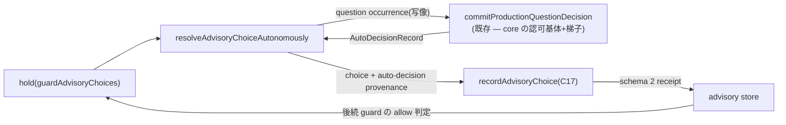

# Domain Entities — `advisory-auto-resolution`(#2253)

上流入力(consumes 全数): unit-of-work.md, unit-of-work-story-map.md, requirements.md, components.md, component-methods.md, services.md

依拠箇所: `component-methods.md` §C17(`AdvisoryChoiceProvenance` / `AdvisoryChoiceReceipt` の型逐語 — 本書の正本)と §C16(occurrence 写像)、`components.md` C16/C17 行、`requirements.md` FR-ADV-3(置換の契約)、`services.md` §プロセス境界 P3、`unit-of-work.md` §`advisory-auto-resolution`(所有境界)、`unit-of-work-story-map.md` §`advisory-auto-resolution`(順序根拠)。

---

## エンティティ一覧

| エンティティ | 種別 | 本 Unit の関与 |
| --- | --- | --- |
| `AdvisoryChoiceProvenance` | 新規 — 判別ユニオン(`human-turn` \| `auto-decision`) | 新設(C17) |
| `AdvisoryChoiceReceipt` | 既存 — 改訂(schema 2 昇格、`humanTurn` → `provenance` 置換) | 改訂(C17) |
| advisory store(on-disk) | 既存 — schema 1 → 2 | 昇格(読替なし — ADR-9) |
| `InteractionOccurrence`(advisory 写像) | 既存型の新しい生成点 | C16 手順 1(kind: "question"、selector 一意化) |
| `AdvisoryChoiceGuardResult`(hold) | 既存 | 消費のみ(C16 の入力) |
| `AutoDecisionRecord` / `AUTO_DECIDED` | 既存(core Unit の梯子が生成) | 消費のみ(provenance の材料) |

## 属性と構造(逐語は component-methods.md §C17 を正本とし再掲しない)

- **`AdvisoryChoiceProvenance`**: `human-turn`(timestamp / shard / eventIdentity — 現行 `HumanTurnProvenance` の同値写像)と `auto-decision`(decisionId / basisKind / basisFingerprint / projectionRevision)。受理判定はこの判別子で 3 点(grounding / 重複排除 / 提示照合)を分岐する単一関数に載る。
- **`AdvisoryChoiceReceipt`(schema 2)**: `humanTurn` フィールドを `provenance` へ置換。`revokedAt?` / `revocationReason?` は既存のまま。
- **occurrence 写像**: `interactionId = advisory-<instance>`、`selector = advisory:<plugin>:<code>:<instance>`。SAFE_ID 適合は §C16 の実測表で確認済み。

## エンティティ相互作用

テキスト代替: guard の hold を C16 が question occurrence へ写像して既存裁定経路(core の認可基体+梯子)にかけ、決定された `AutoDecisionRecord` から `auto-decision` provenance を組んで C17 の受理関数が schema 2 receipt を store へ書く。store の receipt は後続の guard 判定で allow の根拠になる(書き手 C16 ⇄ 受理 C17 の対 — 片側だけでは価値を出荷できない統合根拠)。

## ライフサイクル状態(receipt)

| 状態 | 遷移契機 |
| --- | --- |
| pending(receipt 不在) | advisory 発生(plugin の hold 判定) |
| accepted(`human-turn`) | 人間の選択(現行経路 — 強度不変) |
| accepted(`auto-decision`) | 無人裁定 `run-now`(本 Unit の新経路 — 認可成立時のみ) |
| revoked | 既存の `revokedAt` / `revocationReason` 経路(無改変) |

同一 identity に active receipt が 1 件を超えない(R4 — provenance 跨ぎの排除)。schema 1 store は昇格せず fail-closed hold(guard が人間経路へ倒す)。

## 他 Unit との境界

- **`semi-authorization-core`**: 裁定経路(認可基体・梯子)の提供者。本 Unit は `commitProductionQuestionDecision` 越しの消費者であり、認可の内部に触れない。
- **`semi-docs-revision`**: FR-ADV-5 の射程注記(plugin 非依存は hold 判定面のみ)の記述面を docs 側で守る。
- **`launch-autonomy-flag` / 表示系**: 交差なし。
