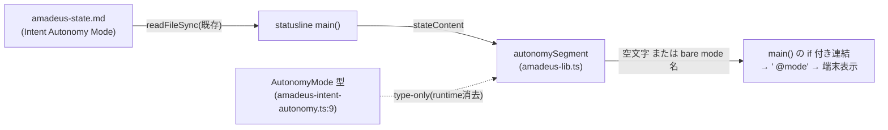

# Domain Entities — `autonomy-statusline`(#2253)

上流入力(consumes 全数): unit-of-work.md, unit-of-work-story-map.md, requirements.md, components.md, component-methods.md, services.md

依拠箇所: `components.md` C14 行(責務・入出力)、`component-methods.md` §C14(シグネチャ)、`requirements.md` FR-DISP-1(語彙の canonical)、`services.md` §S10 / P5(エンティティが流れるプロセス境界)、`unit-of-work.md` §`autonomy-statusline`(所有物の境界)、`unit-of-work-story-map.md` §`autonomy-statusline`(成果物の対応)。

本 Unit は**新しい永続エンティティを作らない**。既存エンティティの読み手と、表示用の値オブジェクト 1 種のみを扱う。

---

## エンティティ一覧

| エンティティ | 種別 | 所有 | 本 Unit の関与 |
| --- | --- | --- | --- |
| `Intent Autonomy Mode`(state フィールド) | 既存 — state ファイルの投影フィールド | 書き手は birth(`amadeus-utility.ts:4635`)と `set-autonomy` / `--autonomy` 経路(他 Unit) | **読み手のみ**(ADR-10) |
| `AutonomyMode` 型 | 既存 — `amadeus-intent-autonomy.ts:9` の判別値 3 種 | `semi-authorization-core` 側の canonical | **type-only import**(runtime 消去、D2) |
| Autonomy セグメント(表示値) | 新規 — 一時的な値オブジェクト(文字列) | 本 Unit(`autonomySegment` の返り値) | 生成のみ(永続化しない) |

## 属性と構造

### `Intent Autonomy Mode`(読み取り対象)

- **所在**: `<record>/amadeus-state.md` の `## Current Status` 配下、様式 `- **Intent Autonomy Mode**: <mode>`(実測: 本 intent の state ファイル)。
- **値域**: `none` / `semi` / `full`(canonical: `amadeus-intent-autonomy.ts:9`)。
- **存在保証**: Intent birth 時に必ず `none` で初期化される(`components.md` §C14〜C15 の実測)。不在は本 intent 以前に birth された legacy record か手書き破損のみで、その場合の表示は縮退(空文字)する。

### Autonomy セグメント(生成物)

- **構造(関数返り値)**: `""`(非表示)または bare の mode 名 `"none"` / `"semi"` / `"full"`(C14 シグネチャのコメント逐語 `// "" | "semi" | "full" | "none"`)。
- **構造(表示形)**: 非空のとき、呼び出し側 `main()` が C14 verbatim `if (autonomy) output += ` @${autonomy}`;` により ` @<mode>`(先頭スペース + `@` + mode 名、5〜6 文字固定)へ合成する。
- **ライフサイクル**: statusline hook の 1 実行(`services.md` P5 — 毎プロンプト)内で生成・連結・破棄される。保存されず、状態を持たない。
- **不変条件**: 非空のとき、返り値は `AutonomyMode` の 3 値のいずれかに一致する(business-rules.md R1 / R7)。

## エンティティ相互作用

テキスト代替: state ファイルの `Intent Autonomy Mode` フィールドを statusline の `main()` が既存 read で取得し、`amadeus-lib.ts` の `autonomySegment` が値域判定して bare の mode 名(または空文字)を返し、`main()` が truthy 判定のうえ ` @` を前置して `output` へ連結し端末に表示される。`AutonomyMode` 型は type-only import で値域をピンする(runtime 依存なし)。

## ライフサイクル状態(読み手から見た mode の遷移)

| 状態 | 表示 | 遷移契機(書き手 — すべて他 Unit / 既存機構) |
| --- | --- | --- |
| `none`(birth 初期値) | ` @none` | birth(`amadeus-utility.ts:4635`) |
| `semi` | ` @semi` | `set-autonomy --mode semi` / `--autonomy semi`(`launch-autonomy-flag`) |
| `full` | ` @full` | `set-autonomy --mode full`(confirmed digest 経由) |
| フィールド不在 / 不正値 | (非表示) | legacy record・手書き破損のみ(正規の書き手はこの状態を作らない) |

本 Unit はどの遷移も起こさない(読み手のみ)。mode をどの経路で設定したかに関わらず表示は同一である(`unit-of-work.md` §独立に出荷できる価値)。

## 他 Unit との境界

- `semi-policy-carrier`(C15 `--status`)とは**語彙を共有**するが実装を共有しない — C15 は projection(canonical)を読み、本 Unit は state(投影)を読む(ADR-10 Consequences の役割分担)。`unit-of-work-story-map.md` §ゴールの割当 の横断行「表示の同一語彙」は、この 2 Unit が同じ mode 名 3 値を使うことで充足される。
- 依存マトリクスの C14 行・列はともに空(`unit-of-work.md` §境界の根拠)であり、本 Unit のエンティティ相互作用は上図の read 1 本に閉じる。
