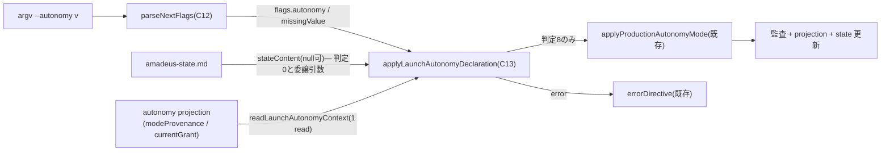

# Domain Entities — `launch-autonomy-flag`(#2253)

上流入力(consumes 全数): unit-of-work.md, unit-of-work-story-map.md, requirements.md, components.md, component-methods.md, services.md

依拠箇所: `component-methods.md` §C12(`ParsedFlags` 拡張)と §C13(`LaunchAutonomyContext` の判別ユニオン)、`components.md` C12/C13 行、`requirements.md` FR-CLI-3(provenance 判別の canonical)、`services.md` §S5 / P3(engine プロセス内で完結する境界)、`unit-of-work.md` §`launch-autonomy-flag`(所有物)、`unit-of-work-story-map.md` §`launch-autonomy-flag`(検証対象)。

本 Unit は**永続エンティティを新設しない**。既存の投影(projection)・state の読み手と、プロセス内の値オブジェクト 2 種を扱う。

---

## エンティティ一覧

| エンティティ | 種別 | 所有 | 本 Unit の関与 |
| --- | --- | --- | --- |
| `ParsedFlags.autonomy?` / `.autonomyMissingValue?` | 新規 — 一時的な parse 結果フィールド | 本 Unit(C12) | 宣言と生成 |
| `LaunchAutonomyContext` | 新規 — 判別ユニオン(プロセス内 snapshot) | 本 Unit(C13) | 宣言と生成 |
| `AutonomyMode` 型 | 既存 — canonical 3 値(`amadeus-intent-autonomy.ts:9`) | `semi-authorization-core` 側 | 参照(受理集合) |
| autonomy projection(`modeProvenance` / `currentGrant`) | 既存 — 監査からの投影 | production 層 | **読み手のみ**(1 read) |
| `Intent Autonomy Mode`(state フィールド) | 既存 — state 投影 | birth / `applyProductionAutonomyMode` | 判別に**使わない**(ADR-13)。書込は委譲先が行う |

## 属性と構造

### `ParsedFlags` の拡張(C12)

```
readonly autonomy?: string;             // 値そのまま(値域検査は C13)
readonly autonomyMissingValue?: boolean; // 値なし --autonomy の捕捉
```

- ライフサイクル: `handleNext` の 1 呼び出し内。永続化しない。
- 不変条件: `autonomy` と `autonomyMissingValue` は同時に立たない(parser の ladder 順で consume 分岐が先に評価される)。

### `LaunchAutonomyContext`(C13 の判定基体)

```
| { kind: "readable"; mode: AutonomyMode; declared: boolean; grant: "present" | "absent" }
| { kind: "unreadable" }
```

- `declared` = `modeProvenance.kind === "human-command"`(ADR-13 の判別子)。`modeProvenance.kind` の値域は `human-command` / `system-default` / `legacy-fail-closed`(`amadeus-intent-autonomy.ts:50-72`)。
- `grant` = `currentGrant.state === "active"` なら `"present"`。
- `unreadable` は独立した状態であり `readable` の既定値へ潰さない(parse-don't-validate — 読取失敗を型で運ぶ)。
- ライフサイクル: projection 1 read の snapshot。判定 3〜7 が共有し、判定後に破棄。

## エンティティ相互作用



テキスト代替: argv を C12 が parse して flags へ、C13 が state(null 可)と projection snapshot から判定 0〜7 を評価し、通過時のみ既存 `applyProductionAutonomyMode` へ委譲して書込・監査が行われる。error は既存 `errorDirective` で表示される。本 Unit 自身はどの永続面にも直接書かない。

## ライフサイクル状態(mode 宣言の遷移 — 本 Unit が起こす遷移)

| 遷移前(provenance) | 入力 | 遷移後 | 経路 |
| --- | --- | --- | --- |
| `system-default`(未宣言) | `--autonomy none/semi` | 当該 mode(`human-command`) | 判定 4 → 6/7 通過 → 8 |
| `system-default` かつ grant 不在 | `--autonomy full` | 遷移しない(fail-closed 停止) | 判定 7 |
| `human-command` 同値 | `--autonomy <同値>` | 遷移しない(no-op continue) | 判定 5 |
| `human-command` 異値 | `--autonomy <異値>` | 遷移しない(loud 停止・`set-autonomy` 案内) | 判定 5 |
| (任意)grant 実在 | `--autonomy none` | 遷移しない(grant 保護) | 判定 6 |
| active intent 不在 | `--autonomy <任意>` | 遷移しない(loud 停止・birth 案内) | 判定 0(Q1 裁定) |

## 他 Unit との境界

- `semi-authorization-core` に依存しない: C13 は `AutonomyMode` 型と既存 `applyProductionAutonomyMode` のみ参照し、semi の新設認可型(`SemiAuthority` 等)を参照しない(`unit-of-work.md` §依存しない理由)。
- `autonomy-statusline` とは書き手⇄読み手の関係(本 Unit の宣言が state に反映され statusline が表示する)だが、コード面の交差はゼロ。
- `semi-docs-revision` が本 Unit に依存する(`--autonomy` の docs 記述は本 Unit の着地後に書ける — yaml edge block)。
