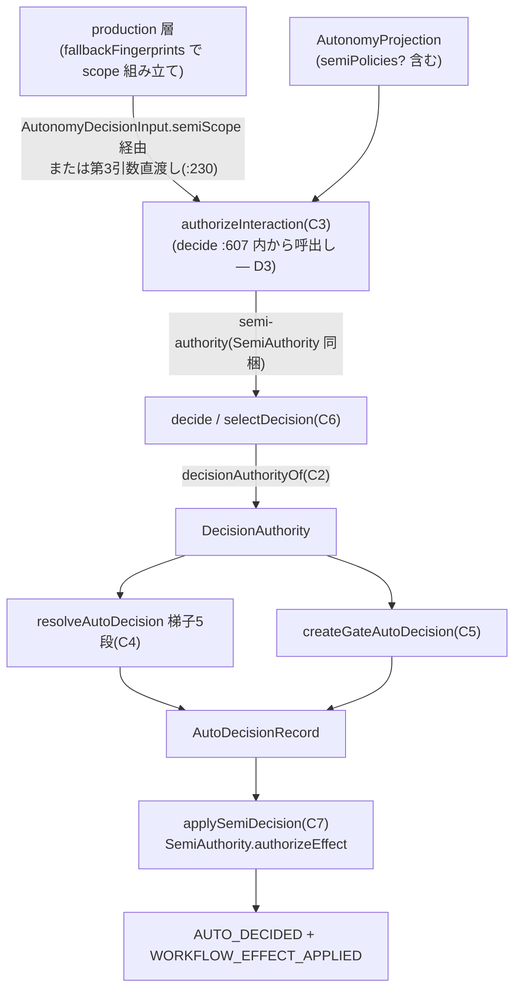

# Domain Entities — `semi-authorization-core`(#2253)

上流入力(consumes 全数): unit-of-work.md, unit-of-work-story-map.md, requirements.md, components.md, component-methods.md, services.md

依拠箇所: `component-methods.md` §C1〜C8(型定義の逐語 — 本書の正本)、`components.md` C1〜C8 行、`requirements.md` FR-AUTH-1(責務限定)、`services.md` §S1(純関数層)、`unit-of-work.md` §`semi-authorization-core`(所有境界)、`unit-of-work-story-map.md` §ゴールの割当(G1〜G3)。

---

## エンティティ一覧

| エンティティ | 種別 | 層 | 本 Unit の関与 |
| --- | --- | --- | --- |
| `SemiAuthority` / `SemiAuthorityScope` | 新規 — 値オブジェクト(認可基体) | 純関数層(`amadeus-intent-autonomy.ts`) | 新設(C1) |
| `SEMI_ROUTINE_INTERACTIONS` | 新規 — 定数(scope 集合の canonical) | 同上 | 新設(C1) |
| `DecisionAuthority` | 新規 — 判別ユニオン(梯子入口の入力) | 同上 | 新設(C2) |
| `DecisionAuthorization` | 既存 — 判別ユニオン(第1関門の出力) | 同上 | 改訂(`semi-mode-gate` 削除・`semi-authority` 追加・`full-grant` payload 拡張)(C3) |
| `AutonomyProjection.semiPolicies?` | 新規 — 任意フィールド | 同上 | フィールド宣言+`semiPoliciesOf` 総関数+片方向不変条件(C8 読み側) |
| `AutoDecisionRecord` / 梯子 5 段 | 既存 | runtime / 純関数層 | 入口述語と authority 供給のみ改訂(C4〜C7)。段・reviewState は無改変 |

## 属性と構造(逐語は component-methods.md §C1 / §C2 を正本とし再掲しない)

- **`SemiAuthorityScope`**: `intentUuid` / `scopeId` / `scopeFingerprint`(SHA256)/ `normFingerprint`(SHA256)/ `allowedInteractionKinds`。組み立ては production 層(ADR-3、questions D3)。
- **`SemiAuthority`**: `kind: "semi-authority"` / `intentUuid` / `scope` / `policies` / `authorityFingerprint`。スマートコンストラクタ `SemiAuthority.of` は不成立を `null` で表す(parse-don't-validate — 生成できた値は認可済み条件を型で運ぶ)。**持たないもの**: TTL・state・発行儀式・grantId(FR-AUTH-1 (1) の検査対象)。
- **`DecisionAuthority`**: `{ kind: "grant" } | { kind: "semi" }` の 2 相。`decisionAuthorityOf` が `DecisionAuthorization` から射影(human-required → `null`)。
- **`semiPolicies`**: 任意フィールド。「方針ゼロ」と「フィールド不在」を同一視(ADR-4)。読み口は `semiPoliciesOf` の 1 本(直読禁止)。

## エンティティ相互作用

テキスト代替: production 層が組み立てた `SemiAuthorityScope` は 2 経路で第1関門へ届く — `decide` 経由(`AutonomyDecisionInput.semiScope` に載り、decide `:607` が第 3 引数へ転送)と、`authorizeProductionOccurrence:230` の直接第 3 引数渡し。第1関門は projection と scope から `semi-authority` を生成し、第2関門が `decisionAuthorityOf` で `DecisionAuthority` へ射影して質問は梯子 5 段・gate は gate 裁定へ渡し、生成された `AutoDecisionRecord` を `applySemiDecision` が `authorizeEffect` で検査してから `AUTO_DECIDED` + `WORKFLOW_EFFECT_APPLIED` の 2 イベントをコミットする。

## ライフサイクル状態

- **`SemiAuthority`**: 認可 1 回ごとに生成・破棄される一時値。永続化されない(basisFingerprint のみが `AUTO_DECIDED` に焼かれる)。grant と異なり発行・失効のライフサイクルを持たない(R2)。
- **`semiPolicies`**: 本 Unit 着地時点では書き手不在のため常に不在(= 方針ゼロ縮退、正規状態)。`semi-policy-carrier` 着地後に `set-mode` / `revoke-full` が設定する。不在→存在→(mode 変更で)不在の遷移はすべて `planHumanAutonomyCommand` 経由(直接書込なし)。
- **`DecisionAuthorization` の世代交代**: 旧 `semi-mode-gate` 値は本 Unit のマージと同時に型空間から消滅する(置換 — R1)。журnal 上の過去 `AUTO_DECIDED` は basisFingerprint 文字列であり型に依存しないため replay 互換は保たれる(ADR-4 §可逆性)。

## 他 Unit との境界

- **`semi-policy-carrier`**: `semiPolicies` の書き手。本 Unit の読み側(宣言+総関数+不変条件)が先に着地し、書き側は読み側へ依存する(`unit-of-work.md` §分割の検証 差分 1)。
- **`stop-question-carveout`** / **`advisory-auto-resolution`**: 本 Unit の認可基体(`authorizeInteraction` → 梯子)に依存する消費者。本 Unit は依存されるのみ。
- **`semi-docs-revision`**: 本 Unit の着地後に旧 semi 定義の記述を改訂する(意味論的依存)。
