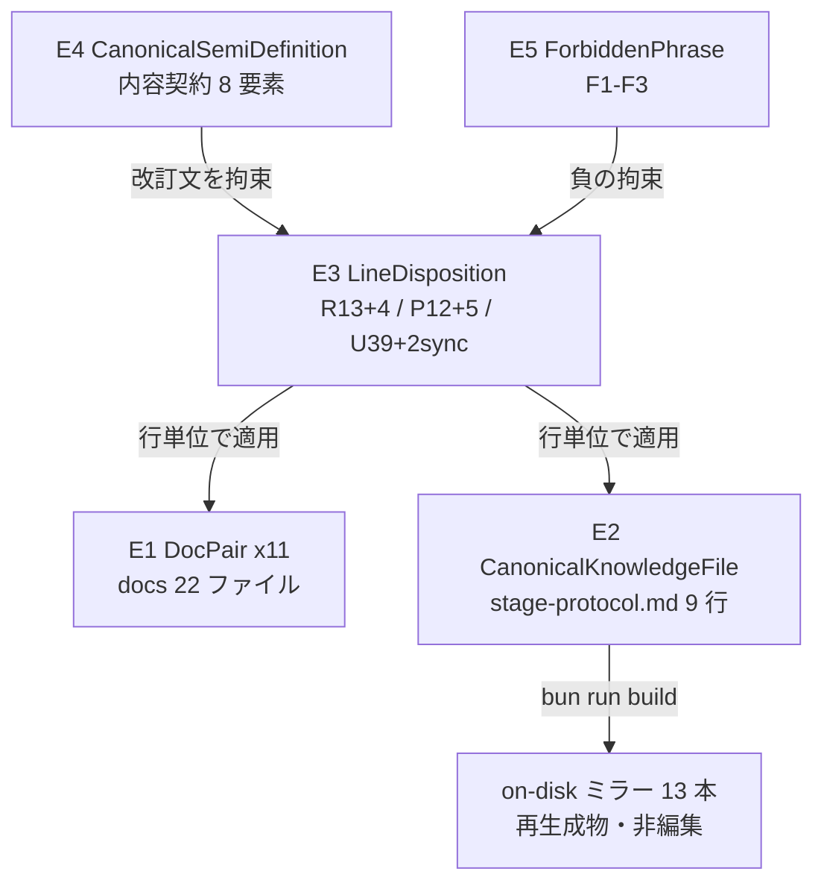

# Domain Entities — `semi-docs-revision` Functional Design(#2253)

上流入力(consumes 全数): unit-of-work.md, unit-of-work-story-map.md, requirements.md, components.md, component-methods.md, services.md

本 Unit(kind: spec)はコード実体を持たないため、ここでの「エンティティ」は**改訂対象の文書コーパスとその分類の概念モデル**である。Unit 境界は `unit-of-work.md` §semi-docs-revision(C18 からテストピンを外した残り)、対象集合の一括りは `components.md` C18、FR の割当は `unit-of-work-story-map.md`、改訂の実体要件は `requirements.md` 領域 H、コード上のメソッド面が存在しないことは `component-methods.md` §C18(「メソッド面なし」)、サービス境界を持たないことは `services.md` に C18 対応の定義が不在であることの確認による(非コード Unit として正しい状態)。

測定 ref: worktree HEAD `5f6561eef6098209c4c29461ae0d7c6d070b5c01`。

---

## エンティティ一覧

### E1: `DocPair`(対訳ペア)— 11 インスタンス

docs 面の改訂単位。`en: <name>.md` と `ja: <name>.ja.md` の 2 ファイルで 1 エンティティ。

| 属性 | 型(概念) | 説明 |
| --- | --- | --- |
| `basename` | 識別子 | ペアの同定キー(例: `guide/glossary`) |
| `enHits` / `jaHits` | 非負整数 | token `semi` の行数(grep 実測 — business-rules.md §BR-7 の目録) |
| `revisionLines` | `LineDisposition[]` | 行単位の処遇(E3) |

**不変条件**: PR に現れる docs 変更はペア単位で閉じる(business-rules.md BR-2)。11 ペアの全数: `guide/02-your-first-workflow`, `guide/04-phases-and-stages`, `guide/16-worked-examples`, `guide/glossary`, `guide/workshop-mode`, `harness-engineering/08-construction-and-swarm`, `reference/03-orchestrator`, `reference/04-stage-protocol`, `reference/04-stages/construction`, `reference/06-hooks-and-tools`, `reference/12-state-machine`(`grep -rln "semi" docs/` 実測 22 ファイルからの機械対化)。

### E2: `CanonicalKnowledgeFile`(正本知識)— 1 インスタンス

`packages/framework/core/amadeus-common/protocols/stage-protocol.md`。

| 属性 | 値(実測) |
| --- | --- |
| 追跡形態 | `git ls-files` 追跡は canonical 1 本のみ(source-only 境界) |
| on-disk ミラー | 14 本(canonical 1 + self-install 5 + `dist/` 8 — codekb `code-structure.md` 現在節の転記) |
| semi 言及 | 9 行(worktree grep 実測、business-rules.md BR-6 の処遇表) |

**ライフサイクル**: 編集 → `bun run build` でミラー再生成 → 追跡ファイル不変を確認(BR-3 / V5)。ミラーは編集対象でも review 対象でもない(使い捨てローカル生成物)。

### E3: `LineDisposition`(行処遇)— 判別ユニオン

改訂作業の中心概念。1 行(または隣接文)に対する処遇を 4 値で分類する:

```
LineDisposition =
  | { kind: "revise";   reason: "old-definition" | "carveout-split" | "flag-sync" }  // R: 旧定義を新意味論へ反転 / carve-out の full+semi 分割 / 起動フラグ同期
  | { kind: "preserve"; reason: "walking-skeleton-human" | "still-true" }            // P: diff 非出現義務(FR-LAD-5)または新意味論でも真
  | { kind: "unchanged" }                                                            // U: mode 列挙・UI 表示・quality repair 等の中立参照
```

**インスタンス数(実測)**: docs 面 R=13 / P=12 / U=39(計 64 = grep 総行数)、第2キー検出の revise 追加 4 箇所(token `semi` 非含有・外数)、正本知識面 revise 2(`:33` `:131`)+ sync 2(`:118` 隣接 / `:125`)+ preserve 5(`:105` `:133` `:442` `:796` `:808`)。全数表は business-rules.md BR-6/BR-7。

**判定述語**(questions D1): 「semi の下で質問(または phase 内ゲート以外の一切)が人間所有のまま残る」と主張する行のみが `revise/old-definition`。列挙・表示・quality repair 記述は該当しない。

### E4: `CanonicalSemiDefinition`(新 semi 定義の内容要素集合)

改訂文が従う内容契約(business-rules.md BR-8 の 8 要素)。実体は「文面」ではなく**述べるべき命題の集合**である:

| 要素 | 命題 | 由来 FR |
| --- | --- | --- |
| ladder | 質問は full と同一の 5 段梯子(confirmed-policy / norm / history / solo-election / agent-recommendation)で無人解決 | FR-LAD-1/2/4 |
| audit | 裁定は `AUTO_DECIDED` 記録、後段 2 段は unreviewed queue | FR-LAD-4 |
| milestones | phase 境界・walking skeleton・Intent 終端は人間 | FR-LAD-5 |
| grantless | current grant = null を維持、semi 専用の軽量認可基体で裁定 | FR-AUTH-1/3 |
| policies | `--policies-file` は semi でも有効(confirmed-policy 段の材料) | FR-POL-1 |
| provenance | mode 設定は human-command 由来のみ | FR-LAD-1(`:512` 維持) |
| vocabulary | mode 名は `--status` `Autonomy:` 行と同一語彙 | FR-DISP-1 / In-4 |
| negative | 禁止語彙(E5)を含まない | FR-LAD-6 / FR-ADV-5 |

### E5: `ForbiddenPhrase`(禁止語彙集合)

| 集合 | 内容 | 由来 |
| --- | --- | --- |
| F1 | 「phase を完走する」「phase 1個ぶん必ず走る」等の走行単位主張(en: complete a phase / whole phase unattended) | FR-LAD-6 |
| F2 | 「`run_required` 経路が plugin 非依存」と読める主張(plugin 非依存は hold 判定の面に限る射程注記を必須とする) | FR-ADV-5 |
| F3 | semi が節目(walking skeleton / phase 境界 / Intent 終端)を自動裁定できると読める主張 | FR-LAD-5 |

検査は business-rules.md V1/V2 の grep 補助 + レビュー実読。

---

## エンティティ関係



テキストフォールバック: E4(内容契約)と E5(禁止語彙)が E3(行処遇)を正負両面から拘束し、E3 が E1(docs 11 対訳ペア)と E2(正本知識 1 本)へ行単位に適用される。E2 の編集は `bun run build` により非追跡ミラー 13 本へ一方向に投影される。

## 他 Unit との関係(改訂タイミングの依存)

本 Unit の改訂文は、挙動を変える他 Unit(`semi-authorization-core` の梯子開放、`stop-question-carveout` の `:422` 開放、`semi-policy-carrier` の policies 担体、`launch-autonomy-flag` の `--autonomy`)が確定させる**新意味論の記述**である。文書が実装より先に新意味論を主張すると「記述と実態の一致」(story map P6)が逆向きに壊れるため、本 Unit の PR は挙動 Unit の着地後(または同一マージ列の最後)に出荷する — 順序の正本は delivery-planning の Bolt 計画に従い、本書はこの制約の存在のみを記録する。

## ライフサイクル(改訂作業の状態遷移)

1. **棚卸し再実行**(BR-9): 2 キー grep で行目録を現 base へ再解決
2. **編集**: R/sync 行のみ改訂(P 行は diff 非出現、U 行は不変)、E4/E5 の契約下で起草
3. **再生成**: `bun run build` → 追跡ファイル不変(V5)
4. **機械検証**: V1〜V6(business-rules.md BR-10)
5. **レビュー実読**: FR-DOC-1 AC の最終判定(grep は補助 — 免責代替禁止)
