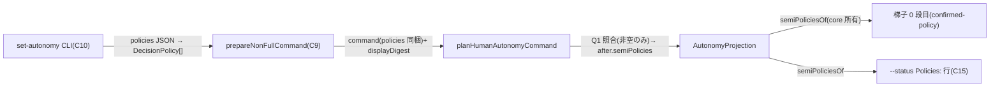

# Domain Entities — `semi-policy-carrier`(#2253)

上流入力(consumes 全数): unit-of-work.md, unit-of-work-story-map.md, requirements.md, components.md, component-methods.md, services.md

依拠箇所: `component-methods.md` §C8(`HumanAutonomyCommand` の型逐語 — 本書の正本)/ §C9(digest 入力型)/ §C15(envelope 拡張)、`components.md` C8〜C10 / C15 行、`requirements.md` FR-POL-1(担体の契約)、`services.md` §S10、`unit-of-work.md` §`semi-policy-carrier`(所有境界)、`unit-of-work-story-map.md` §ゴールの割当(横断「表示の同一語彙」)。

---

## エンティティ一覧

| エンティティ | 種別 | 本 Unit の関与 |
| --- | --- | --- |
| `HumanAutonomyCommand`(`set-mode` / `revoke-full` の `policies`) | 既存型の改訂(必須フィールド追加) | 改訂(C8 書き側) |
| `after.semiPolicies`(projection への書込) | 既存フィールド(core Unit が宣言)への書き手 | 書込規則の所有(§C8 の表) |
| `nonFullCommandDisplayDigest` | 新規 — 純関数(digest の 1 定義) | 新設(C9) |
| `IntentAutonomyStatusEnvelope.policyCount` | 既存型への追加フィールド | 追加(C15) |
| `DecisionPolicy` / `normalizeDecisionPolicies` | 既存 | 再利用のみ(改変しない) |

## 属性と構造(逐語は component-methods.md §C8 / §C9 を正本とし再掲しない)

- **`set-mode`**: `{ kind, mode: "none" | "semi", policies: readonly DecisionPolicy[] }` — `full` を値域に加えない(FR-AUTH-3)。
- **`revoke-full`**: `{ kind, targetMode, policies }` — targetMode semi の書込規則は set-mode semi と同一。
- **digest 入力**: `{ intentUuid, mode, revokedGrantId, policies }` → `autonomyDigest({ ...input, policySetDigest })`。`principalId` / `scope` を含めない(意図的相違 — grant 意味論の不侵入)。
- **`policyCount`**: `grant?.policies.length ?? semiPoliciesOf(projection).length`(直読禁止)。

## エンティティ相互作用

テキスト代替: CLI が受けた policies を C9 が digest 込みの command へ組み、`planHumanAutonomyCommand` が(policies 非空なら Q1 照合を通して)`after.semiPolicies` へ書き込む。読み手は core Unit の `semiPoliciesOf` に一本化され、梯子 0 段目と `--status` 表示の両方が同じ読み口を使う。

## ライフサイクル状態(semiPolicies)

| 状態 | 遷移契機(本 Unit の書込規則) |
| --- | --- |
| 不在(= 方針ゼロ) | birth 初期状態 / `set-mode` semi + policies 空 / `set-mode` none / `issue-full` 系 |
| 存在(正規化済み集合) | `set-mode` semi + policies 非空 / `revoke-full` targetMode semi + policies 非空 |
| 不在へ戻る | `set-mode` none(mode 遷移で未設定へ) |

不変条件「存在 ∧ mode ≠ semi は ILLEGAL_STATE」は core Unit の `assertLegalAutonomyProjection` が守る(本 Unit の書込規則は表の全行がこの不変条件を満たす — §C8 の表で `semi` 以外はすべて未設定)。

## 他 Unit との境界

- **`semi-authorization-core`**: フィールド宣言・`semiPoliciesOf`・不変条件の所有者。本 Unit は書き手のみで、読み口を新設しない。書き側は読み側へ依存する(依存 DAG の辺)。
- **`autonomy-statusline`**: 語彙(mode 名)を共有するがコード交差ゼロ。`--status` は projection(canonical)、statusline は state(投影)という役割分担(ADR-10 Consequences)。
- **`launch-autonomy-flag`**: C13 判定 7 の preview 表示が C9 の digest を利用する(full の場合)が、非 full の照合(Q1)は CLI `set-autonomy` 経路のみ — `--autonomy` 起動フラグは policies を運ばない(フラグに `--policies-file` は無い)。
