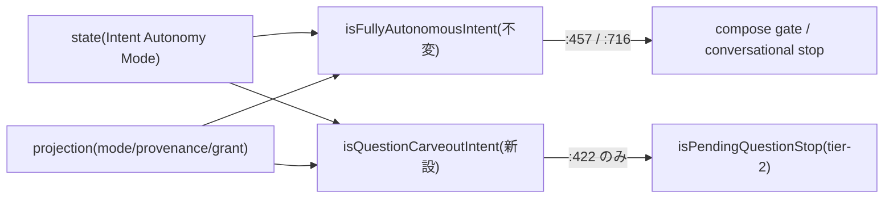

# Domain Entities — `stop-question-carveout`(#2253)

上流入力(consumes 全数): unit-of-work.md, unit-of-work-story-map.md, requirements.md, components.md, component-methods.md, services.md

依拠箇所: `component-methods.md` §C11(述語契約 — 本書の正本)、`components.md` C11 行、`requirements.md` 領域 C(現行実装の verbatim)、`services.md` P4(stop hook のプロセス境界)、`unit-of-work.md` §`stop-question-carveout`(依存マトリクス空の実測)、`unit-of-work-story-map.md` §FR の割当。

本 Unit は**新しい永続エンティティ・型を作らない**。既存の読み手(述語)の分割のみ。

---

## エンティティ一覧

| エンティティ | 種別 | 本 Unit の関与 |
| --- | --- | --- |
| `isFullyAutonomousIntent`(full 限定述語) | 既存関数 — 意味論・名前とも不変 | 保存(D2) |
| `isQuestionCarveoutIntent`(carve-out 述語) | 新規 — 純述語(boolean) | 新設(C11) |
| `Intent Autonomy Mode`(state フィールド) | 既存 | 読み手のみ(`intentAutonomyMode:162-165` 経由) |
| autonomy projection | 既存 | 読み手のみ(`readProductionAutonomyProjection` — 読取専用) |

## 構造(逐語は component-methods.md §C11 を正本とし再掲しない)

- 両述語とも `(stateContent: string, resolvedProjectDir?: string) => boolean`。状態を持たず、毎呼び出しで state + projection を読む(hook の 1 実行内で完結)。
- carve-out 述語の semi 分岐は projection の `mode` と `modeProvenance.kind` の 2 条件 — grant を要求しない(semi は grant を持たない — FR-AUTH-3 との整合)。

## エンティティ相互作用

テキスト代替: state と projection を両述語が読み、carve-out 述語は tier-2 質問判定(`:422`)だけに配線され、full 限定述語は残り 2 点(`:457` / `:716`)に従来どおり配線される。

## ライフサイクル状態

述語は状態を持たない(毎プロンプトの hook 実行内で評価・破棄)。carve-out の可否は mode 遷移(none ⇄ semi ⇄ full — 書き手は他 Unit)に追随して次回評価から変わる。

## 他 Unit との境界

- **`semi-authorization-core`**: 意味論的依存(carve-out は質問が裁定できて初めて意味を持つ)。コード交差ゼロ(`amadeus-stop.ts` を触るのは本 Unit のみ — 依存マトリクス実測)。
- **`autonomy-statusline`**: 同じ state フィールドの読み手同士だが交差なし。
- t121 / t147 / allowlist の同期面は D2 により行 remap(U-6)のみ。
