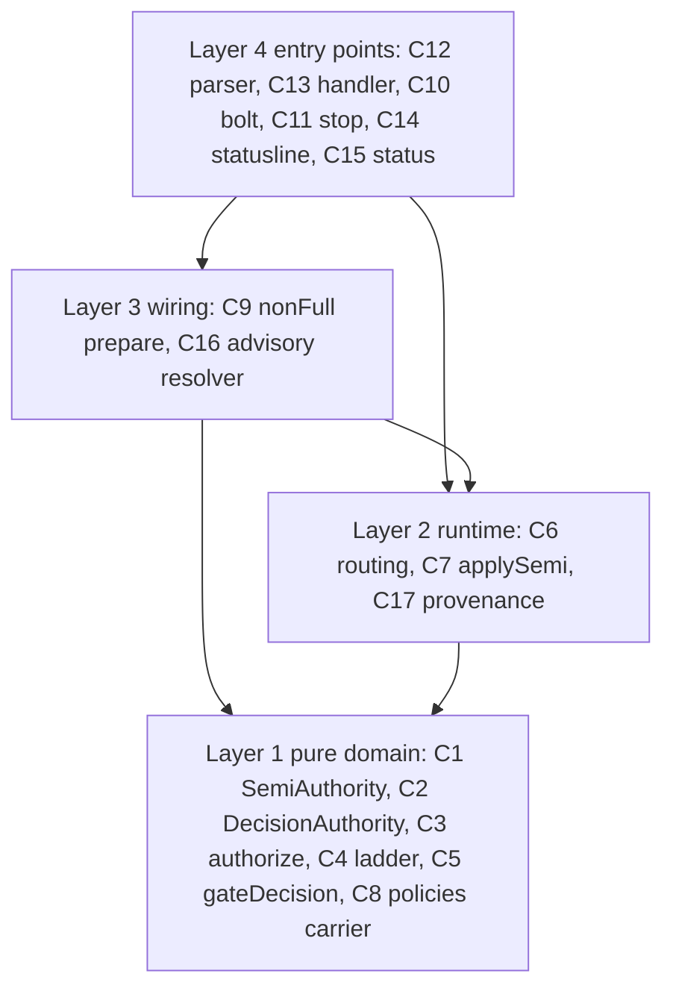
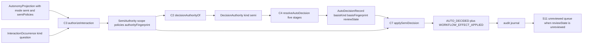
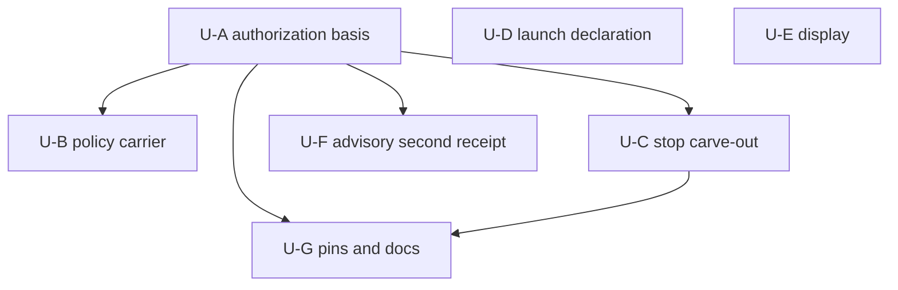

# Component Dependency — semi 再定義と `--autonomy` 起動宣言(#2253)

上流入力(consumes 全数): requirements.md, architecture.md, component-inventory.md

本文書は上記3成果物を次のとおり実参照する。`requirements.md` の C-8(Bolt ごとに PR)・C-9(walking-skeleton ゲート)・OQ-4(Bolt 分割)を §Unit 分割の示唆の制約とし、FR-ADV-1 が「P7(advisory)は P1/P2 に依存する」と述べる依存を §依存 DAG に反映する。`architecture.md` 現在節「承認・裁定経路の現行トポロジ」の2関門構造を §依存マトリクスの層構造の根拠とし、同節「stop hook 側の非対称」を §非対称な依存(stop hook)の根拠とする。`component-inventory.md` 現在節「焦点コンポーネント」表(10 ファイル)を §ファイル単位の交差判定の母集合とし、同表の `amadeus-orchestrate.ts (5544)` / `amadeus-utility.ts (6327)` の行数を §並行実装の交差リスクの根拠とする。

測定 ref: worktree HEAD `974dbf9bcce117a510605b12c20c50e317883566`。コンポーネント記号 C1〜C18 は components.md、S1〜S11 と P1〜P5 は services.md の定義に従う。

---

## 依存マトリクス

行が依存する側、列が依存される側。`→` は「呼び出す / 型を消費する」。空欄は依存なし。

| ↓依存元 \ 依存先→ | C1 SemiAuthority | C2 DecisionAuthority | C3 authorize | C4 ladder | C5 gateDecision | C6 routing | C7 applySemi | C8 policies担体 | C9 nonFull準備 | C16 advisory resolver | C17 provenance |
| --- | --- | --- | --- | --- | --- | --- | --- | --- | --- | --- | --- |
| C1 SemiAuthority | — | | | | | | | → | | | |
| C2 DecisionAuthority | → | — | | | | | | | | | |
| C3 authorize | → | | — | | | | | → | | | |
| C4 ladder | | → | | — | | | | | | | |
| C5 gateDecision | | → | | | — | | | | | | |
| C6 routing | | → | → | → | → | — | → | | | | |
| C7 applySemi | → | → | | | | | — | | | | |
| C8 policies担体 | | | | | | | | — | | | |
| C9 nonFull準備 | | | | | | | | → | — | | |
| C10 bolt loud化 | | | | | | | | | → | | |
| C11 stop述語 | | | | | | | | | | | |
| C12 parser | | | | | | | | | | | |
| C13 applyハンドラ | | | | | | | | | → | | |
| C14 statusline | | | | | | | | | | | |
| C15 status行 | | | | | | | | → | | | |
| C16 advisory resolver | | | | | | → | | | | — | → |
| C17 provenance | | | | | | | | | | | — |
| C18 ピン・docs | (全体の挙動に依存) | | | | | | | | | | |

**循環依存はゼロ**である(`phases/inception.md` § Software Design Principles「循環依存を作らない」)。C1 → C8 は型参照(`DecisionPolicy`)のみで、C8 → C1 の逆向き参照は無い。

### 層構造(依存の向きは常に下向き)

<!-- Text fallback: 4層。Layer 1 は純粋ドメイン(SemiAuthority、DecisionAuthority、authorizeInteraction、梯子、gate 裁定、方針の担体)で FS も projectDir も知らない。Layer 2 はランタイム(ルーティング、semi 効果適用、advisory provenance)。Layer 3 は本番結線(非 full コマンド準備、advisory resolver)。Layer 4 はエントリポイント(flag parser、適用ハンドラ、bolt CLI、stop hook、statusline、status 表示)。依存の向きは常に上から下であり、逆向きの参照は存在しない。 -->

この層構造は既存の `amadeus-intent-autonomy.ts`(純関数)/ `-runtime.ts`(ランタイム)/ `-production.ts`(本番結線)のファイル分割と**一致**する。本設計は新しい層を1つも追加しない。

---

## ファイル単位の交差判定

`component-inventory.md` 現在節「焦点コンポーネント」表の 10 ファイル + advisory 面 1 ファイルが改訂面である。並行実装の交差判定は**静的目録ではなく実 diff で行う**のが規範(`cid:code-generation:c6`)だが、設計段では目録で当たりを付ける。

| ファイル(行数、observed 実測) | 触るコンポーネント | 交差の度合い |
| --- | --- | --- |
| `core/tools/amadeus-intent-autonomy.ts` (961) | C1 / C2 / C3 / C4 / C5 / C8 | **最も交差が濃い**(6 コンポーネント) |
| `core/tools/amadeus-intent-autonomy-runtime.ts` (800) | C6 / C7 / C15 | 中 |
| `core/tools/amadeus-intent-autonomy-production.ts` (900) | C9 | 低 |
| `core/tools/amadeus-intent-autonomy-replay.ts` (175) | — | **無改訂**(ADR-4) |
| `core/hooks/amadeus-stop.ts` (1020) | C11 | **独立**(他コンポーネントと非交差) |
| `core/tools/amadeus-bolt.ts` (1312) | C10 | 低 |
| `core/tools/amadeus-orchestrate.ts` (5544) | C12 / C13 / C16(呼び出し点) | 中(3 箇所が離れている: `:1044-1074` / `handleNext` / `:781-800`) |
| `core/tools/amadeus-utility.ts` (6327) | C15 | **独立**(1 行) |
| `core/hooks/amadeus-statusline.ts` (325) | C14 | **独立** |
| `core/tools/amadeus-directive.ts` | — | **無改訂**(C-3) |
| `core/tools/amadeus-advisory-choice.ts` | C16 / C17 | 高(2 コンポーネントが同一ファイル) |

**非交差で並行実装できる組**: {C11}(stop hook)、{C14}(statusline)、{C15}(utility + runtime の 1 箇所)、{C10}(bolt)。
**直列化が要る組**: {C1〜C8}(同一ファイル 6 コンポーネント)、{C16, C17}(同一ファイル)、{C12, C13}(同一ファイルかつ論理的に対)。

---

## 通信パターンとデータフロー

| 経路 | 種別 | 同期性 | 運ぶもの |
| --- | --- | --- | --- |
| C3 → C6 | 関数戻り値 | 同期 | `DecisionAuthorization`(`semi-authority` / `full-grant` / `human-required`) |
| C6 → C4 | 関数引数 | 同期 | `DecisionAuthority`(C6 内では非 null — `decide` が `human-required` を先に弾く。`resolveAutoDecision` の公開シグネチャは `DecisionAuthority \| null` を受ける)+ occurrence + 文脈 fingerprint |
| C4 → C6 | 関数戻り値 | 同期 | `AutoDecisionResolution`(`decided` / `park` / `invalid`) |
| C6 → C7 | 関数引数 | 同期 | `SemiAuthority` + `AutoDecisionRecord` |
| C7 → S4 | repository port(`commit`) | 同期(`withAuditLock` 直列化) | `IntentAutonomyTransaction`(projection スナップショット同梱) |
| C13 → S5 | `readProductionAutonomyProjection` 呼び出し(`readLaunchAutonomyContext`、**判定ごとに1回**) | 同期(読取のみ、監査イベントを生まない) | projection → `{ mode, declared(`modeProvenance.kind === "human-command"`、ADR-13), grant }` |
| C13 → C9 | `applyProductionAutonomyMode` 呼び出し | 同期 | mode + policies + projectDir + stateContent |
| C9 → C8 | `planHumanAutonomyCommand` 呼び出し | 同期 | `HumanAutonomyCommand`(`set-mode` / `revoke-full` に policies を同梱) |
| C16 → S5 | `commitProductionQuestionDecision` 呼び出し | 同期 | question occurrence + effect registry + capability |
| C16 → C17 | `recordAdvisoryChoice` 呼び出し | 同期 | choice + `AdvisoryChoiceProvenance`(`auto-decision`) |
| C11 → S5 | `readProductionAutonomyProjection` 呼び出し | 同期(読取のみ) | projection |
| C14 → state ファイル | `extractField` | 同期(読取のみ、**既読の文字列から**) | `Intent Autonomy Mode` |

**非同期・イベント駆動の経路は1つも導入しない**(services.md §オーケストレーション)。

### semi 質問裁定のデータフロー

<!-- Text fallback: mode semi と semiPolicies を持つ projection と question occurrence が authorizeInteraction へ入り、SemiAuthority(scope・policies・authorityFingerprint)が出る。decisionAuthorityOf が DecisionAuthority(kind semi)へ射影し、resolveAutoDecision の5段梯子が AutoDecisionRecord(basisKind・basisFingerprint・reviewState)を返す。applySemiDecision が SemiAuthority の効果認可を通し、AUTO_DECIDED と WORKFLOW_EFFECT_APPLIED を監査 journal へ書く。reviewState が unreviewed のものは既存の未レビュー queue へ入る。 -->

---

## 共有リソース

| リソース | 所在 | 読み手 | 書き手 | 競合制御 | 本 intent での変更 |
| --- | --- | --- | --- | --- | --- |
| 監査 journal(シャード) | `<record>/audit/` | S4 / C11 / C13 / C16 / C17 | S3(トランザクション)/ 各種 emit | `withAuditLock`(mkdir ベース) | イベント種別は増やさない。semi 由来の `AUTO_DECIDED` が増える |
| state ファイル(`amadeus-state.md`) | `<record>/` | C11 / C13 / C14 / S5 | C10 / C13(`applyProductionAutonomyMode` 経由) | `withAuditLock`(`handleSetAutonomy:1061`) | フィールドは増やさない |
| advisory store(`.amadeus-advisory-choice.json`) | docsRoot 配下、**gitignore 対象** | C16 / C17 / S8 | C17 / S8 | `withAuditLock`(`guardAdvisoryChoices:592-597`) | `schema` を 2 へ(ADR-9)。receipt の provenance を判別ユニオン化 |
| `tests/.coverage-patch-allowlist.json` | repo ルート | CI ゲート | 人間 / builder | — | C11 の改名時に `:5268` が同期対象(FR-STOP-1) |
| `runtime-graph.json` | `<record>/`、**gitignore 対象** | C16(`graphRevision` の生成元 `loadGraph()`) | compile | — | 不変 |

**新しい共有リソースを1つも導入しない**。

### ロックのネストに関する設計制約

`guardAdvisoryChoices`(`:592-597`)は自前で `withAuditLock` を取り、`commitProductionQuestionDecision` は S4 の `transactionLock`(同じく `withAuditLock`、`amadeus-intent-autonomy-replay.ts:160-165`)を取る。**C16 を `guardAdvisoryChoicesLocked` の内側から呼ぶと同一ロックの再入が起きうる**。本設計は C16 を engine 側(`applyPendingAdvisoryGuard`)から、`guardAdvisoryChoices` が**戻った後**に呼ぶ配置とし、ロック区間を重ねない。再入時の挙動(`withAuditLock` が再入可能かどうか)は**実装時実測が確定条件**である(⚠ decisions.md §未確定事項 U-3)。

---

## 非対称な依存(stop hook)

`architecture.md` 現在節「stop hook 側の非対称」が実測した3軸のうち、本 intent が動かすのは**1軸だけ**である。

| 軸 | `semi` の現行位置 | 本 intent 後 | 依存の変化 |
| --- | --- | --- | --- |
| 継続 cap(`:147-151`) | 自律側(`AUTONOMOUS_BLOCK_CAP = 8`) | **不変** | なし |
| budget mode(`:157-160`) | `gated` | **不変** | なし |
| 質問 carve-out(`:167-178` → `:422`) | 非自律側 | **自律側へ移す** | C11 が projection の `modeProvenance` を読むようになる(現行は grant の `state` のみ) |
| compose gate(`:457`) | 非自律側 | **不変** | なし |
| conversational stop(`:716`) | 非自律側 | **不変** | なし |

C11 は**他のどのコンポーネントにも依存されない**(依存マトリクスの C11 行・列がともに空)。したがって C11 は最も独立に実装・検証できる単位である。

---

## Unit 分割の示唆(units-generation / OQ-4 への申し送り)

`cid:units-generation:c1` は Unit 分割の検証(各 Unit が独立に実装可能であること)を Delivery Planning 前に行うことを要求する。本設計の依存 DAG から導かれる候補を示す。**確定は units-generation の責務**である。

| 候補 Unit | 含むコンポーネント | 推定行数 | 依存する Unit | 独立に出荷可能か |
| --- | --- | --- | --- | --- |
| U-A 認可基体 | C1 / C2 / C3 / C4 / C5 / C6 / C7 | 227 | — | **可**(semi の質問が梯子へ載る = walking skeleton 候補) |
| U-B 方針の担体 | C8 / C9 / C10 / C15 | 113 | U-A(confirmed-policy 段が動く前提) | 可 |
| U-C stop carve-out | C11 | 28 | U-A(semi が質問を裁定できて初めて carve-out に意味が出る) | 可 |
| U-D 起動宣言 | C12 / C13 | 99 | — | **可**(U-A と非交差 — 別ファイル) |
| U-E 表示 | C14 | 20 | — | 可 |
| U-F advisory | C16 / C17 | 175 | U-A(autonomy 認可が要る) | 可 |
| U-G ピン・docs | C18 | 非コード | U-A / U-C(実態が変わってから改訂) | 可 |

<!-- Text fallback: U-A(認可基体)が U-B(方針の担体)・U-C(stop carve-out)・U-F(advisory 第2 receipt)・U-G(ピンと docs)の前提になる。U-C も U-G の前提になる。U-D(起動宣言)と U-E(表示)は U-A に依存せず独立に着手できる。 -->

- **walking skeleton 候補**は U-A である(C-9、`requirements.md` C-9 が記す「semi 質問1件が5段で解決されるエンドツーエンド」と一致)。
- **U-F は U-A に依存する**(FR-ADV-1 が「P7(advisory)は P1/P2 に依存する」と述べる依存と一致)。
- **U-D / U-E は U-A と非交差**であり並行実装できる(`cid:code-generation:c6` の非交差判定 — ファイル目録が交わらない)。ただし着手前に**実 diff での再評価**を行うこと。
- Bolt / PR 粒度は C-8 と `cid:units-generation:c1` に従い delivery-planning が決める。本文書は依存トポロジのみを提示する。

---

## 上流成果物との整合確認

| 上流の主張 | 本設計での扱い |
| --- | --- |
| `architecture.md`「介入点は3点」 | 4点(`:702` を追加)。同節自身が「この1行の条件そのものを緩める必要がある」と述べており矛盾しない |
| `architecture.md`「梯子は5段」 | component-methods.md §梯子の段別戻り値表 が1:1で対応 |
| `architecture.md`「節目を判別する述語は存在せず、新設対象」 | **新設しない**。Q3=A(質問はすべて梯子へ)により、節目の遮断は既存の `occurrence.kind` 集合(`SEMI_ROUTINE_INTERACTIONS`)で表現できる(`requirements.md` C-2 と一致) |
| `component-inventory.md`「`amadeus-autonomy-review*.ts` は直接影響する隣接面」 | **無改訂**で受け皿として機能する(components.md §下流受け皿)。影響は「件数が増える」のみ |
| `component-inventory.md`「`amadeus-bolt.ts` の autonomy サブコマンドは8種」 | 8種を増やさない。C10 は `set-autonomy` の引数検査のみ |
