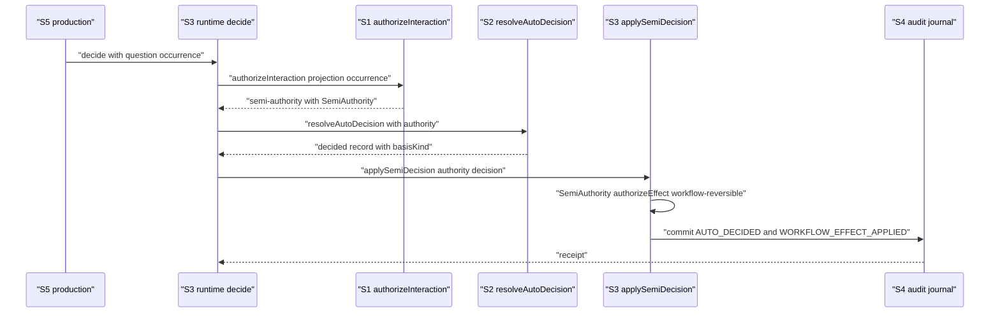
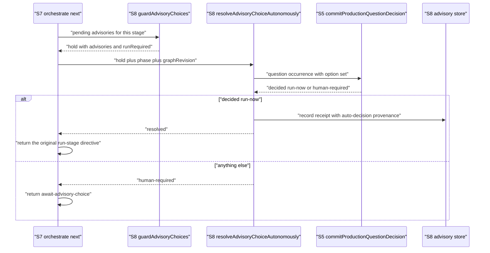
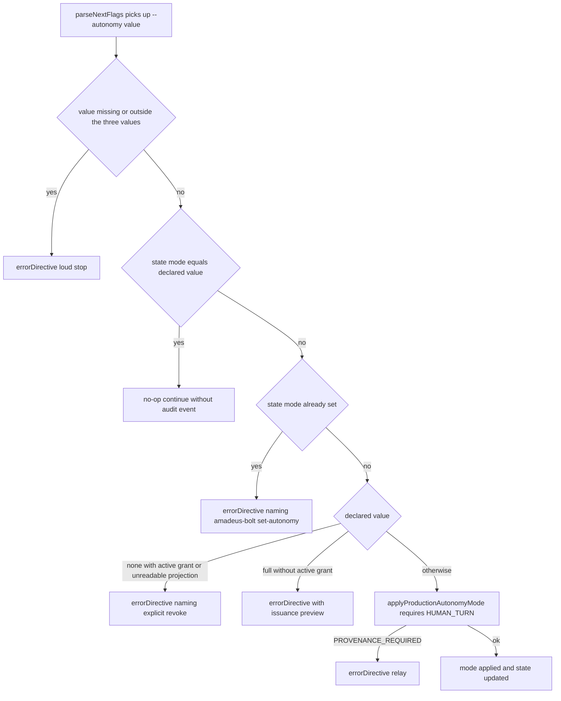

# Services — semi 再定義と `--autonomy` 起動宣言(#2253)

上流入力(consumes 全数): requirements.md, architecture.md, component-inventory.md

本文書は上記3成果物を次のとおり実参照する。`requirements.md` の C-5(source-only 境界)・C-6(`READ_ONLY_FLAGS` 不可)・C-10(リリース経路)・NFR-3(起動フラグの実行コスト)・NFR-5(生成物ドリフトゼロ)を**プロセス境界とライフサイクルの制約**として写像し(§プロセス境界・§ライフサイクル)、FR-CLI-5 / NFR-6 を認可境界の契約とする(§信頼境界)。`architecture.md` 現在節「mode の値域と永続化3面」を**共有状態の3面**の正本とし(§永続化3面と所有者)、同節「承認・裁定経路の現行トポロジ」を呼び出しシーケンスの根拠とする(§オーケストレーション)。`component-inventory.md` 現在節「焦点コンポーネント」表の `core/tools` / `core/hooks` の別と、同文書 `:723` の hook インベントリ実測(「flow-altering は `amadeus-stop.ts` の 1 件のみで、残り 11 は non-blocking」)を §プロセス境界の分類根拠とする。

測定 ref: worktree HEAD `974dbf9bcce117a510605b12c20c50e317883566`。

---

## サービス概念の当てはめ

本プロジェクトは常駐サービスを持たない。`project.md` § Deployment(「デプロイ基盤は持たず、リリースは npm パッケージ配布、GitHub Release Asset、タグ/PR 履歴で管理する」)のとおり、実行単位は**短命な bun プロセス**である。したがって本文書の「サービス」は **(1) プロセス境界を持つ実行単位** と **(2) その中で責務境界を持つ論理サービス** の2層で定義する。cache・horizontal scaling・circuit breaker といった常駐サービス向けの機構は適用しない(`cid:nfr-design:c1`)。

---

## プロセス境界(実行単位)

| # | 実行単位 | 起動者 | 起動形 | 本 intent での変更 | ブロッキング性 |
| --- | --- | --- | --- | --- | --- |
| P1 | engine(`amadeus-orchestrate.ts next`) | conductor(`/amadeus`) | `bun .claude/tools/amadeus-orchestrate.ts next [flags]` | C12 / C13 / C16 の呼び出し点 | stdout = directive JSON / stderr = advisory(`cid:code-generation:stdout-directive-stderr-advisory`) |
| P2 | autonomy CLI(`amadeus-bolt.ts`) | 人間 / conductor | `bun .claude/tools/amadeus-bolt.ts set-autonomy --mode <m> [--policies-file 
]` | C10 | exit code |
| P3 | status CLI(`amadeus-utility.ts --status`) | 人間 | 同上 | C15 | 表示のみ |
| P4 | stop hook(`amadeus-stop.ts`) | ハーネス(Stop イベント) | ハーネス設定経由(`.claude/settings.json:154`、HEAD 実測 verbatim `            "command": "bun \"${CLAUDE_PROJECT_DIR:-.}/.claude/hooks/amadeus-dispatch.ts\" stop"` — `component-inventory.md:1008` が記す `amadeus-stop.ts` 直呼びは observed 断面の記述であり、HEAD では dispatch 経由) | C11 | **flow-altering**(唯一の block 可能 hook) |
| P5 | statusline hook(`amadeus-statusline.ts`) | ハーネス(毎プロンプト) | 同上 | C14 | non-blocking(失敗時 stderr 1 行 + exit 0) |

P4 が唯一の flow-altering hook である事実は `component-inventory.md:723` の実測に依る。本 intent は P4 の**判定述語だけ**を変え、block の可否構造(cap・budget)には触れない(FR-STOP-2)。

P5 は毎プロンプト起動されるため、追加の I/O を持ち込まない設計とする(components.md ADR-10 / C14)。

---

## 論理サービス(プロセス内の責務境界)

| # | 論理サービス | 所在 | 責務 | 依存 | 本 intent での変更 |
| --- | --- | --- | --- | --- | --- |
| S1 | 認可サービス | `amadeus-intent-autonomy.ts`(`authorizeInteraction`) | occurrence を通す/弾く。**純関数**(I/O なし) | projection(引数) | C1 / C2 / C3 |
| S2 | 裁定サービス | 同上(`resolveAutoDecision` / `createGateAutoDecision`) | 選択肢を1つ決める。**純関数**(capability port 経由で外部能力を呼ぶ) | S1 の結果、`DecisionCapabilityPort` | C4 / C5 |
| S3 | 裁定ランタイム | `amadeus-intent-autonomy-runtime.ts`(`decide` / `applySemiDecision` / `reserveFullDecision`) | 裁定 → 効果適用 → トランザクション commit | S1 / S2、repository port | C6 / C7 |
| S4 | 永続化サービス | `amadeus-intent-autonomy-replay.ts` | 監査 journal への encode / decode / replay | 監査シャード(FS) | 不変(ADR-4 により拡張不要) |
| S5 | 本番結線サービス | `amadeus-intent-autonomy-production.ts` | projectDir から projection を解決し、occurrence を組み、S3 を呼ぶ | S3 / S4、state ファイル | C9 |
| S6 | autonomy CLI サービス | `amadeus-bolt.ts`(8 サブコマンド) | 人間コマンドの受理と state 書込 | S5 | C10 |
| S7 | engine ディレクティブサービス | `amadeus-orchestrate.ts` | 次の一手を directive として組み立てる | S5(`productionStageAutonomy`)、S8 | C12 / C13 / C16 |
| S8 | advisory ゲートサービス | `amadeus-advisory-choice.ts` | pending advisory の hold 判定と receipt 受理 | advisory store(FS)、監査シャード、S5(新規) | C16 / C17 |
| S9 | 停止判定サービス | `amadeus-stop.ts` | 継続 / 停止の tier 判定 | state ファイル、S5(`readProductionAutonomyProjection`) | C11 |
| S10 | 表示サービス | `amadeus-statusline.ts` / `amadeus-utility.ts` | 現在地の可読表示 | state ファイル(P5)/ S5(P3) | C14 / C15 |
| S11 | 未レビュー検収サービス | `amadeus-autonomy-review*.ts`(計 1757 行) | `reviewState: "unreviewed"` の受け皿 | S4 の projection | **不変**(semi 由来の裁定が同じ queue に入る) |

**S1・S2 は純関数層**である(`amadeus-intent-autonomy.ts` の冒頭コメント verbatim `// This module owns decisions, not transport.`)。本設計はこの層分離を維持し、`SemiAuthority` / `DecisionAuthority` を**この純関数層に置く**(FS も projectDir も知らない)。

---

## オーケストレーション

### パターンの選択

本設計は**オーケストレーション**(中央の呼び出し元が順序を持つ)であり、コレオグラフィ(イベント購読による分散協調)ではない。理由:

- 判定は同期・決定的でなければならない(NFR-1 の落ちる実証、NFR-6 の provenance 偽装不能性)。イベント購読は判定順序の保証を失う。
- 実行単位が短命プロセスであり、イベントバスを常駐させる基盤が無い(`project.md` § Deployment)。
- 既存の呼び出し構造(`decide` → `authorizeInteraction` → `selectDecision` → `applySemiDecision`)が既にオーケストレーションである。本設計はこれに1つも新しい制御反転を導入しない。

### semi の質問裁定シーケンス(FR-LAD-1〜4)

<!-- Text fallback: S5(本番結線)が question occurrence で S3 の decide を呼ぶ。S3 は S1 の authorizeInteraction を呼び、semi-authority(SemiAuthority を同梱)を得る。S3 は authority を添えて S2 の resolveAutoDecision を呼び、basisKind 付きの裁定レコードを得る。S3 は applySemiDecision で SemiAuthority.authorizeEffect による workflow-reversible 検査を通し、S4 の監査 journal へ AUTO_DECIDED と WORKFLOW_EFFECT_APPLIED の2イベントを commit して receipt を返す。認可が human-required なら S2 以降へは進まない。 -->

### advisory の第2 receipt 経路(FR-ADV-1〜4)

<!-- Text fallback: engine の next が pending advisory を S8 の guardAdvisoryChoices へ渡し hold verdict を得る。engine は await-advisory-choice を組み立てる前に resolveAdvisoryChoiceAutonomously を呼ぶ。この関数は hold を question occurrence へ写像し(run_required のときは選択肢を run-now のみに絞る)、S5 の commitProductionQuestionDecision で autonomy 梯子にかける。run-now が決まったときだけ auto-decision provenance の receipt を store へ書き、元の run-stage directive をそのまま返す。それ以外のすべての結果(認可不成立・park・conflict・defer-with-risk 選択)は await-advisory-choice へ落ちる。 -->

### `--autonomy` 起動宣言(FR-CLI-1〜5)

<!-- Text fallback: parseNextFlags が --autonomy の値を consume する。値省略または3値(none/semi/full)以外は loud エラー。state の mode と同値なら監査イベントを増やさず継続(none の再宣言も no-op)。mode が設定済みで異値なら amadeus-bolt set-autonomy を名指しする loud エラー。none かつ active grant 実在または projection 読取不能なら明示 revoke を案内する loud エラー。full かつ grant 不在なら発行 preview 付きの loud エラー。それ以外は applyProductionAutonomyMode を呼び、HUMAN_TURN 不在なら PROVENANCE_REQUIRED を relay する。 -->

---

## サービス間通信の契約

| 境界 | 形 | 契約 | 本 intent での変更 |
| --- | --- | --- | --- |
| conductor ⇄ engine(P1) | プロセス境界(argv / stdout / exit code) | **stdout = directive JSON、stderr = advisory**(`cid:code-generation:stdout-directive-stderr-advisory`) | `--autonomy` を argv 面に追加(C12)。stdout の directive 種別は増やさない — 既存 `errorDirective` / `run-stage` / `await-advisory-choice` のみを使う |
| engine → directive 消費側 | JSON schema(`amadeus-directive.ts`) | `intent_autonomy_mode?: "semi" \| "full"`(`:97`)。検査 `:606` | **不変**。CLI の3値と directive の2値を同一視しない(C-3)。`none` は `routeMainWorkflowDirective:2192` の if で構造的に排除される |
| S1 → S2 | 関数引数(`DecisionAuthority \| null`) | `null` = 認可基体が解決できなかった | 新設(C2)。梯子入口の単一述語(FR-AUTH-2) |
| S3 → S4 | トランザクション(`IntentAutonomyTransaction`) | `schemaVersion: 1` 固定、projection スナップショットを digest で束縛 | **不変**(ADR-4 が任意フィールドを選ぶ理由) |
| S8 → advisory store | JSON ファイル(`.amadeus-advisory-choice.json`) | `schema: 1` → **`schema: 2`**(ADR-9) | receipt の `humanTurn` を `provenance` 判別ユニオンへ置換(C17) |
| S5 → state ファイル | md フィールド(`Intent Autonomy Mode` / `Intent Grant` / `Construction Autonomy Mode`) | `amadeus-bolt.ts:1072-1078` が書き手 | **不変**(`Construction Autonomy Mode` の潰れは C-4 により据え置き) |
| P4 / P5 → state ファイル | 読み取り(`getField` / `extractField`) | 読み手のみ | C11(P4)は projection も読む。C14(P5)は**state のみ**(ADR-10) |

---

## 永続化3面と所有者

`architecture.md` 現在節「mode の値域と永続化3面」の3面に、本 intent が触れる範囲を重ねる。

| 面 | 正本性 | 所有者 | 本 intent で追加されるデータ |
| --- | --- | --- | --- |
| (1) 監査 journal の replay(canonical) | **正本** | S4 | `semiPolicies`(任意フィールド、ADR-4)。`AUTO_DECIDED` に semi 由来の裁定が増える |
| (2) state の `Intent Autonomy Mode` / `Intent Grant` | 投影 | S6(書込)/ P4・P5(読取) | なし(mode の値域は変わらない) |
| (3) 互換投影 `Construction Autonomy Mode` | 投影 | S6 | なし(C-4 により `semi` は `gated` のまま) |

**advisory store は第4の永続面**であるが、`amadeus/spaces/*/intents/*/.amadeus-*` として gitignore 対象(machine-local runtime)であり、version-controlled な (1)〜(3) とは信頼水準が異なる。この差が ADR-9(schema 昇格で旧 store を fail-closed hold にする)を許容可能にしている根拠である。

---

## 信頼境界

| 境界 | 通過に必要なもの | 偽装不能性の根拠 | 該当 FR/NFR |
| --- | --- | --- | --- |
| mode 適用 | 実 `HUMAN_TURN`(`latestHumanTurnId`、`amadeus-intent-autonomy-production.ts:409-411`) | 監査シャードの実イベント。`--autonomy` フラグ自体は provenance にならない | FR-CLI-5 / NFR-6(1) |
| grant 発行 | `confirmedDisplayDigest` の照合(`issueGrant:307-309`) | digest 一致 | 本 intent 不変(FR-AUTH-3) |
| grant 取消 | `amadeus-bolt set-autonomy --mode none` の**明示コマンド** | 起動フラグから `revoke-full` へ到達不能(C13 判定 4・5) | FR-CLI-2(2) / FR-CLI-3(3) |
| semi 裁定 | `modeProvenance.kind === "human-command"` + scope 内 occurrence | `SemiAuthority.of` のスマートコンストラクタ | FR-LAD-1 / FR-AUTH-1 |
| semi 効果適用 | `classification === "workflow-reversible"` | `SemiAuthority.authorizeEffect` | FR-LAD-5 |
| advisory receipt(人間) | 監査シャードの実 `HUMAN_TURN` + 提示照合 | `isGroundedHumanTurn:852-861` / `hasMatchingAdvisoryPresentation` | FR-ADV-3 / NFR-6(2) |
| advisory receipt(無人) | 監査 journal に実在する `AUTO_DECIDED` の `decisionId` | S4 の journal 照会 | FR-ADV-2 / FR-ADV-3 |

**認可不成立時はすべて人間経路へ戻る**(FR-ADV-2)。第2経路は「人間経路の代替」であって「人間経路の迂回」ではない。

---

## ライフサイクルとスケーリング特性

| 特性 | 値 | 根拠 |
| --- | --- | --- |
| 実行形態 | 短命プロセス(daemon なし) | `project.md` § Deployment |
| 起動コスト | bun 起動 ≈ 20ms + I/O | `.claude/CLAUDE.md` § Prerequisites |
| P1(engine)の追加コスト | **ゼロ**(parse 段)+ advisory hold 時のみ projection 1 読取 | NFR-3(parse 関数内に FS 呼び出し 0 件) |
| P5(statusline)の追加コスト | **ゼロ**(既に読んでいる state 文字列からのフィールド抽出のみ) | ADR-10 |
| 並行性 | 監査書込は `withAuditLock` で直列化(`amadeus-intent-autonomy-replay.ts:160-165`) | 既存機構。本 intent は新しいロックを導入しない |
| スケーリング | 水平/垂直スケーリングの概念を持たない(単一開発マシン上の CLI) | `cid:nfr-design:c1` |
| 障害時の既定 | すべて **fail-closed**(人間経路へ戻る / 非 0 exit) | NFR-1 / NFR-6 |

**新しいロック・キュー・リトライ・タイムアウトを1つも導入しない**。advisory の無人裁定は engine の同一プロセス・同一 `withAuditLock` 区間の外側で行い(`guardAdvisoryChoices` が自前で lock を取る `:592-597`)、`commitProductionQuestionDecision` は S4 の lock を使う — **ロックのネストが生じないこと**を functional-design で確認すること(⚠ 実装時実測が確定条件。`guardAdvisoryChoicesLocked` の内側で `commitProductionQuestionDecision` を呼ぶと `withAuditLock` が再入する可能性がある。本設計は C16 を `guardAdvisoryChoices` の**外側**(engine 側)から呼ぶ配置にしてこれを回避する — decisions.md §未確定事項 U-3)。
