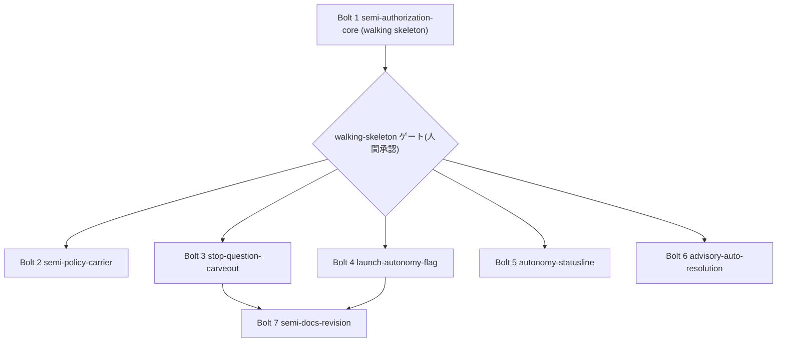

# Bolt Plan — semi 再定義と `--autonomy` 起動宣言(#2253)

上流入力(consumes 全数): requirements.md, components.md, unit-of-work.md, unit-of-work-dependency.md, unit-of-work-story-map.md, stories.md(不在), mockups(不在), team-practices(= `amadeus/spaces/default/memory/team.md`)

本文書は上記を次のとおり実参照する。`requirements.md` の C-8(Bolt ごとに PR)/ C-9(walking-skeleton ゲート)/ FR 群の受け入れ基準を各 Bolt の Definition of Done の正本とし(§各 Bolt の定義)、`components.md` の C1〜C18 の所在と推定行数を Bolt の規模欄の転記元とし(§Bolt 一覧)、`unit-of-work.md` の 7 Unit 定義・規模の配分・テスト番号の予約・未確定事項の引き取り表を Bolt と Unit の 1:1 写像の根拠とし(§Bolt と Unit の写像)、`unit-of-work-dependency.md` の yaml edge block・辺の強度注記(hard / soft)・§ファイル交差・§並行開発の機会を Bolt 順序の DAG 制約とし(§DAG 適合の検証・§波の編成)、`unit-of-work-story-map.md` の §Unit 内の実装順序と §Unit を跨ぐ関心を Bolt 内順序の根拠とする(§Bolt 内の実行順序)。

**`stories.md` は存在しない** — user-stories ステージが SKIP のためである(実測: `ls .../inception/user-stories` → `No such file or directory`)。同様に `mockups`(rough-mockups / refined-mockups)の成果物ディレクトリも存在しない。ストーリー相当の単位は `unit-of-work-story-map.md` が定義した「Intent analysis(ゴール G1〜G4)→ FR → Unit」の3層写像を用い、本文書はその Unit を Bolt へ写す。`team-practices` は `amadeus/spaces/default/memory/team.md` を実読し、§ Way of Working(Bolt ごとに PR、工程記録を実装 PR に同乗させない)・`cid:requirements-analysis:parallel-bolts`(同時アクティブ builder は 1 intent あたり最大4)・`cid:code-generation:c2`(worktree 隔離規律)を波の編成に用いた。`org.md` § Walking Skeleton(Bolt 1 は単独・ゲート付き、残り Bolt 実行前にユーザー承認)と § Way of Working(`main` 起点・`main` へスカッシュマージ)を Bolt 1 の実行形態と分岐運用の根拠とする。

---

## 測定 ref と数値の出所

- 本文書の実測値は **worktree HEAD `5ca9b33e5d313a040f8035709f2ccc22fdcc0cb9`**(`git rev-parse HEAD` の出力からの転記)による(`cid:reverse-engineering:measurement-ref-in-artifacts`)。
- 上流 3 成果物の測定 ref は `d5ca7b4c1100ae4bf28eb7810c1f88fb20b8545a` である。両断面の同値性は `git diff --stat d5ca7b4c1 HEAD -- packages/framework/core/ tests/ docs/` が**空出力**(区間 4 commits、患部面無変更 — `git rev-list --count` → `4`)であることで確認した。したがって上流の file:line 引用と行数は本文書でもそのまま成立する(`cid:requirements-analysis:historical-section-cite-check-at-observed`)。
- 既存テスト番号の最大値は **t439**(`ls tests/unit tests/integration tests/smoke tests/e2e | grep -oE '^t[0-9]+' | sed 's/t//' | sort -n | tail -1` → `439`)。`unit-of-work.md` §テスト番号の予約 の t451〜t452 は HEAD でも衝突しない。
- 行数はすべて `unit-of-work.md` §規模の配分 からの転記であり、本ステージで新たな見積りを起こしていない(`cid:requirements-analysis:ledger-count-mechanical-recalc`)。

---

## 採用した順序決定の枠組み

`org.md` § Walking Skeleton と `requirements.md` C-9 により、**walking-skeleton-first を第一原理**とする。walking skeleton 着地後の残り 6 Bolt は **risk-first(Cockburn の walking skeleton × Reinertsen の risk-reduction value)を主・並行機会最大化を従**とするハイブリッドで並べる。WSJF スコアリングは採らない — 7 Unit のうち 6 つは同一 intent の完了条件を分け合う必須単位であり、価値の相対順位で落とす候補が無いため、WSJF の除算が順序を決めない(`risk-and-sequencing-rationale.md` §採用しなかった枠組み に根拠を記す)。

**Bolt 粒度は 1 Unit = 1 Bolt = 1 PR** とする。根拠は `requirements.md` C-8(「複数 Unit・工程記録・無関係リファクタを単一 PR に束ねない」)と `cid:units-generation:c1` (b)(PR 分割は焦点が絞れる範囲で可、束ねる方向は禁止)。したがって Bolt は 7 本になる。

---

## Bolt 一覧

| # | Bolt(= Unit) | 実行形態 | ゲート | 規模(コード / 非コード) | 予約テスト番号 |
| --- | --- | --- | --- | --- | --- |
| 1 | `semi-authorization-core` | **単独**(他 Bolt を起動しない) | **walking-skeleton ゲート**(人間承認・必須) | 237 / テスト 7 行 | t451 / t452 / t453 |
| 2 | `semi-policy-carrier` | 波 A(並行) | 通常の §12a レビュー + PR 承認 | 103 / — | t454 / t455 |
| 3 | `stop-question-carveout` | 波 A(並行) | 同上 | 28 / テスト 13 行 | t456 |
| 4 | `launch-autonomy-flag` | 波 A(並行) | 同上 | 99 / — | t449 / t450 |
| 5 | `autonomy-statusline` | 波 A(並行) | 同上 | 20 / — | t448 |
| 6 | `advisory-auto-resolution` | 波 B(並行) | 同上 | 175 / — | t457 / t458 / t459 |
| 7 | `semi-docs-revision` | 波 B(並行) | 同上 | — / `stage-protocol.md` 9 行 + `docs/` 22 ファイル | t452 |

コード面合計 237 + 103 + 28 + 99 + 20 + 175 = **662**(`unit-of-work.md` §規模の配分 の合計と一致)。非コード 7 + 13 + 9 = **29**。

**同時アクティブ builder**: 波 A は 4(`cid:requirements-analysis:parallel-bolts` の上限ちょうど)、波 B は 2。上限超過は無い。

---

## 波の編成と DAG 適合

<!-- テキスト代替: Bolt 1 を単独で実行し、walking-skeleton ゲート(人間承認)を通す。承認後に波 A として Bolt 2・3・4・5 を並行実行する。波 A の全 PR が main へ着地した後、波 B として Bolt 6 と Bolt 7 を並行実行する。Bolt 7 は Bolt 1・3・4 の着地を必要とし(DAG の semi-docs-revision → core / stop / flag の3辺)、Bolt 6 は Bolt 1 の着地のみを必要とする(DAG では波 A に置くこともできるが、後述のファイル交差の制御により波 B へ置いた)。矢印は「先に必要なもの → それを必要とするもの」を表す。 -->

### DAG 適合の検証(`unit-of-work-dependency.md` の yaml edge block との照合)

| 宣言された辺(depends_on) | 強度 | 本計画での充足 |
| --- | --- | --- |
| `semi-policy-carrier` → `semi-authorization-core` | hard | Bolt 2 は Bolt 1 着地後(波 A)。充足 |
| `stop-question-carveout` → `semi-authorization-core` | soft | Bolt 3 は Bolt 1 着地後(波 A)。充足 |
| `advisory-auto-resolution` → `semi-authorization-core` | hard | Bolt 6 は Bolt 1 着地後(波 B)。充足 |
| `semi-docs-revision` → `semi-authorization-core` | soft | Bolt 7 は Bolt 1 着地後(波 B)。充足 |
| `semi-docs-revision` → `stop-question-carveout` | soft | Bolt 7 は Bolt 3(波 A)着地後。充足 |
| `semi-docs-revision` → `launch-autonomy-flag` | soft | Bolt 7 は Bolt 4(波 A)着地後。充足 |
| `launch-autonomy-flag` / `autonomy-statusline` は入次数ゼロ | — | Bolt 4 / Bolt 5 は Bolt 1 の完了を**技術的には**待たないが、`org.md` § Walking Skeleton の「Bolt 1 は単独・ゲート付き」により波 A へ置く。これは DAG 違反ではなく DAG が許す順序の中での選択である |

**トポロジ順からの逸脱は 1 件**:`advisory-auto-resolution` は DAG 上は波 A に置ける(依存は Bolt 1 のみ)が、波 B へ後置した。根拠は `unit-of-work-dependency.md` §ファイル交差 が「`amadeus-orchestrate.ts` は依存辺の無い 2 Unit が同一ファイルを触る唯一の組」と実測し、後着側に実 diff での再評価と `tests/.coverage-patch-allowlist.json` の機械 remap を課していることである。詳細な正当化は `risk-and-sequencing-rationale.md` §トポロジ順からの逸脱 に記す。

---

## Bolt と Unit の写像

1 Bolt = 1 Unit の全単射であり、束ねも分割も無い(`requirements.md` C-8)。`unit-of-work.md` §Unit 一覧 の 7 Unit がそのまま Bolt 1〜7 に対応する。Unit を跨ぐ受け入れ確認(`unit-of-work-story-map.md` §Unit を跨ぐ関心)は、各 Bolt の Definition of Done に「自 Bolt が守る面」として分解して載せた。

---

## 各 Bolt の定義

### Bolt 1 — `semi-authorization-core`(walking skeleton)

- **含む Unit**: `semi-authorization-core`(C1〜C7 + C8 の読み側 + FR-PIN-1)
- **walking skeleton か**: **はい**。証明する層は `unit-of-work-dependency.md` §walking skeleton 候補 の実測どおり、S5(本番結線)→ S3(`decide`)→ S1(`authorizeInteraction`)→ S2(`resolveAutoDecision`)→ S3(`applySemiDecision`)→ S4(監査 journal の `AUTO_DECIDED` + `WORKFLOW_EFFECT_APPLIED`)→ S11(unreviewed queue、無改訂)の 7 層である。認可・裁定・効果適用・永続化・検収受け皿を 1 スライスで貫く。
- **Definition of Done**: FR-AUTH-1 / FR-AUTH-2 / FR-AUTH-3 / FR-LAD-1 / FR-LAD-2 / FR-LAD-3 / FR-LAD-4 / FR-LAD-5 / FR-PIN-1 の受け入れ基準がすべて green。加えて (a) `semi-mode-gate` が削除され併存していないこと(`requirements.md` C-7)(b) FR-AUTH-2 の落ちる実証を `resolveAutoDecision` の**直接呼び出しテスト**で行ったこと(`unit-of-work.md` §未確定事項の引き取り 項目 B)(c) U-4 / D の 2 キー棚卸し(識別子と展開後リテラル)を実施したこと (d) `tests/.coverage-patch-allowlist.json` の機械 remap と span 膨張検査(`cid:code-generation:c1-allowlist-mechanical-remap` / `cid:code-generation:cg-allowlist-straddle-swell`)(e) NFR-5(`bun run build` 後に追跡ファイル不変)と NFR-7(PR CI のブロッキング検査集合)が green。
- **確信仮説(出荷が証明すること)**: 「semi の質問 1 件が `human-required` に落ちず、梯子を 1〜4 段(norm / history / solo-election / agent-recommendation)のいずれかで解決し、`AUTO_DECIDED` として記録され、後段 2 段由来なら `unreviewed` として `--status` の `Unreviewed:` 行へ計上される」。**0 段目(confirmed-policy)の解決は本 Bolt では証明しない** — 方針の書き手が Bolt 2 のためであり、`unit-of-work-dependency.md` §walking skeleton 候補 の「正確な射程」と一致する。誇張しない。
- **期待デモ**: semi mode の Intent で question occurrence を 1 件発生させ、(1) 認可が `human-required` でないこと (2) 監査 journal に basisKind 付き `AUTO_DECIDED` が 1 件積まれること (3) `walking-skeleton` occurrence は引き続き `human-required` であることの 3 点を並べて示す。
- **ゲート**: **walking-skeleton ゲート**。`org.md` § Walking Skeleton により本 Bolt は単独実行し、波 A の起動前に人間の明示承認を要する。`amadeus-state.md` の `Construction Autonomy Mode` は `autonomous`(実測)だが、常任グラント・autonomous 設定は walking-skeleton ゲートを認可しない(`project.md` Forbidden「walking-skeleton stance が有効なとき、standing grant に walking-skeleton gate を認可させない」)。

### Bolt 2 — `semi-policy-carrier`

- **含む Unit**: `semi-policy-carrier`(C8 の書き側 / C9 / C10 / C15)
- **walking skeleton か**: いいえ。
- **Definition of Done**: FR-POL-1 / FR-POL-2 / FR-POL-3 / FR-DISP-2 の受け入れ基準が green。U-1(非 full の `confirmedDisplayDigest` 照合点を `planHumanAutonomyCommand` の分岐へ加えるか)を functional-design で確定していること。`projection.semiPolicies` の直読を作らず読み口が `semiPoliciesOf` の 1 本に閉じていること(ADR-4 Consequences、件数取得の `.length` にも例外を設けない)。FR-POL-3 の落ちる実証(loud 化を外すと赤)を 1 セットで実施。
- **確信仮説**: 「`amadeus-bolt set-autonomy --mode semi --policies-file <json>` が方針を運び、semi の質問が梯子 **0 段目(confirmed-policy)** で決定的に解決される。`--status` の `Policies:` 行が grant 不在でも実数を表示する」。Bolt 1 が空振りさせた 0 段目を埋めることが、本 Bolt が固有に証明する事実である。
- **期待デモ**: policies を 1 件設定した semi Intent で、同一の質問が Bolt 1 のときと異なり basisKind `confirmed-policy` で解決されることを並べて示し、`--status` が `Policies: 1` を表示する。

### Bolt 3 — `stop-question-carveout`

- **含む Unit**: `stop-question-carveout`(C11 + FR-PIN-2)
- **walking skeleton か**: いいえ。
- **Definition of Done**: FR-STOP-1 / FR-STOP-2 / FR-PIN-2 の受け入れ基準が green。`:422` のみが semi へ開き、`:457` / `:716` は full 限定を維持することの両方を同一テスト実行で示す。FR-STOP-1 受け入れ基準 (2) の落ちる実証(述語を無条件共有へ戻すと赤)を 1 セットで実施。`AUTONOMOUS_BLOCK_CAP`(`:153`)と `stopBudgetMode`(`:157-160`)が diff に現れないこと。U-5(述語の最終命名)を確定し、`tests/.coverage-patch-allowlist.json:5268` と `tests/unit/t147-kiro-hook-adapter.test.ts:723` を同期。
- **確信仮説**: 「semi の Intent で質問が pending でも stop hook が走行を切らない。一方 compose gate と conversational stop は従来どおり止まる」。**「phase を完走する」ことは証明しない**(FR-LAD-6 の主張限定)。
- **期待デモ**: semi + blank question で stop hook が継続を許し、同じ状態で compose 経路は従来どおり停止することを対で示す。

### Bolt 4 — `launch-autonomy-flag`

- **含む Unit**: `launch-autonomy-flag`(C12 / C13)
- **walking skeleton か**: いいえ。
- **Definition of Done**: FR-CLI-1 〜 FR-CLI-5 と NFR-3 / NFR-6(1) の受け入れ基準が green。判別子が `modeProvenance.kind === "human-command"` であり state フィールドの有無・値を使っていないこと(ADR-13)。`amadeus-directive.ts:97` / `:606` が diff に現れないこと(C-3)。`READ_ONLY_FLAGS` へ追加していないこと(C-6)。parse 関数本体に新規 FS 呼び出しが 0 件(NFR-3)。FR-CLI-2(4) / FR-CLI-3 / FR-CLI-4 の落ちる実証を 1 セットで実施。allowlist の機械 remap + span 検査。
- **確信仮説**: 「`/amadeus --autonomy semi <自由文>` の一手で走行水準が宣言され、値が intent 自由文へ漏れない。birth 直後(`system-default`)の Intent では初回宣言として受理され、人間が決めた既存 mode は無言で書き換えられない」。
- **期待デモ**: birth 直後の Intent へ `--autonomy semi` を打って 0 exit で mode=semi になること、同 Intent へ `--autonomy full` が非 0 exit で停止し grant が revoke されないことを対で示す。

### Bolt 5 — `autonomy-statusline`

- **含む Unit**: `autonomy-statusline`(C14)
- **walking skeleton か**: いいえ。
- **Definition of Done**: FR-DISP-1 の受け入れ基準が green(`none` / `semi` / `full` の 3 値すべてで語彙を出す)。audit projection を読まないこと(ADR-10)。表示語彙が `--status` の `Autonomy:` 行と同一であること。
- **確信仮説**: 「mode をどの経路で設定したかに関わらず、毎プロンプトの statusline に現在の走行水準が出る」。
- **期待デモ**: 3 mode の state 断面それぞれに対する statusline レンダラの出力を並べる。

### Bolt 6 — `advisory-auto-resolution`

- **含む Unit**: `advisory-auto-resolution`(C16 / C17)
- **walking skeleton か**: いいえ。
- **Definition of Done**: FR-ADV-1 〜 FR-ADV-5 の受け入れ基準が green。FR-ADV-2 の落ちる実証(認可判定を無条件 true に差し替えると赤)を 1 セットで実施。引き取り項目 C(`quality-waiver` が `PROHIBITED_EFFECTS` に収載されていることの assert と、崩れると赤になる実証)。U-3(`withAuditLock` 再入可否)の実測と U-7(`formalCheckRoute` の実行担い手)の確定。**U-2 はユーザー裁定事項であり Bolt 内で単独決定しない**(§先行して起票する裁定事項)。着手時に `amadeus-orchestrate.ts` の実 diff 再評価と allowlist の機械 remap + span 検査。
- **確信仮説**: 「full / semi の Intent で pending advisory が 1 件あっても `next` が `await-advisory-choice` ではなく `run-stage` を返し、選択が `AUTO_DECIDED` として記録される。認可不成立(mode=none / 失効 grant / scope 不一致)では従来どおり人間経路へ戻る」。
- **期待デモ**: 同一の pending advisory に対し、full grant 下では `run-stage` が返り、mode=none では `await-advisory-choice` が返ることを対で示す。

### Bolt 7 — `semi-docs-revision`

- **含む Unit**: `semi-docs-revision`(C18 の docs / protocol 面)
- **walking skeleton か**: いいえ。
- **Definition of Done**: FR-DOC-1 / FR-DOC-2 の受け入れ基準が green。`docs/` 限定の grep で旧 semi 定義が 0 件(記録面である codekb と intent record は対象外 — `cid:requirements-analysis:c1-ac-grep-surface-scope`)。日英 11 対訳ペア = 22 ファイルが同一 PR に含まれること。`stage-protocol.md:105` / `:808` が diff に現れないこと(FR-LAD-5 の保存)。canonical 1 本のみを編集し `bun run build` 後に追跡ファイル不変(C-5 / NFR-5)。「phase を完走する」に相当する記述を書かないこと(FR-LAD-6 の記述面)。引き取り項目 A(`docs/` 22 ファイルの 1 ファイルあたり改訂行数)を functional-design で実測。
- **確信仮説**: 「利用者が読む文書と正本知識が、着地済みの semi の実態(質問が梯子へ載る / 節目は人間 / `--autonomy` が存在する)と一致する」。
- **期待デモ**: 改訂前後の `docs/` 該当箇所の diff と、`docs/` 限定 grep が 0 件を返す出力を並べる。

---

## Bolt 内の実行順序(リスク制御としての順序)

`cid:delivery-planning:intra-bolt-order-as-risk-control` に従い、**作業の都合ではなくリスクの窓を消すための順序**を明示する。該当は 3 Bolt である。

| Bolt | 順序 | これが制御するリスク |
| --- | --- | --- |
| Bolt 1 | `unit-of-work-story-map.md` §`semi-authorization-core` の 1〜6(型 → 認可 → ルーティング → 梯子入口 → 効果適用)を先に置き、**7(FR-PIN-1 の `t431:307-313` 分割・反転)を最後**に置く | ピンを先に反転すると、挙動が着地するまで CI が赤のまま残る。`unit-of-work.md` §テスト・ピンの所属 が「旧仕様ピンは挙動変更と同一の変更でしか green を保てない」と実測したとおり、反転は挙動確定後でなければ assert を書けない |
| Bolt 3 | 述語の分割と呼び出し点 3 箇所への割当 → 落ちる実証(無条件共有へ戻すと赤)→ **FR-PIN-2(`t121:1138-1150` の反転)** → allowlist / t147 の同期 | 同上。加えて落ちる実証を反転より前に置くことで、「反転したから green になった」のか「carve-out が効いて green になった」のかの取り違えを防ぐ |
| Bolt 6 | **(0) base 前進後の `amadeus-orchestrate.ts` 実 diff 再評価と allowlist 機械 remap** → (1) C17(provenance 判別ユニオンと store schema 2)→ (2) C16(resolver)→ (3) `applyPendingAdvisoryGuard` の改訂 → (4) U-3 / U-7 の実測 → (5) FR-ADV-2 の落ちる実証 | (0) を実装より前に置くのは、Bolt 4 が同一ファイルの `:1044-1074` へ行を挿入した後に着手するためである(§波の編成の逸脱)。remap を後回しにすると allowlist の行ピンが別の測定可能行へ無音転位する(`cid:code-generation:allowlist-line-pin-stale` 追補)。(1)→(2) は `unit-of-work-story-map.md` の「1 が receipt の型と受理関数を確定してからでないと 2 が書けない」に従う |

Bolt 2 / 4 / 5 / 7 の内部順序は `unit-of-work-story-map.md` §Unit 内の実装順序 をそのまま採る(型・契約の依存順であり、リスク制御としての追加の並べ替えを要しない)。

---

## 波の実行規律

- **分岐とマージ**: 各 Bolt は `main` を起点とする短命ブランチで実装し、`main` へスカッシュマージする(`org.md` § Way of Working)。ブランチ名は Bolt スラッグ(= Unit 名)に対応させる。
- **worktree 隔離**: 波 A / 波 B の並行実装は `git worktree` 隔離で行い、本線ツリーのブランチ切替で実装しない(`cid:code-generation:solo-bolt-worktree-required`)。割当 worktree 外での git 状態変更は禁止する(`cid:code-generation:c2`)。
- **工程記録の分離**: `amadeus/` ツリーの工程記録は実装 PR に同乗させず、チェックポイントのコミットで本線へ流す(`team.md` § Way of Working)。
- **共有台帳の分散**: `tests/.coverage-patch-allowlist.json` は Bolt 1 / 3 / 4 / 6 の 4 本が触る。各 Bolt が自 PR で機械 remap し、挿入位置を分散する(`cid:code-generation:shared-ledger-insert-collision`)。波内で後にマージされる Bolt は base 前進後に remap をやり直す。
- **PR ごとの収束**: PR 作成後は収束ループ(競合解消 → レビュースレッド → 必須 check)を回し、マージはユーザーの明示承認後に行う(`team.md` `cid:requirements-analysis:no-ai-merge` / `cid:requirements-analysis:pr-converge-loop-required`)。

---

## 先行して起票する裁定事項

`U-2`(ADR-6 の selector に advisory instance を含める設計が生む「梯子 3 段への縮退」が実運用で許容できるか)は、Option B への変更が FR-ADV-1 逐語の改訂に当たるため**エスカレーション正準リスト(4)によりユーザー裁定を要する**(`unit-of-work.md` §未確定事項の引き取り U-2)。裁定のリードタイムを Bolt 6 の着手クリティカルパスに載せないため、**Bolt 1 の walking-skeleton ゲートの場で併せて提示**する。これは Bolt 6 を波 B へ後置したことによる唯一の副作用リスクへの対処であり、根拠は `external-dependency-map.md` §人間の裁定・承認 に記す。

---

## 上流からの逸脱(申告)

1. **`advisory-auto-resolution` を DAG が許す最早の波(波 A)ではなく波 B へ置いた** — ファイル交差の制御。`risk-and-sequencing-rationale.md` §トポロジ順からの逸脱 で正当化する。無申告の逸脱ではない。
2. **入次数ゼロの `launch-autonomy-flag` / `autonomy-statusline` を Bolt 1 と並行させていない** — `org.md` § Walking Skeleton の「Bolt 1 は単独・ゲート付き」に従う。`unit-of-work-dependency.md` §並行開発の機会 が「開始時点で相互独立」と記す 3 Unit のうち 2 つを待たせる選択であり、DAG ではなく walking-skeleton 規範に由来する。
