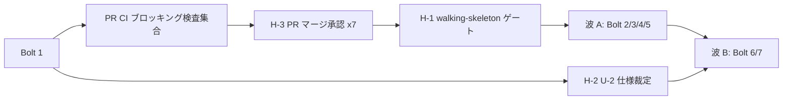

# External Dependency Map — semi 再定義と `--autonomy` 起動宣言(#2253)

上流入力(consumes 全数): requirements.md, components.md, unit-of-work.md, unit-of-work-dependency.md, unit-of-work-story-map.md, stories.md(不在), mockups(不在), team-practices(= `amadeus/spaces/default/memory/team.md`)

本文書は上記を次のとおり実参照する。`requirements.md` の NFR-7(既存ブロッキング検査集合の列挙)と C-10(リリース経路)/ C-9(walking-skeleton ゲート)/ C-5(source-only 境界)をゲート項目の正本とし(§CI・検査ゲート・§人間の裁定・承認)、`unit-of-work-dependency.md` の §統合点と契約(「**非同期・イベント駆動の統合点は 1 つも無い**」「新しいロック・キュー・リトライ・タイムアウトも導入しない」)を外部依存不在の一次根拠とし(§外部サービス依存の不在)、`components.md` の §Reuse Inventory(新設は 5 件、残り 13 は既存機構の改訂)と §変更しないもの を「新しい外部契約を導入しない」ことの根拠とし(§外部サービス依存の不在)、`unit-of-work.md` の §Unit 一覧 の deployment model(`embedded` × 6 / `shared` × 1)を「新しいデプロイ単位が無い」ことの根拠とし(§外部サービス依存の不在)、`unit-of-work-story-map.md` の §Unit を跨ぐ関心 の U-2 行を人間裁定の待ち項目の根拠とする(§人間の裁定・承認)。

**`stories.md` と `mockups` は存在しない**(user-stories / rough-mockups / refined-mockups が SKIP。実測: `ls .../inception/user-stories` → `No such file or directory`)。したがって外部ステークホルダーのレビュー待ち(デザインレビュー・受け入れデモの日程調整など)に相当するゲート項目は存在しない。`team-practices`(`team.md`)からは `cid:requirements-analysis:no-ai-merge`(PR マージは人間の明示承認)・`cid:requirements-analysis:merge-approval-latency`(承認の長期保留は正常系)・`cid:code-generation:local-lcov-pre-push`(coverage の正規判定は PR CI を正とする)を採る。

測定 ref: worktree HEAD `5ca9b33e5d313a040f8035709f2ccc22fdcc0cb9`(`git rev-parse HEAD` の出力からの転記)。

---

## 外部サービス依存の不在(反証可能な根拠)

本 intent の 7 Bolt は、**新しい外部 API・外部データソース・外部チームからの引き渡し・外部ベンダー調達を 1 つも導入しない**。この主張は次の実測と上流の実測に接地している(`cid:approval-handoff:c4` — 存在しない依存を補完せず、N/A には反証可能な根拠を書く)。

| 依存の類型 | 判定 | 反証可能な根拠 |
| --- | --- | --- |
| 外部 API の呼び出し | **N/A** | `unit-of-work-dependency.md` §統合点と契約 の 6 統合点はすべて repo 内(型 / 総関数 / 関数呼び出し / machine-local JSON ファイル / 監査シャード / 文書)であり、同節が逐語で「**非同期・イベント駆動の統合点は 1 つも無い**」「新しいロック・キュー・リトライ・タイムアウトも導入しない」と実測している |
| 外部データの提供待ち | **N/A** | 本 intent が読む状態はすべて intent record 配下(`amadeus-state.md`、監査シャード)と machine-local ファイル(`.amadeus-advisory-choice.json`)である。`unit-of-work-dependency.md` §統合点と契約 の store 行が「machine-local」と明記 |
| 外部チームからの引き渡し | **N/A** | Team Formation が SKIP であり(実測: `ls .../ideation/team-formation` → `No such file or directory`)、実行形態はソロモードである(`team-allocation.md` §実行形態)。引き渡しの相手が存在しない |
| 新しい runtime / ランタイム依存の追加 | **N/A** | `unit-of-work.md` §Unit 一覧 の deployment model は `embedded` × 6 / `shared` × 1 であり、同節の kind 判定根拠が「6 Unit はいずれも `packages/framework/core/` 配下のモジュール改訂であり、単独の runtime を持たない」と述べる。`project.md` Forbidden(配布フレームワークへ runtime dependency を追加しない)にも抵触しない |
| 新しい npm 依存の追加 | **N/A** | `components.md` §Reuse Inventory の新設 5 件(`SemiAuthority` / `DecisionAuthority` / advisory resolver / engine ハンドラ / provenance 型)はすべて repo 内の TypeScript 型・関数であり、外部パッケージを要求しない。同節が既存機構の再利用を 8 項目で棚卸ししている |
| リリース・配布経路の調整 | **N/A** | `requirements.md` C-10 により本 intent の PR はバージョン面に触れない。リリースは `release.yml` の `workflow_dispatch` のみが行い、本 intent の完了条件に含まれない |
| 外部承認(法務・セキュリティレビュー・調達) | **N/A** | `requirements.md` の Constraints にこの類型の項目が無く、`unit-of-work.md` §未確定事項の引き取り の 11 件にも外部組織を待つ項目が無い |

したがって本文書の実質的な内容は、**repo 内で機械的に実行される検査ゲート**と、**人間の裁定・承認**の 2 種に限られる。

---

## CI・検査ゲート(すべての Bolt が消費する)

`requirements.md` NFR-7 が列挙するブロッキング検査集合である。所有者は本リポジトリの GitHub Actions であり、外部組織のリードタイムを持たない。実行される workflow ファイルは HEAD 実測で `ci.yml` / `pbt.yml` / `perf.yml` ほかである(`ls .github/workflows/` の出力からの転記 — `ci.yml`, `issue-labels.yml`, `metrics-backfill.yml`, `metrics-maintenance.yml`, `no-silent-drop-evidence-reconcile.yml`, `pbt.yml`, `perf.yml`, `release.yml`)。

| ゲート | 所有 | ブロックする Bolt | リードタイム | 緩和・回避策 |
| --- | --- | --- | --- | --- |
| `bun run typecheck` / `bun run lint` | PR CI | 全 7 | 分オーダー | 事前ローカル実行 |
| 隔離 2 回ビルドの再現性検査 / `bun run source-only:check` / グラフ不変量検査 | PR CI | 全 7(特に Bolt 7 は C-5 の canonical 1 本編集を検査される) | 分オーダー | `bun run build` 後に追跡ファイル不変を事前確認(NFR-5) |
| `bash tests/run-tests.sh --ci` | PR CI | 全 7 | 分〜十数分 | ベースライン実測で自変更由来と既存赤を切り分ける(R-4) |
| Project Coverage Gate(絶対下限 AND merge-base 相対) / Patch Coverage Gate | PR CI + Codecov | 全 7 | 分オーダー | coverage の正規判定は PR CI を正とする(`cid:code-generation:local-lcov-pre-push`)。UNCOVERED は計測状況の実測 → seam 抽出 → allowlist の順で対処 |
| complexity ゲート | PR CI | 全 7 | 分オーダー | 匿名関数の ordinal 照合により既存関数が偽 NEW_VIOLATION になりうる(`cid:code-generation:complexity-baseline-ordinal`)— 第一手は匿名増ゼロの実装 |
| plugin-conformance-e2e | PR CI | 全 7 | 分オーダー | — |
| `tests/.coverage-patch-allowlist.json` の行ピン整合 | 共有台帳(repo 内) | Bolt 1 / 3 / 4 / 6 | 即時 | 各 PR で機械 remap + span 膨張検査。波内で後にマージされる側は base 前進後にやり直す |

**PR CI が発火しない条件**: PR が `CONFLICTING` の間は `pull_request` CI が発火しない(`cid:code-generation:conflicting-pr-suppresses-ci`)。波 A / 波 B の並行で CI 未発火を観測したら、第一容疑を merge conflict とし `gh pr view --json mergeable` と `git merge-tree` の非破壊プローブで確定する。

---

## 人間の裁定・承認(唯一の不定リードタイム項目)

外部組織ではないが、**待ち時間が計画の外にある**という意味で本計画で唯一のゲート項目である。

| # | 項目 | 誰が | ブロックする Bolt | リードタイム | 緩和 |
| --- | --- | --- | --- | --- | --- |
| H-1 | **walking-skeleton ゲートの承認** | ユーザー | 波 A の全 4 Bolt(Bolt 2〜5) | 不定 | `org.md` § Walking Skeleton により必須。`Construction Autonomy Mode` は `autonomous`(state 実測)だが、常任グラント・autonomous 設定はこのゲートを認可しない(`project.md` Forbidden)。省略も前倒しもしない |
| H-2 | **U-2 の仕様裁定**(ADR-6 の 3 段縮退の許容可否) | ユーザー | Bolt 6(裁定が Option B なら FR-ADV-1 逐語の改訂に及ぶ) | 不定 | **H-1 のゲートで先行提示**し、待ち時間を Bolt 6 の着手クリティカルパスから外す(`bolt-plan.md` §先行して起票する裁定事項)。Bolt 内でも Bolt 間でも単独決定しない(エスカレーション正準リスト(4)) |
| H-3 | **各 PR のマージ承認**(7 本) | ユーザー | 後続波の起動(Bolt 2〜5 の着地が波 B の前提) | 不定 | AI は自発マージしない(`cid:requirements-analysis:no-ai-merge`)。承認の長期保留は正常系として扱い、承認待ちをブロッカー扱いしない(`cid:requirements-analysis:merge-approval-latency`)。承認到着後は head の必須 CI green と mergeable を再実測してからマージ |
| H-4 | **実装逸脱が生じた場合の裁定** | ユーザー(ソロモードでは正準リスト該当分) | 発生した Bolt | 不定 | builder は逸脱をその場で実装せず停止して報告する(`cid:code-generation:deviation-stop-before-implement`)。該当しうる箇所は R-6(U-3 でロック区間が重なった場合の設計変更)/ R-11(Bolt 7 の規模が見積りを大きく超えた場合) |

**H-1 と H-3 の関係**: Bolt 1 の PR マージ承認(H-3 の 1 本目)と walking-skeleton ゲートの承認(H-1)は別の承認である。前者は成果物を `main` へ載せる承認、後者は残り Bolt の実行を開始する承認であり、`cid:requirements-analysis:standing-approval-scope-limit`(常任承認の適用範囲は明示された行為種別に限定し、別種のゲートへ流用しない)により、一方をもって他方の承認とみなさない。

---

## Bolt × ゲートの対応表

| Bolt | 消費する CI ゲート | 消費する人間ゲート |
| --- | --- | --- |
| 1 `semi-authorization-core` | 全 CI ゲート + allowlist remap | H-3(PR マージ)→ **H-1(walking-skeleton)** + H-2 の先行提示 |
| 2 `semi-policy-carrier` | 全 CI ゲート | H-1 の後に着手、H-3 |
| 3 `stop-question-carveout` | 全 CI ゲート + allowlist remap | H-1 の後に着手、H-3 |
| 4 `launch-autonomy-flag` | 全 CI ゲート + allowlist remap | H-1 の後に着手、H-3 |
| 5 `autonomy-statusline` | 全 CI ゲート | H-1 の後に着手、H-3 |
| 6 `advisory-auto-resolution` | 全 CI ゲート + allowlist remap(base 前進後の再評価込み) | 波 A 着地後に着手、H-2 の裁定を前提、H-3 |
| 7 `semi-docs-revision` | 全 CI ゲート(特に source-only 境界と再現性検査) | Bolt 1 / 3 / 4 の着地後に着手、H-3 |

---

## 依存グラフ(ゲート視点)

<!-- テキスト代替: Bolt 1 は PR CI のブロッキング検査集合を通り、PR マージ承認(H-3)を経て main へ着地する。その後 walking-skeleton ゲート(H-1)の承認により波 A(Bolt 2/3/4/5)が起動する。U-2 の仕様裁定(H-2)は Bolt 1 のゲートの場で先行提示され、波 B の Bolt 6 の前提となる。波 A の全 Bolt が着地した後に波 B(Bolt 6/7)が起動する。CI ゲートは図では Bolt 1 の経路のみ描いているが、実際には全 7 Bolt が同じ集合を消費する(§Bolt × ゲートの対応表)。 -->

---

## 未確定として残す項目

外部依存に関する未確定は **0 件**である。`unit-of-work.md` §未確定事項の引き取り の 11 件はすべて repo 内の設計・実装判断(U-1 / U-3 〜 U-7 / A 〜 D)またはユーザー裁定(U-2 = 本文書の H-2)であり、外部組織の応答を待つ項目は含まれない。この判定は同表の「引き取る Unit」列がすべて本 intent の Unit で埋まっていることに接地している。
