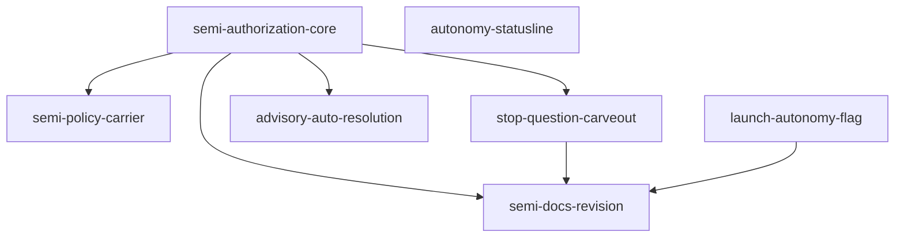

# Unit of Work Dependency — semi 再定義と `--autonomy` 起動宣言(#2253)

上流入力(consumes 全数): components.md, component-methods.md, services.md, component-dependency.md, decisions.md, requirements.md

本文書は上記6成果物を次のとおり実参照する。`component-dependency.md` の §依存マトリクス・§層構造・§ファイル単位の交差判定・§Unit 分割の示唆 を辺の一次根拠とし(§依存の根拠・§ファイル交差)、`components.md` の C1〜C18 の所在と充足 FR を Unit 間の辺の写像に用い(§依存の根拠)、`component-methods.md` のシグネチャと型の依存(`DecisionAuthority` / `SemiAuthority` / `AdvisoryChoiceProvenance`)を統合点の契約とし(§統合点と契約)、`services.md` の論理サービス S1〜S11 と §サービス間通信の契約 を統合面の分類根拠とし(§統合点と契約)、`decisions.md` の ADR-1 / ADR-4 / ADR-8 / ADR-9 / ADR-11 / ADR-13 を辺の有無の裁定根拠とし(§依存の根拠・§依存しない辺)、`requirements.md` の FR-ADV-1(P7 は P1/P2 に依存)・C-8・C-9 を境界制約とする。`stories.md` は user-stories ステージが SKIP のため存在しない。

本文書は**トポロジのみ**を記述する。単一の推奨ビルド順序の提示や critical path の特定は行わない — それは Stage 2.8 Delivery Planning が本 DAG を入力として行う経済判断である。

測定 ref: worktree HEAD `d5ca7b4c1100ae4bf28eb7810c1f88fb20b8545a`(`git rev-parse HEAD` の出力からの転記)。Unit 名と行数は `unit-of-work.md` の定義に従う。

---

## 依存 DAG(機械可読)

```yaml
units:
  - name: semi-authorization-core
    kind: library
    depends_on: []
  - name: semi-policy-carrier
    kind: library
    depends_on: [semi-authorization-core]
  - name: stop-question-carveout
    kind: library
    depends_on: [semi-authorization-core]
  - name: advisory-auto-resolution
    kind: library
    depends_on: [semi-authorization-core]
  - name: launch-autonomy-flag
    kind: library
    depends_on: []
  - name: autonomy-statusline
    kind: library
    depends_on: []
  - name: semi-docs-revision
    kind: spec
    depends_on: [semi-authorization-core, stop-question-carveout, launch-autonomy-flag]
```

テキスト代替: 根は3つ — `semi-authorization-core`、`launch-autonomy-flag`、`autonomy-statusline`(いずれも依存なし)。`semi-policy-carrier`、`stop-question-carveout`、`advisory-auto-resolution` の3つはそれぞれ `semi-authorization-core` に依存する(相互には依存しない)。`semi-docs-revision` は `semi-authorization-core`・`stop-question-carveout`・`launch-autonomy-flag` の3つに依存する。自己依存はなく、循環もない。



<!-- Text fallback: semi-authorization-core から semi-policy-carrier、stop-question-carveout、advisory-auto-resolution、semi-docs-revision へ辺が出る。stop-question-carveout から semi-docs-revision へ、launch-autonomy-flag から semi-docs-revision へも辺が出る。autonomy-statusline は入次数も出次数もゼロの孤立ノードである。矢印の向きは「依存先 → 依存元」ではなく「先に必要なもの → それを必要とするもの」であり、yaml の depends_on と同じ関係を逆向きの矢印で描いている。 -->

**非循環の確認**: 入次数ゼロのノード集合 {`semi-authorization-core`, `launch-autonomy-flag`, `autonomy-statusline`} を除去すると {`semi-policy-carrier`, `stop-question-carveout`, `advisory-auto-resolution`} が入次数ゼロになり、さらに除去すると `semi-docs-revision` が残って入次数ゼロになる。全ノードが除去できるため循環は存在しない(Kahn のアルゴリズムによる机上トレース)。`depends_on` に現れる名前はすべて宣言済み Unit 名であり、自己参照は無い。

---

## 依存の根拠(辺ごと)

| 辺(depends_on) | 一次根拠 | 型・機構の実体 |
| --- | --- | --- |
| `semi-policy-carrier` → `semi-authorization-core` | `component-dependency.md` §Unit 分割の示唆 の U-B 依存理由「U-A(confirmed-policy 段が動く前提)」。加えて `unit-of-work.md` §分割の検証 の差分 1 が `AutonomyProjection.semiPolicies?` のフィールド宣言と総関数 `semiPoliciesOf` を core 側に置くと決めている | `semi-policy-carrier` の C8 書き側(`planHumanAutonomyCommand` が `after.semiPolicies` を設定 — `component-methods.md` §C8 の表)は core が宣言した任意フィールドへ書く。C15 の `policyCount` も `semiPoliciesOf(projection)` を読む(ADR-4 Consequences) |
| `stop-question-carveout` → `semi-authorization-core` | `component-dependency.md` §Unit 分割の示唆 の U-C 依存理由「semi が質問を裁定できて初めて carve-out に意味が出る」 | carve-out 述語は `readProductionAutonomyProjection` の `modeProvenance.kind` を読む(`component-methods.md` §C11 の判定表)。core が semi の質問裁定を成立させていないと、hook が止めなくても質問が解決されず走行が進まない |
| `advisory-auto-resolution` → `semi-authorization-core` | `requirements.md` FR-ADV-1(「autonomy 認可を通し、full/semi では梯子で選択肢を決める」)と `intent-backlog.md` シーケンシング(「P7 は P1/P2 の認可基体と質問解決コアに依存する」) | C16 は `commitProductionQuestionDecision`(`amadeus-intent-autonomy-production.ts:524`)を再利用し、その内部で `authorizeInteraction` → `selectDecision` → `resolveAutoDecision` を通る。semi での受理は core の `SemiAuthority` 経路が無いと成立しない。`component-dependency.md` の依存マトリクスでも C16 → C6 の辺が実在する |
| `semi-docs-revision` → `semi-authorization-core` | `requirements.md` FR-DOC-2 が `stage-protocol.md:33`(semi の phase 境界と auto-approve 手順)と `:131`(semi の正本1行定義)の**反転**を求める。反転後の記述が正しくなるのは core の意味論が着地した後である | 記述内容が core の挙動そのもの |
| `semi-docs-revision` → `stop-question-carveout` | `requirements.md` FR-LAD-6(走行単位の主張の限定 — 「質問で止まらない」)の docs 面。走行が質問で止まらない事実は hook の carve-out が着地して初めて成立する | `components.md` C18 の充足 FR に FR-LAD-6(docs へ「phase を完走する」と書かないこと)が挙がっている |
| `semi-docs-revision` → `launch-autonomy-flag` | `requirements.md` FR-DOC-2 が `stage-protocol.md:125` を「起動フラグ追加に伴い同期する」と規定する | `--autonomy` の CLI 契約が docs の記述対象になる |

### 辺の強度の注記(hard = 型・コンパイル結合 / soft = 意味論)

- **hard**: `semi-policy-carrier` → `semi-authorization-core`(`semiPolicies?` フィールド宣言と `semiPoliciesOf` が core に無いと型が通らない)/ `advisory-auto-resolution` → `semi-authorization-core`(`commitProductionQuestionDecision` 経由で `DecisionAuthority` に間接依存)
- **soft**: `stop-question-carveout` → `semi-authorization-core`(carve-out 述語は既存 `readProductionAutonomyProjection` と `modeProvenance` のみを読み core の新設型を参照しない — 意味が出るのは core 着地後、という意味論的依存)/ `semi-docs-revision` → 3 Unit(docs は実装着地後に書くという順序依存)。delivery-planning は soft 辺を並行機会として扱ってよい(§12a iteration 1 指摘)

### 依存しない辺(不在の根拠)

| 想定されうる辺 | 不在の根拠 |
| --- | --- |
| `semi-authorization-core` → `semi-policy-carrier`(逆向き) | ADR-4 が `semiPolicies` を**任意フィールド**と定め、不在を「方針ゼロ」= 梯子 0 段目の縮退という**正当なドメイン状態**として扱う(ADR-4 §「これは互換シムではない」の根拠 3)。core は書き手の存在を前提にしない。したがって逆向きの辺は生じず、循環にもならない |
| `launch-autonomy-flag` → `semi-authorization-core` | ADR-8 Decision「engine が持つのは判定と委譲のみで、書込は既存 `applyProductionAutonomyMode` が独占する」。C13 は既存経路へ委譲し、`SemiAuthority` / `DecisionAuthority` を参照しない。値域は既存 `AutonomyMode`(`amadeus-intent-autonomy.ts:11`、verbatim `export type AutonomyMode = "none" | "semi" | "full";`)であり新設型ではない |
| `launch-autonomy-flag` → `autonomy-statusline`(および逆向き) | ADR-10 により statusline は state ファイルの `Intent Autonomy Mode` を読む。このフィールドは Intent の birth 時点で必ず書かれる(`amadeus-utility.ts:4635` verbatim `- **Intent Autonomy Mode**: none` — `components.md` §C14〜C15 の実測)ため、statusline は `--autonomy` の着地を待たない |
| `launch-autonomy-flag` → `semi-policy-carrier` | 上流 `component-dependency.md:29` は C13 → C9 の辺を持つが、Unit 間の辺としては不要 — C13 の呼び出しは既存 `applyProductionAutonomyMode` に対するもので、`semi-policy-carrier` が `policies` 引数を足しても既定値(空配列)で成立する(`component-methods.md:323` の `prepareNonFullCommand(before, input.mode, normalized)` — `policies` の供給元は既存 `normalized` であり carrier の着地を待たない)。上流マトリクスの辺の消去にあたるため本行で申告する(§12a iteration 1 指摘) |
| `autonomy-statusline` → 任意 | `component-dependency.md` の依存マトリクスで C14 の行・列がともに空。§ファイル単位の交差判定 も `amadeus-statusline.ts` (325) を「**独立**」と分類 |
| `advisory-auto-resolution` → `semi-policy-carrier` | C16 は方針を読まない。梯子 0 段目の解決可否は advisory の裁定結果に影響するが、ADR-6 により advisory の `selector` は毎回異なる(`advisoryInstance` = `randomUUID()`)ため confirmed-policy 段は構造的に一致せず、方針の有無に依存しない(ADR-6 Consequences「advisory の裁定は実効的に3段」) |
| `semi-docs-revision` → `semi-policy-carrier` / `autonomy-statusline` / `advisory-auto-resolution` | FR-DOC-1 / FR-DOC-2 が名指す改訂対象は semi の**意味論定義**と起動フラグである。方針の担体・statusline セグメント・advisory 経路は semi の定義文を変えない。ただし本 DAG は `semi-docs-revision` を最後に置くことも許容する(トポロジは順序を1つに固定しない)ため、delivery-planning が docs を一括で最後に流す判断を取ることを妨げない |

---

## 統合点と契約

| 統合点 | 種別 | 提供側 Unit | 消費側 Unit | 契約 |
| --- | --- | --- | --- | --- |
| `AutonomyProjection.semiPolicies?` + `semiPoliciesOf` | 型 + 総関数(同期・純関数) | `semi-authorization-core` | `semi-policy-carrier` | 任意フィールド。読み口は `semiPoliciesOf` の1本に閉じ、直読を作らない(ADR-4 Consequences)。不変条件は片方向(`semiPolicies` が存在するなら `mode === "semi"`) |
| `SemiAuthority` / `DecisionAuthority` | 型(同期・純関数層 S1/S2) | `semi-authorization-core` | `advisory-auto-resolution`(間接 — `commitProductionQuestionDecision` 経由) | `component-methods.md` §C1 / §C2 のシグネチャ。`decisionAuthorityOf` はオーバーロード2本(内部呼び出しは非 null、公開境界は `\| null`) |
| `readProductionAutonomyProjection` | 読み取り専用の関数呼び出し(同期、監査イベントを生まない) | 既存(S5、無改訂) | `stop-question-carveout` / `launch-autonomy-flag` | `services.md` §サービス間通信の契約 の「P4 / P5 → state ファイル」行。読取のみで書込は行わない |
| `applyProductionAutonomyMode` | 関数呼び出し(同期、書込を独占) | 既存(S5、`semi-policy-carrier` が引数を拡張) | `launch-autonomy-flag` | ADR-8 により engine は第2の書込経路を作らない。`semi-policy-carrier` が `policies` 引数を足しても C13 の呼び出しは既定値(空配列)で成立する |
| `AdvisoryChoiceProvenance` + store `schema: 2` | JSON ファイル(`.amadeus-advisory-choice.json`、machine-local) | `advisory-auto-resolution` | 同 Unit 内(C16 が書き、C17 が受理) | ADR-9 により schema 1 は既存 fail-closed 経路で hold になる。Unit を跨がない |
| 監査 journal(`AUTO_DECIDED` / `WORKFLOW_EFFECT_APPLIED`) | append-only シャード(`withAuditLock` で直列化) | `semi-authorization-core` | `advisory-auto-resolution`(`decisionId` の実在照会)/ 既存 S11 未レビュー queue(無改訂) | `services.md` §共有リソース。イベント種別は増やさない |
| `stage-protocol.md` / `docs/` | 文書(その場で消費される契約) | `semi-docs-revision` | 全 Unit の利用者 | C-5 により canonical 1 本のみを編集。`:105` / `:808` は保存(FR-DOC-2) |

**非同期・イベント駆動の統合点は1つも無い**(`services.md` §オーケストレーション「本設計はこれに1つも新しい制御反転を導入しない」)。新しいロック・キュー・リトライ・タイムアウトも導入しない。

---

## ファイル交差(並行実装時の実務上の注意)

`component-dependency.md` §ファイル単位の交差判定 の 11 ファイル表を Unit 粒度へ写像したもの。交差判定は着手前に**実 diff で再評価**するのが規範であり(`cid:code-generation:c6`)、本表は当たりを付けるための静的目録である。

| ファイル(行数は上流実測) | 触る Unit | 交差 |
| --- | --- | --- |
| `core/tools/amadeus-intent-autonomy.ts` (961) | `semi-authorization-core`(C1〜C5、C8読)/ `semi-policy-carrier`(C8書) | 依存辺があるため直列。並行しない |
| `core/tools/amadeus-intent-autonomy-runtime.ts` (800) | `semi-authorization-core`(C6 / C7)/ `semi-policy-carrier`(C15 の envelope) | 同上 |
| `core/tools/amadeus-intent-autonomy-production.ts` (900) | `semi-authorization-core`(ADR-3 が裁定した production 層の `SemiAuthorityScope` 組み立て結線 — `fallbackFingerprints` を export し `SemiAuthority.of(projection, scope)` へ渡す。C1〜C18 の列挙に現れない上流欠落を §12a iteration 1 指摘で core 所属と確定。行数は core の 237 行見積りの内数)/ `semi-policy-carrier`(C9) | **core + carrier(依存辺 carrier → core により直列)。並行しない** |
| `core/tools/amadeus-bolt.ts` (1312) | `semi-policy-carrier`(C10) | 単独 |
| `core/tools/amadeus-utility.ts` (6327) | `semi-policy-carrier`(C15 の1行) | 単独 |
| `core/hooks/amadeus-stop.ts` (1020) | `stop-question-carveout`(C11) | 単独・独立 |
| `core/hooks/amadeus-statusline.ts` (325) | `autonomy-statusline`(C14) | 単独・独立 |
| `core/tools/amadeus-orchestrate.ts` (5544) | `launch-autonomy-flag`(`:1044-1074` + `handleNext`)/ `advisory-auto-resolution`(`:781-800`) | **依存辺の無い 2 Unit が同一ファイルを触る唯一の組**。領域は離れている(`:781-800` と `:1044-1074`)ため textual conflict は起きにくいが、後着側は base 前進後に実 diff で再評価し、`tests/.coverage-patch-allowlist.json` の行ピンを機械 remap する(§未確定事項 U-6、`cid:code-generation:c1-allowlist-mechanical-remap` / `cid:code-generation:cg-allowlist-straddle-swell`) |
| `core/tools/amadeus-advisory-choice.ts` | `advisory-auto-resolution`(C16 / C17) | 単独(Unit 内では高交差) |
| `core/tools/amadeus-directive.ts` | — | **無改訂**(C-3)。`:97` / `:606` はどの Unit の diff にも現れない |
| `core/tools/amadeus-intent-autonomy-replay.ts` (175) | — | **無改訂**(ADR-4) |
| `tests/unit/t431-intent-autonomy.test.ts` | `semi-authorization-core`(FR-PIN-1)/ `semi-policy-carrier`(`set-mode` への `policies` 追加が既存呼び出し点の型を変える) | 依存辺があるため直列 |
| `tests/integration/t121-stop-hook-enforce.test.ts` | `stop-question-carveout`(FR-PIN-2) | 単独 |
| `tests/.coverage-patch-allowlist.json` | 行を挿入する 4 Unit(`semi-authorization-core` / `stop-question-carveout` / `launch-autonomy-flag` / `advisory-auto-resolution`) | **共有台帳**。各 Unit が自 PR で remap し、`cid:code-generation:shared-ledger-insert-collision` に従って挿入位置を分散する |
| `docs/`(22 ファイル)/ `core/amadeus-common/protocols/stage-protocol.md` | `semi-docs-revision` | 単独 |

---

## 並行開発の機会

依存辺を持たない Unit の集合(複数の妥当な topological order が存在する。どれを選ぶかは 2.8 の経済判断であり、本文書は選ばない):

- **開始時点で相互独立**: `semi-authorization-core` / `launch-autonomy-flag` / `autonomy-statusline` の3つ。ファイル交差は `launch-autonomy-flag` と `advisory-auto-resolution` の組のみ(§ファイル交差)であり、この3つの間には交差が無い。
- **`semi-authorization-core` 着地後に相互独立**: `semi-policy-carrier` / `stop-question-carveout` / `advisory-auto-resolution` の3つ。触るファイルは互いに素である(`amadeus-intent-autonomy*.ts` + `amadeus-bolt.ts` + `amadeus-utility.ts` / `amadeus-stop.ts` / `amadeus-advisory-choice.ts` + `amadeus-orchestrate.ts:781-800`)。
- **最後まで独立**: `autonomy-statusline` は全 Unit と非交差であり、任意の時点で並行できる。
- **合流点**: `semi-docs-revision` は入次数 3 の唯一の合流ノードである。

並行実装の実施形態(worktree 隔離・同時アクティブ builder の上限)は team.md の `cid:requirements-analysis:parallel-bolts`(1 intent あたり最大4)と `cid:code-generation:c2` の隔離規律に従い、本文書は規定しない。

---

## walking skeleton 候補

`requirements.md` C-9(scope は `self-feature`、最初の Construction Bolt に walking-skeleton ゲートを維持)と `intent-backlog.md` シーケンシング(「walking skeleton 候補は P2 の最小スライス — semi 質問1件が**5段**で解決されるエンドツーエンド」)に対応する Unit は **`semi-authorization-core`** である。`component-dependency.md` §Unit 分割の示唆 も U-A を walking skeleton 候補と名指している。

**この Unit がエンドツーエンドである根拠**: `services.md` §semi の質問裁定シーケンス の全経路 — S5(本番結線)→ S3(`decide`)→ S1(`authorizeInteraction`、C3)→ S2(`resolveAutoDecision`、C4)→ S3(`applySemiDecision`、C7)→ S4(監査 journal へ `AUTO_DECIDED` + `WORKFLOW_EFFECT_APPLIED`)→ S11(unreviewed queue、無改訂)— を1本通す。認可・裁定・効果適用・永続化・検収受け皿のすべての層を1スライスで貫く。

**正確な射程**(誇張を避けるための明示): この Unit のみが着地した時点で成立するのは「semi の質問1件が梯子の全5段を**順に降り**、1〜4 段(norm / history / solo-election / agent-recommendation)のいずれかで解決される」ところまでである。**0 段目(confirmed-policy)での解決には `semi-policy-carrier` が要る** — 方針の書き手がいないため `semiPoliciesOf` が `[]` を返し 0 段目が空振りするからである(ADR-4 の縮退)。骨格としてはこれで足り、`requirements.md` FR-LAD-4 の受け入れ基準(1)「confirmed-policy が無い場合に norm→history→solo-election→agent-recommendation の順に降りる」がまさにこの状態を検収対象にしている。

---

## 上流トレーサビリティ

| 上流の主張 | 本 DAG での扱い |
| --- | --- |
| `component-dependency.md` §Unit 分割の示唆 の U-A〜U-G(7 候補) | 7 Unit として確定。差分は2点のみで `unit-of-work.md` §分割の検証 に申告済み(C8 の読み/書き分割、テストピンの移設) |
| 同 「U-D / U-E は U-A と非交差であり並行実装できる」 | `launch-autonomy-flag` / `autonomy-statusline` を入次数ゼロの根として保存 |
| 同 「U-F は U-A に依存する」 | `advisory-auto-resolution` → `semi-authorization-core` の辺として保存 |
| 同 「U-G は U-A / U-C に依存」 | `semi-docs-revision` → {`semi-authorization-core`, `stop-question-carveout`} を保存し、FR-DOC-2 の `:125`(起動フラグ同期)を根拠に `launch-autonomy-flag` への辺を**追加**した |
| `requirements.md` FR-ADV-1 / `intent-backlog.md` 「P7 は P1/P2 に依存」 | `advisory-auto-resolution` の唯一の依存辺として反映(P1 と P2 はいずれも `semi-authorization-core` に統合されているため辺は1本になる) |
| `intent-backlog.md` シーケンシング「P1 → P2 → (P3, P4, P7 並行可) → P5 → P6」 | トポロジとして矛盾しない。ただし本 DAG は P4(`launch-autonomy-flag`)と P5 の statusline 面(`autonomy-statusline`)を**根**に置く点でより広い並行機会を許す — 依存の実体(ADR-8 / ADR-10)が P1/P2 への依存を要求しないためである。順序の選択は 2.8 が行う |
| `components.md` §コンポーネント一覧 「6〜7 Unit へ分割できる粒度」 | 7 Unit(コード面 6 + spec 面 1) |
