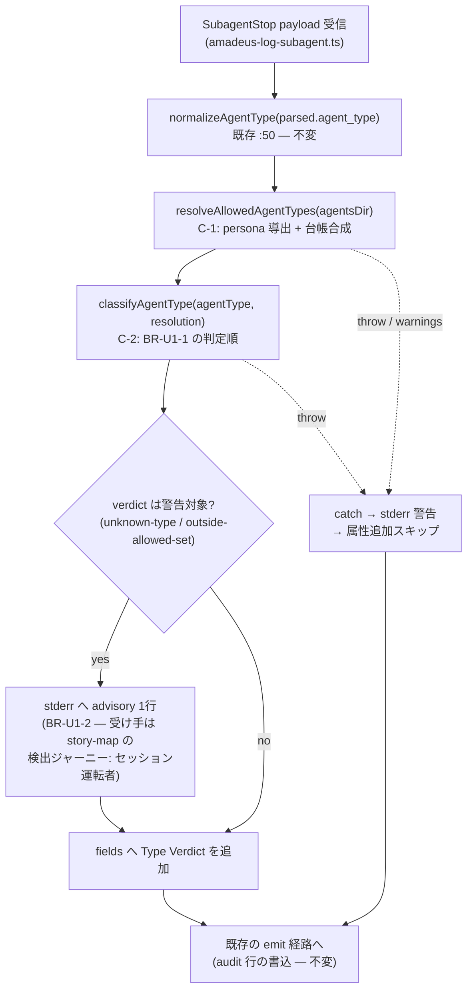

# U1 detection-skeleton — Business Logic Model

**上流入力(consumes 全数)**: `component-methods`(シグネチャ正本)/ `components`(責務境界)/ `requirements`(FR-1/2 のフロー)/ `unit-of-work`(範囲)/ `unit-of-work-story-map`(検出ジャーニー)/ `services`(実行単位とタイミング)

**測定 ref**: observed `7060956c5617125dd2f4e284957aa180cb306484`

## 処理フロー(completed 面 — U1 の全経路)



テキスト補足(fallback): payload → normalize(既存)→ 許可集合解決(C-1)→ verdict 分類(C-2)→ 警告対象なら stderr advisory(unit-of-work-story-map の検出ジャーニーが定める受け手 = セッションを運転する人間への即時シグナル)→ `Type Verdict` 属性追加 → 既存 emit。C-1/C-2 のどの失敗も X 経路(catch → 警告 → スキップ)で H(emit 継続)へ合流する — emit に到達しない経路は存在しない(BR-U1-3)。

## モジュール構成と依存方向

```text
amadeus-subagent-observability.ts(新設・下位)
  ├─ BUILTIN_AGENT_TYPES(C-4)
  ├─ resolveAllowedAgentTypes(C-1)… node:fs のみ依存
  └─ classifyAgentType(C-2)… 依存なし(純関数)
        ↑ import
core/hooks/amadeus-log-subagent.ts(既存・上位)… U1 で差し込み
core/otel/event-registry.ts … SUBAGENT_COMPLETED optional に "Type Verdict"(BR-U1-5)
```

新設モジュールは `amadeus-lib.ts` を import しない(循環回避 — component-dependency の設計拘束)。

## 状態

本 Unit は状態を持たない — 全関数が純関数または冪等な読取(dir 読取は hook 発火ごと、キャッシュなし)。audit 行が唯一の永続出力で、既存の append-only 経路に optional 属性を1つ足すだけ。

## エラーモデル

| 異常 | 分類 | 挙動 |
|---|---|---|
| agents dir 不在・読取失敗 | 回復可能(環境差) | warnings に積み stderr へ — 台帳のみで照合続行(fail-open) |
| frontmatter に name 無し | 回復可能(データ) | 当該ファイルを skip し warnings へ |
| 分類・属性組立の予期せぬ throw | defect | catch → stderr 警告 → 属性スキップ → emit 継続(BR-U1-3)。無音失敗にしない |

## Review — Iteration 2

- **Verdict:** READY
- **Reviewer:** amadeus-architecture-reviewer-agent
- **Date:** 2026-08-05T22:20:04Z
- **Iteration:** 2
- **Scope decision:** none

iteration 1 の BLOCKER(AD 正本に無い personaNames フィールドの無申告追加)は、canonical シグネチャ保存の代替設計(builtin 先勝ち判定順+同名 tie-break 明記)で閉包し、FR-1/FR-2・AC-1/AC-2 への trace と fail-open 契約も整合、要求にない互換レイヤーの混入も無いため READY。

### Findings

- FOLLOW-UP | business-rules.md:11-12 | 判定順逆転は無申告ではないが AD 規則コメントとの意図的相違の明文照合が不足 | 是正済み: citation-semantics-check 段落を BR-U1-1 へ追記
- FOLLOW-UP | business-rules.md:33 | STARTED 側 Type Verdict の registry 半面は U2 FD が確実に拾う必要 | U2 BR-U2-4 が3属性(Type Verdict/Model/Model Source)追加+着地実測を明記済み
- FOLLOW-UP | domain-entities.md:44 | builtin 先勝ちにより組込型と同名 persona が実在すると AC-3 の帰属が移る | 是正済み: U3 BR-U3-6 に衝突ゼロの機械確認 (0) を追加
- NIT | business-logic-model.md:3 | story-map の本文実参照ゼロ | 是正済み: フロー図と補足へ検出ジャーニーの受け手を明記
