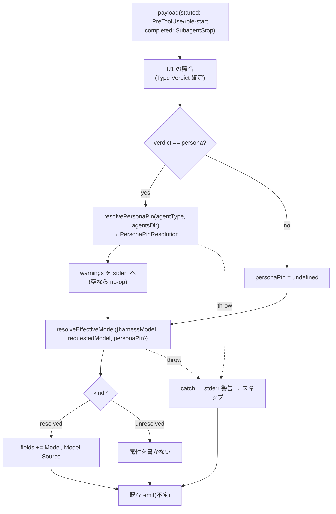

# U2 model-attribution — Business Logic Model

**上流入力(consumes 全数)**: `component-methods`(シグネチャ)/ `components`(C-3/C-5/C-6)/ `requirements`(FR-3 フロー)/ `unit-of-work`(範囲)/ `unit-of-work-story-map`(model ジャーニー)/ `services`(実行単位)

**測定 ref**: observed `7060956c5617125dd2f4e284957aa180cb306484`

## 処理フロー(両面共通の model 解決)



テキスト補足: U1 の verdict 確定後、persona のときだけ pin を読む — `resolvePersonaPin` は契約上 throw せず `{pin, warnings}` を返し、warnings は stderr へ流して続行(fail-open)。3入力で C-3 を呼び、resolved なら2属性を追加、unresolved なら何も書かず、いずれも既存 emit へ合流。防御の外周 catch(X 経路)は pin 読取層(D)と解決層(F)の両方を覆う(BR-U2-6 の二層)。

## 面ごとの入力差(実測に接地)

| 面 | harnessModel | requestedModel | 発火条件 |
|---|---|---|---|
| started(`subagentStartFields`) | `payload.model`(現行ハーネスでは未供給の想定 — AS-2) | `tool_input.model`(明示時のみ — live 実測) | kimi role-start は即時 / Claude Code は #2303+#2297 修正後(CON-2) |
| completed(`amadeus-log-subagent.ts`) | `parsed.model`(Codex 供給 — fixture 実測) | 常に `undefined`(payload に tool_input 無し) | 全ハーネスで現行発火 |

## モジュール構成の増分(U1 からの差分)

```text
amadeus-subagent-observability.ts(U1 で新設)
  += resolvePersonaPin(C-3 補助 — dir 走査 + frontmatter name: 一致で引き当て、PersonaPinResolution を返す・throw しない)… node:fs
  += resolveEffectiveModel(C-3)… 依存なし(純関数)
core/tools/amadeus-lib.ts … subagentStartFields へ照合 + model 解決を差し込み(started 配線)
core/hooks/amadeus-log-subagent.ts … U1 差し込み点に model 解決を追加
core/otel/event-registry.ts … STARTED optional +3 / COMPLETED optional +2
ClaudeCodeHookInput … model?: string 型宣言(FR-3c)
```

循環回避の方向(新設が下位)は U1 と同一。`amadeus-lib.ts` 側の差し込みで新設モジュールを import する(lib → observability の一方向)。

## 状態・エラーモデル

U1 と同一(無状態・fail-open)。pin 読取の異常は2クラスに分ける(§12a iteration 1 BLOCKER の是正):
- 「persona frontmatter に model 無し」— 正当な状態。`personaPin = undefined`、warnings に積まない(実測では14 persona 全てにピンがあるが、将来のピン無し persona を欠陥扱いしない)
- 「ファイル不在・読取失敗・frontmatter parse 不能」— 回復可能(環境差/データ)。`pin: undefined` + warnings 1件で返し、呼び手が stderr へ流して解決を続行(throw しない — NFR-3)

## Review — Iteration 2

- **Verdict:** READY
- **Reviewer:** amadeus-architecture-reviewer-agent
- **Date:** 2026-08-05T22:27:08Z
- **Iteration:** 2
- **Scope decision:** none

i1 の BLOCKER(resolvePersonaPin の読取失敗契約不在)は PersonaPinResolution 型+fail-open 契約で閉包。i2 で是正起因の新 BLOCKER(persona ファイル引き当て規則の未規定)が出たため、E-LSSADS13 に従い閉包確認限定の追加イテレーション(i2b)を実施 — 引き当て規則を FR-1a と同一原理(frontmatter name: 完全一致、basename 決め打ち禁止)で固定し、i2b が全指摘の閉包を確認して READY(予算超過の開示: 通常2回+閉包確認1回)。

### Findings

- FOLLOW-UP | domain-entities.md:51 | (i2 の BLOCKER 指摘 — i2b で閉包確認済み)resolvePersonaPin の引き当て規則未規定 | 是正: agentsDir 走査 + frontmatter name: 完全一致(basename 決め打ち禁止)、重複は先勝ち+warnings、不在は warnings 1件。BR-U2-7 に引き当て規則のピン(basename ≠ name: 対照テスト)を追加
- FOLLOW-UP | business-rules.md:19 | (閉包済み)AD 内2表現(personaPins 写像 / personaPin 単数)の採否 | component-methods の単数形を採ると明記
- FOLLOW-UP | business-logic-model.md:41 | (閉包済み)FS 走査最大2回の期待値差分 | services の期待との意図的差分として申告
- FOLLOW-UP | business-rules.md:21 | (閉包済み)warnings→stderr の呼び出し点数規律 | guard-announcement-callsite-count の grep 実測を明記
- NIT | domain-entities.md:66 | (閉包済み)registry 断定 | 実装時実測の留保へ整合
