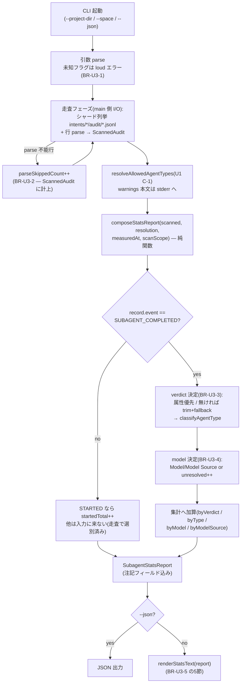

# U3 subagent-stats — Business Logic Model

**上流入力(consumes 全数)**: `component-methods`(CLI 契約正本)/ `components`(C-7 責務)/ `requirements`(FR-4 のフロー)/ `unit-of-work`(範囲 = C-7 単体)/ `unit-of-work-story-map`(監査ジャーニー — 集計の受け手)/ `services`(read-only 契約)

**測定 ref**: observed `7060956c5617125dd2f4e284957aa180cb306484`

## 処理フロー(read-only 集計)



テキスト補足(fallback): 引数 parse(fail-closed)→ **走査フェーズ**(main 側 I/O — シャード全行を parse し `ScannedAudit` を構成、parse 不能行は `parseSkippedCount` に計上)→ 許可集合解決(warnings 本文は stderr、`allowedSetWarnings` としてレポートにも保持)→ **`composeStatsReport(scanned, resolution, measuredAt, scanScope)`**(純関数)が verdict / model / source の3軸で分類し注記フィールド込みの `SubagentStatsReport` を合成 → `renderStatsText` / --json で出力(レンダラはレポートのフィールドのみから描画)。走査・集計・出力のどこにも書込は無い(不変条件1)。

## モジュール構成と依存方向

```text
packages/framework/core/tools/amadeus-subagent-stats.ts(新設 CLI — C-7)
  ├─ composeStatsReport(scanned, resolution, measuredAt, scanScope): SubagentStatsReport … export 純関数(BR-U3-8 の seam — シグネチャ正本は domain-entities)
  ├─ renderStatsText(report): string … export 純関数(text 出力の組立)
  └─ main(argv) … 走査フェーズ(node:fs — ScannedAudit の構成)+ 出力のみ
        │ import
        ▼
amadeus-subagent-observability.ts(U1 新設)
  ├─ classifyAgentType(C-2)… 旧行の集計時分類に再利用
  ├─ resolveAllowedAgentTypes(C-1)… 現在の許可集合の取得
  └─ BUILTIN_AGENT_TYPES(C-4)
```

依存は stats → observability の一方向(新設同士でも上位/下位を固定 — U1 の循環回避方向と同一)。`amadeus-lib.ts` へは依存しない。

## 状態・エラーモデル

本 Unit は無状態の読取 CLI — 実行のたびにシャードを全数読み直す(audit は移動値 — FR-4b の測定 ref ヘッダが時点を固定する)。

| 異常 | 分類 | 挙動 |
|---|---|---|
| audit dir・シャード不在 | 正常系(空 corpus) | 0 件レポートを出力(エラーにしない — 走査対象ゼロは事実) |
| 行の JSON parse 失敗 | 回復可能(データ) | skip + 件数を注記行に出す(BR-U3-2 — 隠さない fail-open) |
| **シャード実在下の読取失敗**(EACCES・途中 I/O エラー等)| 観測の不完全(環境差)| **fail-loud**: 当該シャードを `unreadableShardCount` に計上して走査は続行(他シャードの診断価値を保つ)、path を stderr へ、注記行に件数(0 でも出す)。ただし **exit は非0** — 観測宇宙が欠けた集計を「完全な集計」と誤読させない(下記追記の分類根拠参照) |
| 未知フラグ・不正引数 | 呼び手の誤用 | loud エラー + 非0 exit(BR-U3-1 — fail-closed) |
| 許可集合の解決失敗 | 回復可能(環境差) | U1 の fail-open 契約に従い台帳のみで再分類を続行。warnings 本文は AD 正本どおり stderr へ流し、`allowedSetWarnings` としてレポートに保持・件数を注記行へ(BR-U3-5 — 役割分担であり AD からの逸脱ではない) |

> **訂正注記(nfr-design §12a iteration 1 の cross-stage 是正、2026-08-06)**: 「シャード実在下の読取失敗」行を追加。当初の表は不在(正常系)と行破損(fail-open)のみを定義しており、実在するが読めないシャードのクラスが未定義だった — ND reviewer が「計上先未定義+fail-open/fail-closed 分類の反転」として BLOCKER 指摘。分類根拠: 行レベルの破損は「観測できた範囲の欠陥」なので fail-open(exit 0)、シャードレベルの読取失敗は「観測宇宙そのものの欠け」なので集計続行+非0 exit の fail-loud(誤った走査範囲でのもっともらしい集計を script 消費側に信用させない)、引数誤用は「観測開始前の契約違反」なので fail-closed。3クラスの分岐は回復可能性と誤診断リスクの2軸で単調。

## Review — Iteration 2

- **Verdict:** READY
- **Reviewer:** amadeus-architecture-reviewer-agent
- **Date:** 2026-08-05T22:24:05Z
- **Iteration:** 2
- **Scope decision:** none

iteration 1 の BLOCKER(SubagentStatsReport が注記数値を運べない)と MAJOR 3件・MINOR 2件・NIT 2件は全て閉包(注記フィールド追加、ScannedAudit/SubagentAuditRecord と seam シグネチャ新設、warnings の stderr/レポート役割分担、AC-3 の決定的述語化、trim+fallback の集計側適用、byModelSource の story-map trace、scanScope ヘッダ、Bolt 断定の撤回)。新設不変条件と U2 書込規則の整合・FR-4/AC-3/AC-6 への trace・read-only 契約の維持も成立し READY。

### Findings

- FOLLOW-UP | business-rules.md:19 | Type Verdict 属性の union パース段が不在 | 是正済み: isTypeVerdict() 述語+非適合は手順2再分類+verdictMismatchCount 計上を BR-U3-3 へ追記
- FOLLOW-UP | domain-entities.md:79 | 対欠落の計上先フィールド未名指し | 是正済み: 縮退許容へ緩め、既存フィールドからの導出値として注記行を規定(専用フィールド追加も verdictMismatchCount 流用もしない)
- FOLLOW-UP | business-rules.md:41 | AC-3 再計算の独立性未規定 | 是正済み: 被検 CLI を経由しない独立手段(jq/grep)を明記(自己参照比較の禁止)
- NIT | business-rules.md:9 | active-space 不在時 fallback 未記載 — 実装時に既存様式へ倣う
- NIT | domain-entities.md:36 | scanScope が2事実を1文字列に詰める — text ヘッダ用途としては契約内
- NIT | domain-entities.md:79 | U2 BR 番号の逐語照合はスコープ外 — 実質内容は component-methods.md:61 で確認済み
