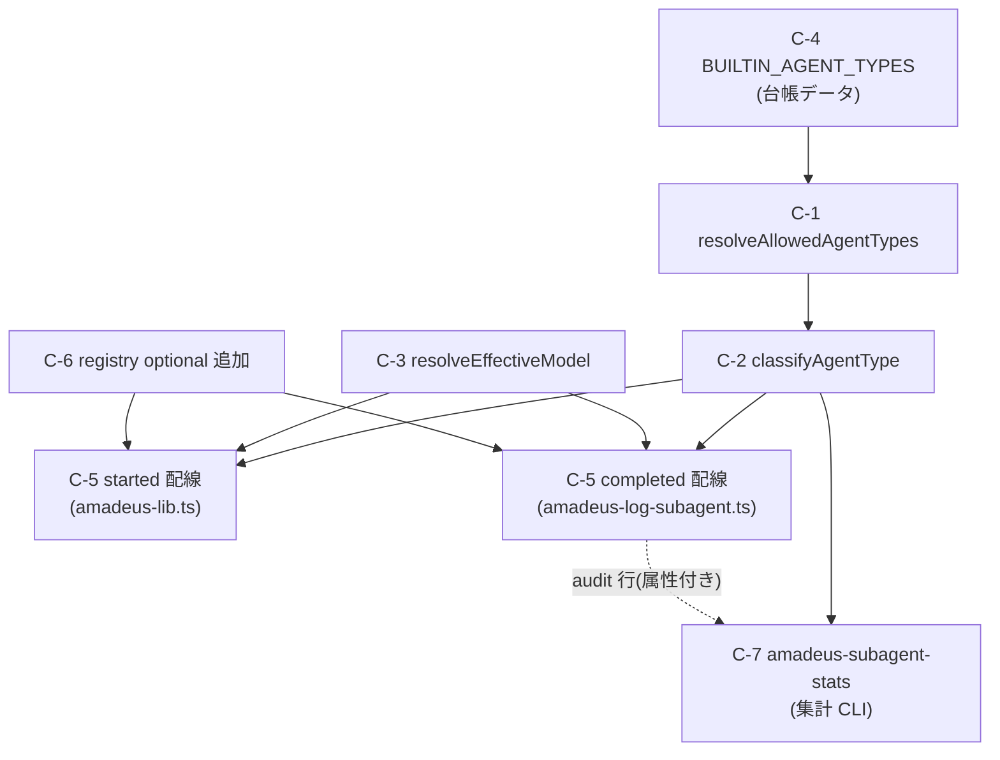

# Application Design — Component Dependency

**上流入力(consumes 全数)**: `requirements`(FR 間の依存 — backlog PU-0〜PU-4 の依存グラフの精密化)/ codekb `architecture`(既存 seam の依存方向)/ codekb `component-inventory`(モジュール境界 — 循環依存の不在確認)

**測定 ref**: observed `7060956c5617125dd2f4e284957aa180cb306484`

## 依存グラフ

テキスト補足(mermaid fallback): C-4 → C-1 → C-2 → {C-5 started, C-5 completed, C-7}。C-3 → {C-5 started, C-5 completed}。C-6 → {C-5 両面}(属性名の registry 承認)。C-7 は C-2 を直接 import し(旧行の集計時分類)、C-5 completed が書いた属性付き audit 行をデータとして読む。

## 依存の性質と実装順序への含意

- **C-4 / C-1 / C-2 / C-3 は同一新設モジュール内**(`amadeus-subagent-observability.ts`)で、外部依存は `node:fs`(C-1 のみ)と既存 `amadeus-lib.ts` の型のみ。**循環なし**: 新設モジュールは `amadeus-lib.ts` を import しない(型は構造的に受ける)— 逆方向(`amadeus-lib.ts` → 新設)の import は C-5 started 配線で発生するため、循環を避けるには新設側を下位に置く。
- **C-6 は C-5 より先**: registry に無い属性を書くと検証で落ちる(NFR-4)。同一 PR 内の順序制約。
- **C-7 は C-5 と独立に着地可能**: 属性の無い旧行でも集計時分類(C-2 適用)で動作するため、C-5 未着地でも FR-4 の大半を満たす。risk 順(backlog)では C-5 の後に置くが、交差はない。
- **既存コードへの変更は3ファイルに限定**: `amadeus-lib.ts`(started 配線)/ `amadeus-log-subagent.ts`(completed 配線)/ `event-registry.ts`(optional 追加)。他はすべて新設。

## Bolt 分割への示唆(units-generation への入力)

依存が一直線(C-4→C-1→C-2→C-5)+2独立枝(C-3、C-7)なので、Unit は「純関数層+台帳」「hook 配線+registry」「集計 CLI」の3分割か、walking-skeleton(self-feature は最初の Bolt をゲート付き end-to-end スライスとする — project.md § Walking Skeleton)を考慮した「最小 e2e スライス(C-4/C-1/C-2 + completed 配線 + AC-2 実証)→ 残り」の2分割が候補。確定は units-generation。
