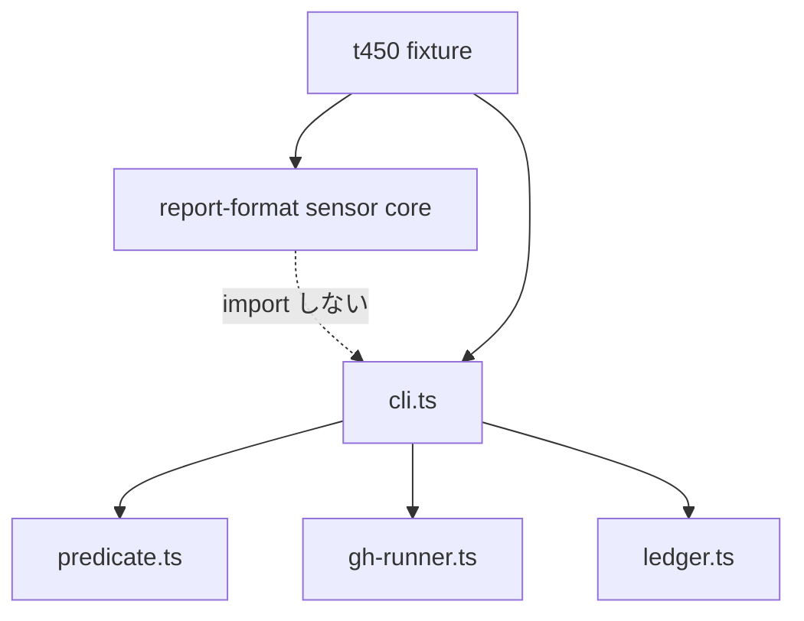

# Component Dependency — 260807-merged-pr-convergence

上流入力(consumes 全数): `requirements`(Constraint: engine 無変更・core→plugin import 禁止)、`architecture` / `component-inventory`(codekb — 既存依存方向)。

## 依存方向(変更後も不変)

テキストフォールバック: cli → {predicate, gh-runner, ledger} の一方向。sensor(core)は plugin を import せず、t450 が renderReport から fixture を描画して両者のドリフトを防ぐ。循環依存なし。

## 変更が依存へ与える影響

- gh-runner → predicate 方向の依存は発生しない(raw を返すのみ — 既存契約維持)。
- landed 経路は ledger を使わない(threads 集計不要)— cli → ledger 依存は既存 converged 経路のみに留まる。
- sensor の landed 規則追加は core 内で閉じ、plugin への新依存を作らない。

## ビルド・投影依存

canonical(`plugins/pr-convergence/` + core sensor)→ `bun run build` → dist/plugins + opt-in self-install(`.claude/plugins/` ほか)。編集は canonical のみ(NFR-3)。
