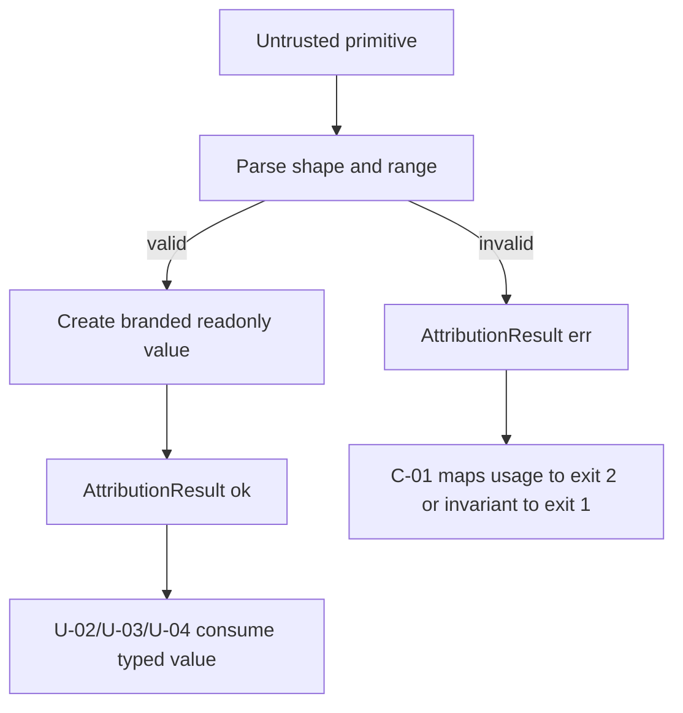

# Business Logic Model — attribution-domain-contracts

上流入力（consumes全数）は `unit-of-work.md`、`unit-of-work-story-map.md`、`requirements.md`、`components.md`、`component-methods.md`、`services.md` である。本UnitはC-02のformat-neutral domain contractだけを実装し、S-01 Stage Statistics CLIのI/Oを所有しない。

## Processing model

U-01は外部値を検証済みvalueへ変換し、後続U-02〜U-04が無効状態を受け取れないようにする。全関数はpure、同期、入力非破壊である。

| Flow | Input | Decision | Output |
|---|---|---|---|
| Target stage parse | `string \| undefined` | undefinedは`code-generation`、1〜64文字のASCII lowercase kebab-caseだけを許可 | `AttributionResult<TargetStage, UsageError>` |
| Outlier limit parse | `string \| undefined` | undefinedは10、10進整数0〜100 | `AttributionResult<OutlierLimit, UsageError>` |
| Interval parse | start/end number | integerかつ`start < end` | `AttributionResult<SecondInterval, AccountingInvariantError>` |
| Primary reason select | detected findings | fixed precedenceの最初のreason | `CandidateRejectionReason` |
| Accounting failure | subject + invariant | window/population subjectを保持 | typed `accounting-invariant` |

## Constructor workflow



<!-- Text fallback: primitiveをshape/rangeでparseし、invalidならtyped err、validならbrand付きreadonly valueを返す。C-01だけがerrをexitへ写像する。 -->

constructorは「validateして元primitiveを返す」のではなく、証明済みbrandを返す。後続moduleは同じrange/slug条件を再検査しない。

## Primary rejection algorithm

`candidatePrimaryReason(findings)`は次のclosed orderを走査し、`findings`に存在する最初のreasonを返す。

1. `malformed-event-set`
2. `digest-mismatch`
3. `unsupported-event-set-schema`
4. `duplicate-event-set-id`
5. `missing-intent`
6. `intent-mismatch`
7. `missing-stage`
8. `stage-mismatch`
9. `missing-identity`
10. `duplicate-start`
11. `duplicate-terminal`
12. `missing-start`
13. `missing-terminal`
14. `invalid-timestamp`
15. `non-positive-interval`
16. `outside-window`
17. `empty-after-idle`

探索順は入力findingsの順序に依存しない。primary以外の成立reasonはU-02のsecondary diagnosticsへ残り、primary countへ重複加算しない。公開signatureは上流どおり`CandidateRejectionReason`を直接返す。findingsが空の呼出しだけはprogrammer faultとしてbuilt-in `TypeError("candidatePrimaryReason requires at least one finding")`を投げる。custom exception class、fallback reason、空入力用sentinelは作らない。U-02はfindingを1件以上検出した分岐からだけこの関数を呼ぶ。

## Cross-Unit transfer model

U-02は明示証拠を`DecodedCandidate`へ保持し、採用時に同じ`candidateId`、`explicitIntent`、`family`、`category`を`ExplicitLifecycleInterval`へ移す。U-03は各intervalについて、`window.intent === interval.explicitIntent`かつ`window.stage === interval.stage`のeligible window集合だけを評価する。時刻が重なる別intent windowは候補集合に入れない。

```text
DecodedCandidate
  -- explicit intent/stage/identity + exactly one start/terminal --> ExplicitLifecycleInterval
  -- any finding -----------------------------------------------> RejectedCandidate

ExplicitLifecycleInterval × AttributionWindow
  -- same intent + same stage --> clip / idle subtraction / disposition
  -- different intent or stage -> not an eligible pair
```

このtransferでcandidate family/categoryはaccounted dispositionまで保持される。windowは`intent × stage × measuredInterval`から得たstable identityを持つため、同じtarget stageで複数intentのwindowが時間重複しても帰属先をtimestampから選ばない。

## Result propagation

`AttributionResult<T,E>`は`ok`/`err`の2状態だけを持つ。expected input failureはexceptionを投げず、U-02〜U-04が明示的に短絡・変換する。未知の実装defectだけは通常のfail-fast境界へ到達できるが、candidate rejectionへ偽装しない。

- `usage`: C-01だけがusage text + exit 2へ写像する。
- `decode`: U-02がcandidate inventoryのrejectionへ写像し、CLI全体を失敗させない。
- `accounting-invariant`: U-03/U-04からC-01へ伝播し、stdout reportなし + exit 1にする。

## Complexity and determinism

constructorはO(1)、primary reason選択はclosed vocabulary長17に対してO(1)上限である。locale、timezone、filesystem、object identity、入力配列順に依存しない。同じprimitive/findingsからbyte-equivalentなdomain valueを返す。

## Review — Iteration 1

- **Verdict:** NOT-READY
- **Reviewer:** amadeus-architecture-reviewer-agent
- **Date:** 2026-08-09T23:28:24Z
- **Iteration:** 1
- **Scope decision:** none

U01のprecedenceと基本validation方針は整合するが、上流でC-02/U-01へ割り当てられた必須domain contractの一部が欠落または未確定であり、U-02/U-03が推測なしに実装できない。

### Findings

- BLOCKER | domain-entities.mdのExplicitLifecycleIntervalはcandidateId、lifecycleIdentity、stage、intervalしか持たず、明示intent、family、categoryを保持しない。また上流components.mdがC-02所有とするAttributionWindowの構造自体が定義されていない。FR-EVT-3、unit-of-work.md、component-methods.md、services.mdはU-03がcandidateの明示intentとwindow intentを一致させ、accounted dispositionへfamily/categoryを保持することを要求するため、現契約では同じtarget stageで複数intentのwindowが重なるfixtureを型安全かつ推測なしに処理できない。ExplicitLifecycleIntervalとAttributionWindowの全属性・identity・constructor境界を定義し、U-03の同一intent clip入力を成立させる必要がある。
- BLOCKER | business-rules.mdはAttributionCategoryを9値で閉じるとだけ記載し、上流component-methods.mdで固定された9つのcanonical値を列挙していない。さらにcomponents.mdがC-02所有とするEventSetId、DecodedCandidate、RejectedCandidate、AttributionWindow等のpublic domain contractもdomain-entities.mdに構造・不変条件・関係がない。U01の責務であるclosed vocabularyとpublic type contractが部分的に縮小され、U-02〜U-04が独自定義を補う余地があるため、上流の全C-02型を採用・委譲・非公開のいずれかへ明示的に分類し、採用する型は完全なshapeと不変条件を定義する必要がある。
- BLOCKER | TargetStage validationは「safe slug」だけで具体的な文字集合、先頭末尾条件、長さ等がなく、FR-POP-2/FR-TEST-1のsafe/unsafe fixtureを決定できない。またcandidatePrimaryReasonの空findingsについて「typed invariantまたはexhaustive call-site contract」と二択を残しているが、上流signatureはCandidateRejectionReasonを直接返す。Functional Designとして実装とtest期待値が一意になっていないため、slug grammarと空入力の単一failure contractを確定し、constructor/function signatureおよびtable-driven verificationへ反映する必要がある。

## Review — Iteration 2

- **Verdict:** READY
- **Reviewer:** amadeus-architecture-reviewer-agent
- **Date:** 2026-08-09T23:33:21Z
- **Iteration:** 2
- **Scope decision:** none

前回3件のBLOCKERは、明示intentを含むcross-Unit型、全C-02契約の分類と主要public shape、closed category値、safe slug文法、空findingsの単一failure契約によって解消され、上流責務・依存方向・Issue scopeとの矛盾や縮小はない。

### Findings

- None
