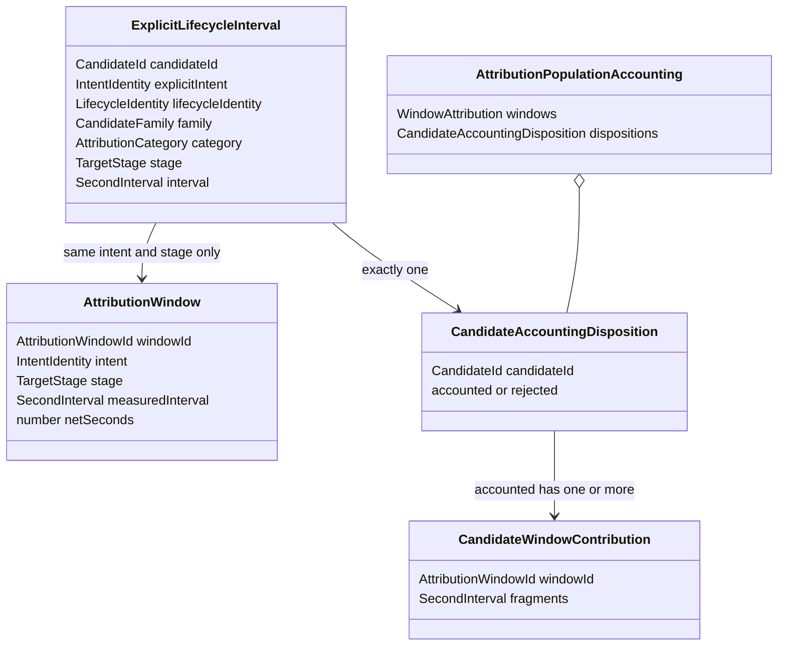

# Domain Entities — attribution-domain-contracts

上流入力（consumes全数）は `unit-of-work.md`、`unit-of-work-story-map.md`、`requirements.md`、`components.md`、`component-methods.md`、`services.md` である。ここでいうentityは永続DB entityではなく、one-shot S-01 process内を流れるimmutable domain valueとidentityである。

## Ubiquitous language

| Concept | Kind | Identity / equality | Owner |
|---|---|---|---|
| `TargetStage` | branded value object | safe slug value | U-01 |
| `OutlierLimit` | branded value object | integer value | U-01 |
| `SecondInterval` | immutable value object | start/end pair | U-01 |
| `IntentIdentity` | branded identity | 明示intent UUID/record identity | U-01 contract、U-02/U-04 mint |
| `CandidateId` | branded identity | canonical candidate identity | U-01 contract、U-02 mint |
| `EventSetId` | branded identity | event-set envelopeの明示ID | U-01 contract、U-02 mint |
| `AttributionWindowId` | branded identity | stable intent×stage window identity | U-01 contract、U-04 mint |
| `LifecycleIdentity` | branded identity | family-specific correlation fields | U-01 contract、U-02 mint |
| `ExplicitLifecycleInterval` | immutable domain value | candidate identity | U-02 construct、U-03 consume |
| `CandidateAccountingDisposition` | discriminated result value | candidate identity | U-03 construct |
| `AttributionPopulationAccounting` | first-class collection/result | window/candidate sets | U-03 construct、U-04 consume |
| `AttributionError` | discriminated error value | type + subject/source | all Units consume |

## Value object shapes

`SecondInterval`はinteger-secondの半開区間`[start,end)`を表す。durationを別mutable fieldとして保存せず`end - start`から導出する。start/endはparse済みであり、negative/zero durationを表現できない。

`TargetStage`と`OutlierLimit`はCLI表示値とは分離する。brandの構築口をsmart constructorへ限定し、後続関数の引数で未検証`string`/`number`を受け取らない。

## Public contract classification

C-02に割り当てられた型を次のとおり分類する。採用した型をU-02〜U-04が再定義してはならない。

| Contract | Classification | Reason |
|---|---|---|
| `TargetStage`、`OutlierLimit`、`SecondInterval` | C-02 publicとして採用 | primitive validationの単一所有者にする |
| `IntentIdentity`、`CandidateId`、`EventSetId`、`AttributionWindowId`、`LifecycleIdentity` | C-02 public opaque typeとして採用 | intent、candidate、event set、window、lifecycleのidentityを混同させない |
| `CandidateFamily`、`AttributionCategory`、`CandidateRejectionReason`、`CandidateFinding` | C-02 public closed vocabularyとして採用 | decoder、accountant、reporterのdriftを防ぐ |
| `DecodedCandidate`、`RejectedCandidate`、`ExplicitLifecycleInterval`、`AttributionWindow` | C-02 public discriminated/immutable valueとして採用 | U-02→U-03の受渡しを推測不要にする |
| `CandidateAccountingDisposition`、`CandidateWindowContribution`、`AttributionPopulationAccounting` | C-02 public accounting contractとして採用 | U-03→U-04の全件会計を型で固定する |
| `AttributionResult`、`AttributionError` | C-02 public result/error contractとして採用 | expected failureの例外化を防ぐ |
| `AttributionCorpus`、`CandidateInventory`、`SecondaryDiagnostic` | U-02へ委譲 | corpus構築・decode処理の所有物であり、C-02はそのleaf valueだけを所有する |
| `IdleIndex`、`WindowAttribution` | U-03へ委譲 | interval algorithm/result計算の所有物であり、C-02は参照されるidentity/dispositionだけを所有する |
| `AttributionWindowSelection`、`StageAttributionReport` | U-04へ委譲 | window eligibilityとsemantic reportの所有物である |
| renderer row、CLI option、journal wire record | C-02では非公開・非所有 | façade、renderer、既存journal codecの責務である |

## Complete public shapes

以下はU-01の実装契約であり、`readonly`を省略してはならない。`IntentIdentity`は明示されたintentだけから作り、window containmentやtimestampから推定しない。

```typescript
type DecodedCandidate = {
  readonly type: "decoded-candidate";
  readonly candidateId: CandidateId;
  readonly sourceIds: readonly string[];
  readonly family: CandidateFamily;
  readonly category: AttributionCategory;
  readonly explicitIntent: IntentIdentity | null;
  readonly explicitStage: TargetStage | null;
  readonly lifecycleIdentity: LifecycleIdentity | null;
  readonly starts: readonly CandidateBoundary[];
  readonly terminals: readonly CandidateBoundary[];
  readonly findings: readonly CandidateFinding[];
};

type CandidateBoundary = {
  readonly sourceId: string;
  readonly kind: "start" | "terminal";
  readonly at: number | null;
};

type RejectedCandidate = {
  readonly type: "rejected-candidate";
  readonly candidateId: CandidateId;
  readonly sourceIds: readonly string[];
  readonly family: CandidateFamily;
  readonly primaryReason: CandidateRejectionReason;
  readonly secondaryReasons: readonly CandidateRejectionReason[];
};

type ExplicitLifecycleInterval = {
  readonly type: "explicit-lifecycle-interval";
  readonly candidateId: CandidateId;
  readonly explicitIntent: IntentIdentity;
  readonly lifecycleIdentity: LifecycleIdentity;
  readonly family: CandidateFamily;
  readonly category: AttributionCategory;
  readonly stage: TargetStage;
  readonly interval: SecondInterval;
};

type AttributionWindow = {
  readonly type: "attribution-window";
  readonly windowId: AttributionWindowId;
  readonly intent: IntentIdentity;
  readonly stage: TargetStage;
  readonly measuredInterval: SecondInterval;
  readonly netSeconds: number;
};
```

`DecodedCandidate`はdecodeできたcandidate groupだけを表す。innerを安全に復元できないevent-set envelopeは、`EventSetId`またはsource record identityから1つの`CandidateId`を決定的にmintし、直接`RejectedCandidate`へ送るため、架空のinner件数を作らない。`sourceIds`は1件以上かつcanonical journal order、`starts`/`terminals`は0件以上で同順序とする。

`ExplicitLifecycleInterval` constructorは`explicitIntent`、`stage`、`lifecycleIdentity`がすべて存在し、start/terminalが各1件、timestampがinteger second、`start < end`のときだけ成功する。`family → category`はclosedな1対1 mappingに一致しなければならない。これによりU-03は`window.intent === interval.explicitIntent`かつ`window.stage === interval.stage`のwindowだけをclipできる。

`AttributionWindow` constructorは明示intent、target stage、positiveな`measuredInterval`、finite integerの`netSeconds > 0`を要求し、`netSeconds`が`measuredInterval`のdurationを超える値を拒否する。window identityは`intent × stage × measuredInterval`のcanonical tupleから決定的にmintする。同一identityのcollisionはconstructorで併合せず、U-04の`ambiguous-window-identity`除外へ送る。

`EventSetId`は非空のcanonical envelope ID、`CandidateId`は`family × explicit intent-or-source fallback × lifecycle identity-or-source fallback`、`LifecycleIdentity`はfamily固有correlation tupleのcanonical encodingである。opaque identity constructorは空文字、前後空白、ASCII controlを拒否し、元primitiveへのcastだけでは作れない。

## Identity relationships



<!-- Text fallback: accepted lifecycle intervalはcandidate IDごとに1 dispositionへ写像され、accounted dispositionは1件以上のwindow contributionを持ち、population accountingが全dispositionを所有する。 -->

Candidate identity、lifecycle identity、window identityは用途が異なる。candidateが複数windowと交差してもcandidate ID/dispositionは1件のままで、window contributionだけが複数になる。

## Result and error lifecycle

domain valueはmutable lifecycleを持たない。処理状態は判別unionの遷移として表す。

```text
untrusted primitive -> AttributionResult.err
                    -> AttributionResult.ok(typed value)

decoded candidate -> rejected(primary + secondary diagnostics)
                  -> accepted(ExplicitLifecycleInterval)

accepted candidate -> rejected(outside-window | empty-after-idle)
                   -> accounted(one-or-more contributions)
```

decode段階でrejectedになったcandidateはU-03へ渡らず、post-accounting reasonと競合しない。`accounting-invariant`はcandidateの正常なlifecycle stateではなく、pipeline全体を停止するinternal faultである。

## Collection invariants

`AttributionPopulationAccounting`は単なる2配列ではなく、次の関係を一体で保証するfirst-class collectionである。

- candidate IDs in dispositions are unique。
- accepted input candidate setとdisposition candidate setが全単射。
- window IDs in windows are uniqueでeligible setと全単射。
- accounted contributionは存在するwindow IDだけを参照する。
- fragmentはpositiveで、U-03が正規化した順序を保つ。

ただしU-01はこのcollectionを計算・検証するalgorithmを持たず、型とconstructor-level invariantだけを提供する。全体の会計検証はU-03、consumer-side再検証はU-04が所有する。

## Dependency boundary

U-01はdependency graphのdepth 0であり、標準ライブラリ以外のruntime dependencyを追加しない。U-02/U-03/U-04はU-01をimportできるが逆edgeは禁止する。S-01 service lifecycle、stdout、audit row、renderer固有fieldはdomain entityへ含めない。
