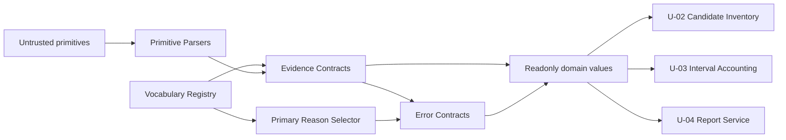

# Logical Components — attribution-domain-contracts

## Scope and upstream applicability

本設計はpresent consumeである `business-logic-model.md` を、1つのin-process pure library境界へ写像する。`security-requirements.md`と`tech-stack-decisions.md`はNFR Requirements stageのscope skipに伴うexpected-absentであり、Requirements Analysis NFR-1〜7とApplication Design ADRを代替正本とする。`performance-requirements.md`、`scalability-requirements.md`、`reliability-requirements.md`はlibrary kindの本Unitでは非適用で、engineも対応outputをpruneしている。

C-02はApplication Designの依存グラフ最下層であり（`component-dependency.md:13-20`）、filesystem、process、renderer、audit writerを所有しない（`components.md:58-75`）。新しいdeployable、AWS resource、network、database、queue、daemonは作らない。

## Logical component inventory

| Component | Responsibility | Inputs | Outputs | Forbidden dependencies |
|---|---|---|---|---|
| Primitive Parsers | stage、outlier、interval primitiveを証明済みvalueへ変換 | string、number | `AttributionResult<branded, error>` | filesystem、process、renderer |
| Vocabulary Registry | family、category、reason、dispositionのclosed tupleと型を単一所有 | compile-time literals | readonly tuple / union | candidate decode、interval algorithm |
| Evidence Contracts | candidate、window、event-set、explicit intervalのreadonly public shape | validated values | discriminated readonly records | journal codec、runtime projection |
| Primary Reason Selector | finding集合へ固定precedenceを一度だけ適用 | non-empty reason set | `CandidateRejectionReason` | renderer、format-specific rule |
| Error Contracts | usage、decode、accounting invariantをclosed union化 | subject + invariant | typed `err` value | exit code、stdout/stderr |

これらはsource file内の論理責務であり、別process、別package、別deployableへ分割しない。実装上の単一public moduleは `amadeus-stage-attribution-domain.ts` で、subcomponent名は内部整理とtest ownershipを示すだけで新しい公開APIを増やさない。

## Dependency and data flow

<!-- Text fallback: untrusted primitiveはParserで検証され、VocabularyとEvidence Contractからreadonly domain valueになる。Primary Reason SelectorとError Contractも同じclosed vocabularyを使い、U-02〜U-04へ一方向に提供する。 -->

依存方向はconsumerからC-02への一方向である。C-02からU-02/U-03/U-04へのcallback、registry lookup、service locatorを作らない。cross-Unit transferは `business-logic-model.md` のexplicit intent/stage/identity付きvalueだけを使う。

## Failure domains and blast radius

| Failure | Containment | Blast radius | Recovery |
|---|---|---|---|
| primitive validation failure | Primitive Parsers | 該当CLI invocationのreport生成前 | callerがusageへ写像、retryは修正argvだけ |
| candidate evidence failure | Evidence/Reason contracts | 該当candidate group | rejectionとしてreportへ残し、他candidateを継続 |
| accounting invariant | Error Contracts | attribution report全体 | stdout reportを生成せずexit 1、推定値へfallbackしない |
| programmer fault | exhaustive branch / empty finding | process invocation | fail-fast、unknown failureをcandidate rejectionへ偽装しない |

共有mutable state、lock、cache、pool、retry loopはない。process memoryはinvocation-localであり、failureは次回processへ持ち越さない。C-02変更のblast radiusはU-02〜U-04のcompile/test contractに限定され、legacy measured branchやjournal storeへ直接到達しない。

## Isolation and shared resources

- **Service isolation:** in-process module boundaryとreadonly typesで隔離する。OS/container/network isolationは非適用。
- **Data isolation:** C-02はraw corpusを保持せず、検証済みprimitiveとsafe identityだけを運ぶ。
- **Resource isolation:** external resource 0件。AWS、filesystem、network、database、environment credentialを参照しない。
- **Concurrency:** global mutable singletonを持たず、同じ関数をparallel testから呼んでも共有状態を競合させない。
- **Versioning:** vocabulary変更はtupleとderived unionを同じchange reasonで更新し、consumerのexhaustive checkをcompile/test failureにする。

## NFR allocation and verification seams

| Requirement fallback | Component owner | Verification |
|---|---|---|
| NFR-1 accounting correctness | Primitive Parsers / Error Contracts | invalid intervalとfinite invariantのtable/PBT |
| NFR-2 determinism | 全component | shuffled finding inputで同一reason/value |
| NFR-3 fail-closed | Evidence Contracts / Primary Reason Selector | missing evidenceと複合findingのfixed precedence |
| NFR-6 maintainability/testability | Vocabulary Registry + pure functions | direct unit import、complexity ceiling 15以下 |
| NFR-7 read-only safety | module boundary | forbidden I/O import、入力非破壊assert |

performance caching、horizontal scaling、circuit breaker、health check、failover、backupは、本Unitがstateless pure libraryでexternal dependencyを持たないため非適用である。これらを形だけ導入すると新しいfailure domainとdependencyを増やすため禁止する。
