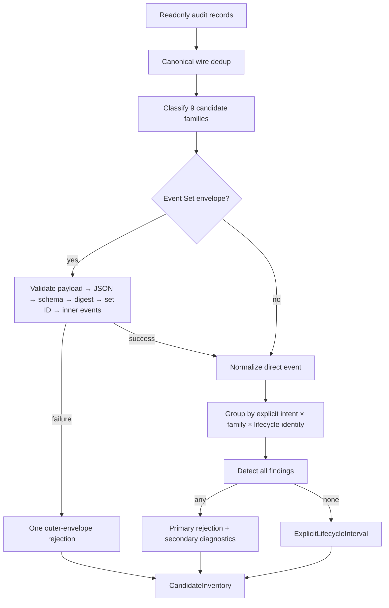

# Business Logic Model — candidate-evidence-inventory

上流入力（consumes全数）は`unit-of-work.md`、`unit-of-work-story-map.md`、`requirements.md`、`components.md`、`component-methods.md`、`services.md`である。本UnitはC-03のattribution-only corpus viewとcandidate decodeを所有し、legacy measured branch、interval accounting、reportingを変更しない。

## End-to-end processing

<!-- Text fallback: readonly audit rowsをcanonical wire dedupし、9 familyを分類する。Event Setは固定順で検証し、失敗はouter envelope 1件としてrejectする。成功したdirect/inner eventは明示intent・family・identityでgroup化し、全findingを検出してprimary/secondaryへ分けるか、完全なものだけintervalへ変換する。 -->

## Corpus projection

`buildAttributionCorpus(records)`は入力配列を変更せずcanonical journal orderで走査する。`journalRecordKey`と同じwire identityを`Set`へ記録し、最初のrecordだけを`AttributionCorpus.records`へ保持する。後続duplicateは`canonicalDuplicateCount`だけを増やし、lifecycle eventとしてdecodeしない。

このdedupはU-04が分岐後に渡すreadonly copyだけへ作用する。既存`ScannedCorpus.records`、measured window件数、raw/net秒、既存除外件数へ結果を戻さない。

## Event Set decoding

`decodeEventSetEnvelope`は次の安全な依存順で検査するが、検査順をprimary reasonの選択順には使わない。

1. 必須payload fieldの存在。
2. JSON/object shape。
3. supported schema version。
4. canonical bytesから再計算したdigestとouter digestの一致。
5. 非空`EventSetId`とouter/inner ID整合。
6. inner event配列と各eventのtype/timestamp/origin shape。

検証可能なfindingをすべて収集した後、17値のfixed precedenceを1回だけ適用する。payload欠落またはJSON/object shape不正なら安全に評価できない下流findingを推定せず`malformed-event-set`だけを作る。object shapeまで読めた場合はschema supportとcanonical raw bytesのdigestを独立に検証するため、unsupported schema + digest mismatchはprimary=`digest-mismatch`、secondary=`unsupported-event-set-schema`になる。event-set ID重複は全outerをparseした第2 passで加える。payload/JSON/inner shapeは`malformed-event-set`、digestは`digest-mismatch`、schemaは`unsupported-event-set-schema`、同一`EventSetId`の2 envelopeは`duplicate-event-set-id`である。decoderがinner件数を確定できない場合、outer envelope sourceから決定的にmintした1つのcandidateだけをrejectし、推定件数を作らない。

正常なexecution/unit-pool/loop-monitor/transaction envelopeでは、intentとstageを同じcanonical envelopeの明示fieldからinnerへ継承できる。別row、window containment、timestamp近接からの継承は禁止する。writer、repository、runtime projectionは呼ばない。

## Candidate normalization and grouping

direct eventとdecoded inner eventを共通の`NormalizedCandidateEvent`へ変換する。変換時点では欠落値を`null`として保持し、黙ってdropしない。

group keyは`explicitIntent-or-missing-token × explicitStage-or-missing-token × family × lifecycleIdentity-or-source-fallback`である。stageをkeyへ含め、同じintent/family/identityが別stageで再利用されてもboundaryを合流させない。stage欠落eventは専用missing tokenでgroup化し、明示stageのgroupへ付け替えない。identityを作れないeventはsource identityごとに1 candidate groupを作り`missing-identity`へ送る。intentが欠落しても異なるsourceを1 groupへ合流させない。group/member順はcanonical journal ordering、同順位はsource IDのcode-point昇順とする。

classifierは次の優先順でclosedに評価する。exact outer-envelope eventを先に判定し、次にdirect prefix、最後に`*_TRANSACTION_COMMITTED`を判定する。同一eventを複数familyへ入れない。

| Match | Family | Candidate counting unit |
|---|---|---|
| `EXECUTION_EVENT_SET_COMMITTED` | execution-event-set | decode成功時は`operationId` groupごと、decode不能時はouter 1件 |
| `UNIT_POOL_EVENT_SET_COMMITTED` | unit-pool-event-set | decode成功時は`attemptId` groupごと、decode不能時はouter 1件 |
| `LOOP_MONITOR_EVENT_SET_COMMITTED`または`LOOP_MONITOR_*` | loop-monitor | event setは`Event Set Id`ごと、他はsource rowごと。現schemaではmissing-boundary rejection |
| `SENSOR_*` | sensor | `Fire id × intent × stage` group。identity欠落はsource rowごと |
| `SWARM_*` | swarm | `Batch number × intent × stage` group。identity欠落はsource rowごと |
| `BOLT_*` | bolt | `Bolt slug`または明示`Batch number × Bolt names` group。identity欠落はsource rowごと |
| `SUBAGENT_*` | subagent | `Agent ID × intent × stage` group。identity欠落はsource rowごと |
| `MERGE_DISPATCH_*` | merge-dispatch | `Bolt slug × intent × stage` group。identity欠落はsource rowごと |
| `*_TRANSACTION_COMMITTED` | transaction-envelope | `Transaction Id`ごと、欠落はsource rowごと。現schemaではmissing-boundary rejection |

上記に一致しないeventはcandidate family外であり、candidate inventoryからだけ除外する。prefixに一致した未知/補助event typeは黙って除外せず、同じidentity groupの`evidence-only` memberにする。identityがなければsource row単位のgroupを作り、missing identity/boundary reasonへ送る。

family別boundaryは次のとおりである。

| Family | Start | Terminal | Lifecycle identity | Category |
|---|---|---|---|---|
| sensor | `SENSOR_FIRED` | `SENSOR_PASSED` / `SENSOR_FAILED` / `SENSOR_BUDGET_OVERRIDE` | `Fire id` | `sensor-execution` |
| swarm | `SWARM_STARTED` | `SWARM_COMPLETED` | `Batch number` | `swarm-lifecycle` |
| bolt | `BOLT_STARTED` | `BOLT_COMPLETED` / `BOLT_FAILED` | `Bolt slug`、なければ`Batch number × Bolt names` | `bolt-lifecycle` |
| subagent | `SUBAGENT_STARTED` | `SUBAGENT_COMPLETED` | `Agent ID` | `subagent-lifecycle` |
| loop-monitor | 現supported schemaではなし（`LOOP_MONITOR_EVENT_SET_COMMITTED`は`evidence-only`） | 現supported schemaではなし | 明示`Partition Key × Event Set Id`はinventory identityにだけ使用 | `loop-monitor-lifecycle` |
| merge-dispatch | `MERGE_DISPATCH_INVOKED` | `MERGE_DISPATCH_RETURNED` / `MERGE_DISPATCH_FALLBACK` | `Bolt slug` | `merge-dispatch-lifecycle` |
| execution-event-set | inner `operation-started` | inner `operation-finished` | `operationId` | `execution-lifecycle` |
| unit-pool-event-set | inner `unit-acquired` | inner `unit-settled` | `attemptId` | `unit-pool-lifecycle` |
| transaction-envelope | 現supported transaction schemaではなし（envelopeは`evidence-only`） | 現supported transaction schemaではなし | 明示`Transaction Id` | `transaction-lifecycle` |

`SWARM_UNIT_CONVERGED`、`SWARM_UNIT_FAILED`、`SWARM_BATON_RETURNED`、`SWARM_DEGRADED`および各prefixの上表にないeventは`evidence-only`であり、start/terminal cardinalityを増やさない。loop-monitor/transaction envelopeもpayload/schema/digestまたはtransaction integrityを検証してinner evidenceをinventoryするが、現supported schemaにはattribution用の明示start/terminal対を認定しない。したがってinventory identityを作れても`missing-start`/`missing-terminal`へ送り、将来のschema event名をpattern matchして採用しない。瞬間eventをzero-duration intervalとして採用しない。

## Finding and decision pipeline

各groupで全findingを集めてからU-01のfixed precedenceを1回だけ適用する。

1. envelope decode findings。
2. explicit intentの欠落/eligible window intent集合との不一致。
3. explicit stageの欠落/target stageとの不一致。
4. family identityの欠落。
5. start/terminal cardinalityの重複・欠落。
6. timestamp parse/integer-second validation。
7. `start >= terminal`。

`candidatePrimaryReason`の戻り値を`RejectedCandidate.primaryReason`へ保存し、それ以外の成立reasonをprecedence順の`SecondaryDiagnostic.reasons`へ保存する。secondaryはprimary countへ加えない。findingが0件のgroupだけを`ExplicitLifecycleInterval`へ変換する。

## Complexity and determinism

canonical dedup、classification、groupingはrow数nに対してexpected O(n)、各groupのsortingを含む全体上限はO(n log n)、memoryはO(n)である。外部service、disk cache、並列scan、sampling、approximationを導入しない。同じrecords、target stage、eligible windowsから同じaccepted/rejected順とcountを返す。

## Failure propagation

candidate/envelopeの入力不正は`CandidateInventory.rejected`へ入りCLI failureにしない。unexpected codec defectやclosed vocabulary exhaustiveness違反だけをprogrammer faultとしてfail-fastさせる。U-02はfilesystemへ書かず、`AttributionResult.err(accounting-invariant)`、exit code、stdout/stderrを生成しない。

## Review — Iteration 1

- **Verdict:** NOT-READY
- **Reviewer:** amadeus-architecture-reviewer-agent
- **Date:** 2026-08-09T23:40:25Z
- **Iteration:** 1
- **Scope decision:** none

canonical dedup、outer failureの1件計数、明示intentによる分離、legacy measured branch隔離は整合するが、event vocabulary、複合Event Set failureのprimary precedence、stageを跨ぐlifecycle groupingに実装を一意化できない矛盾が残る。

### Findings

- BLOCKER | FR-EVT-1は6つのprefix familyを含む全9 familyの完全inventoryを要求するが、family別boundary表は一部のstart/terminal名しか列挙せず、同じprefix内の非boundary eventをevidence-onlyとして数えるのか対象外として無視するのか、そのidentity・candidate計数単位を定義していない。さらにloop-monitor/transactionは現schemaに完全pairなしとする一方、Verification rulesは9 familyそれぞれの完全pair testを要求しており矛盾する。closed classifierを推測なく実装できるよう、全supported event typeからfamily・boundary・identity・outer/inner計数単位への網羅的mappingを固定し、pairを持たないfamilyの期待testをmissing-boundary rejectionへ整合させる必要がある。
- BLOCKER | Event Set decoderはpayload→JSON→schema→digestの順で検査し「最初に失敗した条件」をprimaryへ写像すると規定するが、FR-EVT-5の固定precedenceはdigest-mismatchをunsupported-event-set-schemaより先に置く。unsupported schemaとdigest mismatchが同時成立するenvelopeではartifact内だけでprimary reasonが二通りになり、primary/secondary countと3format parityが入力経路依存になる。検証可能なfindingを全て収集して17値precedenceを一度だけ適用するか、decode契約を固定precedenceと一致させる必要がある。
- BLOCKER | lifecycle group keyと最終candidate IDがfamily×explicit intent×lifecycle identityだけでexplicit stageを含まない。同一intent・family・identityがtarget stageと別stageで再利用されると、別stageのboundaryがtarget candidateへ合流し、stage-mismatchやduplicate-start/terminalによって本来有効なtarget intervalまで不採用になり得る。FR-EVT-3の明示stage分離と決定的candidate計数を満たすため、stageをgroup/identityへ含めるか、target/non-targetをgroup形成前に非干渉でpartitionし、missing-stageのfallback group規則も一意に定義する必要がある。

## Review — Iteration 2

- **Verdict:** READY
- **Reviewer:** amadeus-architecture-reviewer-agent
- **Date:** 2026-08-09T23:43:36Z
- **Iteration:** 2
- **Scope decision:** none

前回3 BLOCKERは解消され、closed classifier、pair非対応familyのfail-closed test、全検証可能findingへの固定precedence、stageを含むgroup/candidate identityが上流契約とscopeを維持して一意化された。

### Findings

- FOLLOW-UP | `decodeEventSetEnvelope`の上流public seamと`EventSetDecodeError`は単一reason型のままだが、Functional Designは複数findingを収集してsecondary diagnosticsへ渡す。実装時は内部validation resultでfinding集合を保持し、public単一errorへ早期縮退してsecondaryを失わないこと。unsupported schema + digest mismatch testがこの境界を検証するため現時点のBLOCKERではない。
- NIT | business-logic-model.md冒頭のflowchartとtext fallbackだけはgroup keyを`explicit intent × family × lifecycle identity`と旧表記のまま示すが、同文書の詳細規則、business-rules.md、domain-entities.md、verificationはすべてexplicit stage/missing-stage tokenを含む。誤読防止のため図のlabelも詳細契約へ揃えるとよい。
