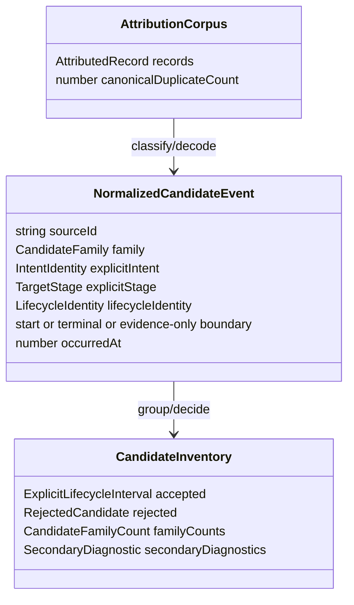

# Domain Entities — candidate-evidence-inventory

上流入力（consumes全数）は`unit-of-work.md`、`unit-of-work-story-map.md`、`requirements.md`、`components.md`、`component-methods.md`、`services.md`である。U-02固有entityはprocess-local readonly projectionであり、U-01のopaque identity、closed vocabulary、result、interval型を再定義しない。

## Owned shapes

```typescript
type AttributionCorpus = {
  readonly records: readonly AttributedRecord[];
  readonly canonicalDuplicateCount: number;
};

type NormalizedCandidateEvent = {
  readonly sourceId: string;
  readonly sourceOrder: string;
  readonly eventSetId: EventSetId | null;
  readonly family: CandidateFamily;
  readonly category: AttributionCategory;
  readonly boundary: "start" | "terminal" | "evidence-only";
  readonly explicitIntent: IntentIdentity | null;
  readonly explicitStage: TargetStage | null;
  readonly lifecycleIdentity: LifecycleIdentity | null;
  readonly occurredAt: number | null;
};

type CandidateFamilyCount = {
  readonly family: CandidateFamily;
  readonly observed: number;
  readonly accepted: number;
  readonly rejected: number;
};

type SecondaryDiagnostic = {
  readonly candidateId: CandidateId;
  readonly family: CandidateFamily;
  readonly reasons: readonly CandidateRejectionReason[];
  readonly sourceIds: readonly string[];
};

type CandidateInventory = {
  readonly accepted: readonly ExplicitLifecycleInterval[];
  readonly rejected: readonly RejectedCandidate[];
  readonly familyCounts: readonly CandidateFamilyCount[];
  readonly secondaryDiagnostics: readonly SecondaryDiagnostic[];
};

type EventSetDecodeError = Extract<
  AttributionError,
  { readonly type: "decode" }
>;
```

`AttributedRecord`は既存scanから受けるreadonly normalized journal recordでありU-02は所有・変更しない。`DecodedInnerEvent`は既存execution/unit-pool/transaction codecのwire shapeをformat-neutralな`NormalizedCandidateEvent`へ変換する一時値で、module外へexportしない。

## Entity relationships



<!-- Text fallback: AttributionCorpusのrecordをclassify/decodeしてNormalizedCandidateEventを作り、group/decision後にaccepted、rejected、family count、secondary diagnosticsを一体で持つCandidateInventoryへ変換する。 -->

## Inventory invariants

- `canonicalDuplicateCount >= 0`かつ`records.length + canonicalDuplicateCount = attribution branchへ渡されたrecord数`。
- `accepted`と`rejected`のcandidate ID集合は非交差で、それぞれ内部でも一意。
- `familyCounts`はclosed family順で常に9行を持ち、各行で`observed = accepted + rejected`。
- 全accepted/rejected candidateは対応family行へちょうど1回数えられる。
- `secondaryDiagnostics`はsecondary reasonが1件以上のrejected candidateだけに1件あり、primary reasonを含まず、precedence順で重複しない。
- `sourceIds`は1件以上、canonical journal order、重複なし。
- accepted値は明示intent/stage/identity、exactly-one start/terminal、positive integer-second interval、family/category mappingを必ず満たす。

## Candidate identity lifecycle

candidate IDはgroup形成前にsourceから仮mintし、明示identityが得られた場合は`family × explicit intent-or-missing token × explicit stage-or-missing token × lifecycle identity`のcanonical tupleから最終mintする。identity欠落やouter decode failureでも、`family × explicit intent/stage token × outer source ID`から安定candidate IDを作るためrejectionを黙って失わない。同じsource/corpusからは同じIDを返し、別family、別intent、別stageを同じIDにしない。

`EventSetId`はouter envelopeの明示IDであり、canonical wire identityとは別物である。同じwire rowの重複はcorpus dedup、異なるwire rowが同じEventSet IDを主張する場合は`duplicate-event-set-id`として区別する。

## State transitions

```text
AttributedRecord
  -> ignored as non-candidate (legacy record remains untouched)
  -> direct NormalizedCandidateEvent
  -> Event Set decode error -> RejectedCandidate (outer unit)
  -> decoded NormalizedCandidateEvent[]

NormalizedCandidateEvent group
  -> findings present -> RejectedCandidate + optional SecondaryDiagnostic
  -> no findings      -> ExplicitLifecycleInterval
```

`ignored as non-candidate`はcandidate family外のrowだけである。9 familyに分類されたrowは必ず下段のaccepted/rejectedへ到達する。

## Dependency boundary

U-02はU-01 domain contractと既存read-only journal/Event Set codecだけに依存する。U-03 interval accountant、U-04 report/service、filesystem writer、process、rendererをimportしない。Event Setの永続repositoryやreplayを呼び出さず、与えられたrecordだけをpureにdecodeする。
