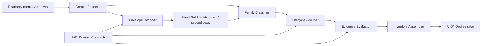

# Logical Components — candidate-evidence-inventory

## Scope and upstream applicability

本設計はpresent consumeの `business-logic-model.md` を、C-03のin-process library境界へ写像する。`security-requirements.md`と`tech-stack-decisions.md`はNFR Requirements stageのscope skipに伴うexpected-absentであり、Requirements Analysis NFR節とaccepted Application Designを代替正本にする。`performance-requirements.md`、`scalability-requirements.md`、`reliability-requirements.md`はlibrary kindの本Unitで非適用で、対応outputもengineがpruneしている。

C-03はC-02 domainと既存journal/event contractsだけへ依存し、C-01、C-04、C-05、renderer、writer、runtime projectionへ逆依存しない。新しいdeployable、AWS resource、database、network service、queue、daemonは作らない。

## Logical component inventory

| Component | Responsibility | Input | Output | Isolation rule |
|---|---|---|---|---|
| Attribution Corpus Projector | canonical wire identityでattribution branchだけをdedup | readonly normalized rows | `AttributionCorpus` + duplicate count | measured branchへ結果を戻さない |
| Envelope Decoder | payload/schema/digest/set ID/inner event findingを収集 | Event Set outer row | decoded inner eventsまたはouter rejection | writer/repositoryを呼ばない |
| Event Set Identity Index | parse済みouterをEvent Set IDで索引し、第2 passでcollisionを確定する | 全outer decode outcome | collision finding付きoutcome | invocation間でindexを共有しない |
| Family Classifier | exact outer→direct prefix→transactionのclosed順で9 familyへ分類 | direct/decoded event | family + boundary role | 1 eventを複数familyへ入れない |
| Lifecycle Grouper | intent×stage×family×identity/source fallbackでgroup化 | normalized candidate events | deterministic groups | missing tokenとexplicit valueを合流しない |
| Evidence Evaluator | 全検証可能findingを収集しfixed precedenceを適用 | candidate group + eligible intents/stage | intervalまたはrejected candidate | window containmentを使わない |
| Inventory Assembler | accepted/rejected、primary/secondary、family countをcanonical順で固定 | evaluator results | `CandidateInventory` | report/renderer logicを持たない |

各componentは同じ `amadeus-stage-attribution-candidates.ts` 内のlogical responsibilityであり、別processやpublic serviceへ分割しない。public seamはC-02型を使うpure functionに限定し、component間の一時finding集合は内部型として保持する。

## Dependency and data flow

<!-- Text fallback: readonly rowをattribution branchだけdedupし、Event Set decode後に全outerをID索引する第2 passでcollisionを付与してからfamily分類する。intent/stage/identity groupの全findingを評価してinventoryを作り、U-04へ一方向に返す。 -->

Envelope Decoderは検証可能なfinding集合をInventory Assemblerまで保持する。上流public seamが単一`EventSetDecodeError`を持つ場合も、内部集合を最初のerrorへ早期縮退させず、primary/secondary分離後に公開値へ変換する。

Event Set Identity Indexは全outer envelopeのshape、schema、digest、Event Set IDを検証可能な範囲までdecodeした後に一度だけ走る。非空IDを`Map<EventSetId, OuterOutcome[]>`へcanonical orderで登録し、member数が2以上の各collision setについて、**関係する全outer outcome**へ`duplicate-event-set-id` findingを付与する。collisionしたouterはinner lifecycle eventをFamily Classifierへ流さず、outer sourceごとに1件のenvelope-level rejected candidateを作る。これにより1つのID collisionは関係outer件数ぶん明示計数されるが、未知のinner candidate数は推定しない。異なるIDとID欠落outerは影響を受けない。

## Failure domains and blast radius

| Failure | Failure domain | Observable result | Unaffected surface |
|---|---|---|---|
| malformed outer envelope | 1 outer source | 1 rejected candidate | 他outer、legacy measured branch |
| duplicate Event Set ID | 同じIDを持つ全outerのcollision set | 各関係outerに1 `duplicate-event-set-id` rejection | 異なるID、ID欠落outer、legacy measured branch |
| candidate identity/boundary failure | 1 deterministic group | primary + secondary reasons | 他group、CLI existing fields |
| canonical duplicate | attribution corpus view | duplicate count、後続decodeなし | measured input sequence |
| unexpected codec/program defect | C-03 invocation | fail-fast | audit corpusはread-onlyで不変 |

C-03が返すfailureはcandidate単位が既定で、partial evidenceを正常intervalへ昇格しない。programmer faultだけはinventoryへ偽装せずprocess failureへ伝播する。C-03変更のblast radiusはnew attribution sectionに限定され、legacy stage duration、sensor/model/review bucket統計へedgeを持たない。

## Shared resources and capacity

- process外のshared mutable resourceは0件。dedup `Set`、Event Set ID index `Map`、group `Map`、finding arrayはinvocation-localであり、同一call内の第1/第2 passだけで共有して返却後に破棄する。
- corpus row数nに対しexpected O(n)、group sortを含む上限O(n log n)、memory O(n)を維持する。
- cache、connection pool、thread pool、queue、horizontal scaling、autoscalingは非適用である。
- 229 shard・136,011 row以上でもsamplingやapproximationへ切り替えず、同じclosed validationを実行する。
- parallel decodeはcanonical orderとfailure isolationを壊し得るため導入せず、単一processの決定的走査を維持する。

## Isolation strategy

- **Branch isolation:** dedup済み`AttributionCorpus`をmeasured functionsへ渡さない。
- **Evidence isolation:** missing intent/stage/identityはdedicated token/source fallbackでgroup化し、明示値groupへ混入させない。
- **Schema isolation:** unsupported Event Setは将来event名を推測せずouter rejectionへ閉じる。
- **Format isolation:** rendererとreport sectionをimportせず、semantic inventoryだけを返す。
- **I/O isolation:** existing normalized rowsを受けるだけで、filesystem scanやaudit writeを所有しない。

## NFR allocation and verification seams

| Requirement fallback | Owner | Verification seam |
|---|---|---|
| NFR-2 determinism | Projector / Grouper / Assembler | duplicate/shuffle/tie fixtures |
| NFR-3 fail-closed | Decoder / Evaluator | missing evidence、複合finding、pairless family |
| NFR-5 current-corpus scale | 全component | ≥229 shard・≥136,011 row相当の単一process integration |
| NFR-6 maintainability | component boundaries | pure unit tests、complexity ceiling 15以下 |
| NFR-7 read-only safety | Projector boundary | input snapshot不変、forbidden writer imports |

circuit breaker、retry/backoff、health check、failover、backupはexternal dependencyとpersistent stateがないため非適用である。malformed evidenceへのretryは同じ不正入力を繰り返すだけなので行わず、理由付きrejectionを安定出力する。
