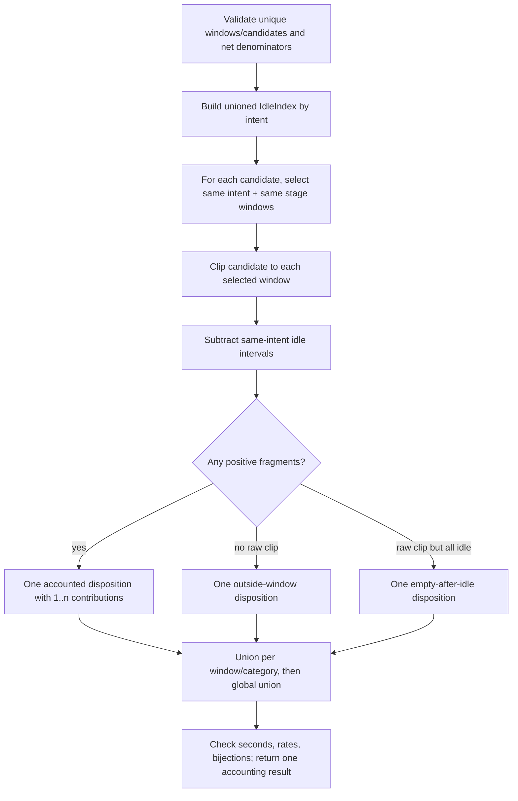

# Business Logic Model — population-interval-accounting

上流入力（consumes全数）は`unit-of-work.md`、`unit-of-work-story-map.md`、`requirements.md`、`components.md`、`component-methods.md`、`services.md`である。本UnitはC-04のpure interval algebraとpopulation accountingだけを所有する。

## Interval primitives

全primitiveはfinite safe integer secondの半開区間`[start,end)`を受け、入力を変更しない。

### `clipInterval(interval, window)`

`start = max(interval.start, window.start)`、`end = min(interval.end, window.end)`を計算し、`start < end`なら新しい`SecondInterval`、それ以外は`null`を返す。境界接触をpositive秒へ膨らませない。

### `unionIntervals(intervals)`

`start asc → end asc`でcopyをsortし、次の`start <= current.end`ならmergeする。したがってnested、identical、overlap、adjacent intervalを1本へ正規化し、離れたintervalだけを残す。出力はstart昇順、positive、相互非重複、非隣接である。

### `subtractIntervals(interval, exclusions)`

exclusionsを先にunionし、base intervalへclipしてから左から走査する。各exclusionの前方gapだけをpositive fragmentとして返し、末尾gapがpositiveなら追加する。結果は0件以上、start昇順、相互非重複で、最大件数はclip済みexclusion数+1である。

### `intervalSeconds(intervals)`

`unionIntervals`後の各`end - start`を加算する。途中と結果を`Number.isSafeInteger`で検査し、overflow/non-finiteを黙って返さない。

## Population accounting pipeline

<!-- Text fallback: window/candidate identityとnet denominatorを検証し、intent別idle unionを作る。candidateごとに同一intent/stage windowだけを選び、clipとidle差引を行い、accounted/outside-window/empty-after-idleの1 dispositionへ分類する。最後にwindow/category unionとglobal unionを作り全恒等式を検査する。 -->

## Candidate disposition algorithm

各`ExplicitLifecycleInterval`について次を実行する。

1. `window.intent === candidate.explicitIntent && window.stage === candidate.stage`のwindowだけをcandidate IDとは独立にdeterministic orderで選ぶ。
2. 全選択windowとの`clipInterval`を評価する。
3. positive clipごとに、同じintentのunion済みidle intervalを`subtractIntervals`で差し引く。
4. raw positive clipが0件なら`rejected(reason="outside-window")`。
5. raw positive clipはあるが全windowのfragmentが0件なら`rejected(reason="empty-after-idle")`。
6. 1件以上fragmentが残れば`accounted`とし、positive fragmentがあるwindowごとに1 contributionを持つ。

時刻が重なる別intent/別stage windowはstep 1で除外し、raw clipの有無にも数えない。eligible window 0件なら全candidateが`outside-window`となる。candidateが複数windowへcontributionを持ってもdispositionは1件である。

## Window accounting algorithm

disposition構築後、eligible windowごとにaccounted contributionをcategory別へ集める。

1. canonical 9 categoryそれぞれについて全fragmentを`unionIntervals`し、`categorySeconds`を求める。0秒categoryもrowを保持する。
2. 9 categoryのunion済みfragmentを再度`unionIntervals`してglobal unionを作り、`observableSeconds`を求める。
3. `categorySumSeconds = Σ categorySeconds`、`overlapSeconds = categorySumSeconds - observableSeconds`。
4. `unattributableSeconds = netSeconds - observableSeconds`。
5. `coverage = observableSeconds / netSeconds`、`unattributableRate = unattributableSeconds / netSeconds`。

category重複は`overlapSeconds`へ残すがobservableへ重複加算しない。U-03はmedian/P95やoutlier sortを計算せず、U-04が全`WindowAttribution`を同じ母集団として統計化できるcanonical per-window値だけを返す。

## Fail-closed invariant transaction

入力検証、disposition、window accounting、出力検証のどこか1件でも不変条件に違反したら、部分`windows`や部分`dispositions`を返さず`AttributionResult.err(accounting-invariant)`を返す。

- window固有のnet/identity/seconds違反は`subject={type:"window",windowId}`。
- candidate重複やdisposition欠落は`subject={type:"population",candidateId}`。
- candidateを特定できない集合重複/全体恒等式は`subject={type:"population"}`。

expectedな`outside-window`/`empty-after-idle`はerrorではなくdispositionであり、CLI failureを発生させない。

## Deterministic order and complexity

window結果は`intent → measuredInterval.start → measuredInterval.end → windowId`、dispositionは`candidateId`、contributionはwindow順、categoryはclosed tuple順で返す。Map insertion order、filesystem order、input orderに依存しない。

window数w、candidate数c、生成fragment総数kに対し、candidate-window評価はworst-case O(cw)、interval normalizationはwindow/category単位で合計O(k log k)、memoryはO(w+c+k)である。全corpus intervalを1配列へ集めずwindow/category bucketで処理する。sampling、approximation、external cacheを使わない。

## Review — Iteration 1

- **Verdict:** READY
- **Reviewer:** amadeus-architecture-reviewer-agent
- **Date:** 2026-08-09T23:48:43Z
- **Iteration:** 1
- **Scope decision:** none

U03は半開区間代数、同一intent/stage限定、idle差引、candidate単一dispositionと複数window contribution、category/global union、全単射、determinism/PBT、typed fail-closed transaction、Unit境界を上流契約と矛盾なく網羅している。

### Findings

- NIT | unattributableRateはbusiness-logic-model.mdでunattributableSeconds/netSeconds、business-rules.mdで浮動小数点恒等式を優先して1-coverageと記述されている。数学的意味と実装方針は明白だが、実装時の迷いをなくすため前者も後者へ統一するとよい。
