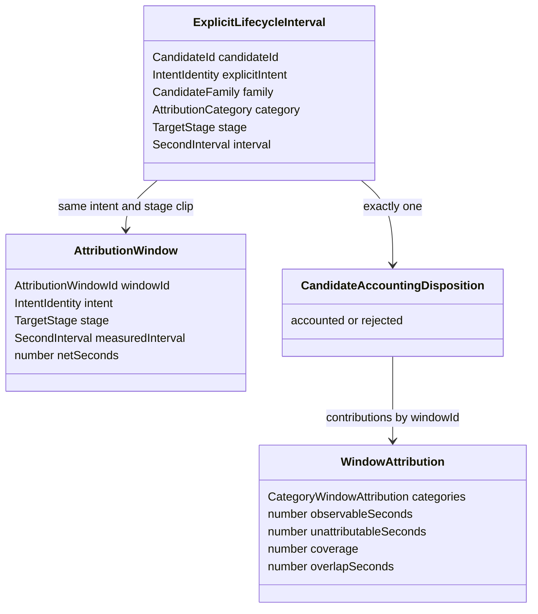

# Domain Entities — population-interval-accounting

上流入力（consumes全数）は`unit-of-work.md`、`unit-of-work-story-map.md`、`requirements.md`、`components.md`、`component-methods.md`、`services.md`である。U-03はU-01のidentity/interval/disposition契約を消費し、accounting algorithm固有のcollectionを所有する。

## Owned shapes

```typescript
type IntentIdleIntervals = {
  readonly intent: IntentIdentity;
  readonly intervals: readonly SecondInterval[];
};

type IdleIndex = {
  readonly byIntent: readonly IntentIdleIntervals[];
};

type CategoryWindowAttribution = {
  readonly category: AttributionCategory;
  readonly fragments: readonly SecondInterval[];
  readonly seconds: number;
  readonly share: number;
};

type WindowAttribution = {
  readonly windowId: AttributionWindowId;
  readonly intent: IntentIdentity;
  readonly stage: TargetStage;
  readonly measuredInterval: SecondInterval;
  readonly netSeconds: number;
  readonly categories: readonly CategoryWindowAttribution[];
  readonly categorySumSeconds: number;
  readonly observableFragments: readonly SecondInterval[];
  readonly observableSeconds: number;
  readonly overlapSeconds: number;
  readonly unattributableSeconds: number;
  readonly coverage: number;
  readonly unattributableRate: number;
};

type AttributionPopulationAccounting = {
  readonly windows: readonly WindowAttribution[];
  readonly dispositions: readonly CandidateAccountingDisposition[];
};
```

`CandidateAccountingDisposition`、`CandidateWindowContribution`、`ExplicitLifecycleInterval`、`AttributionWindow`、`AccountingInvariantError`はU-01 contractを再利用し、U-03で別shapeを定義しない。

## Relationship model



<!-- Text fallback: explicit lifecycle intervalは同一intent/stage windowだけへclipされ、candidateごとに1 dispositionになる。accounted contributionをwindow IDで集約し、category/global unionからWindowAttributionを作る。 -->

## IdleIndex invariants

- `byIntent`のintent identityは一意でcanonical identity順。
- 各`intervals`は`unionIntervals`済みでstart昇順、positive、相互非重複、非隣接。
- idle sourceのapproval、park、session区分はaccounting semanticsに影響しないため、この型では区別しない。
- unknown intentやwindow containmentでidleを別intentへ移さない。

## CategoryWindowAttribution invariants

- windowごとにclosed category順でちょうど9件。
- fragmentsはwindow内、idle非交差、start昇順、positive、相互非重複、非隣接。
- `seconds = intervalSeconds(fragments)`、`share = seconds / window.netSeconds`。
- seconds 0ではfragmentsは空、shareは0。null/NaN/Infinityを使わない。

## WindowAttribution invariants

- input `AttributionWindow`のidentity/intent/stage/measuredInterval/netSecondsをそのまま保持する。
- `observableFragments`は全category fragmentsのglobal union。
- category/global/residual/ratioはbusiness-rulesの全恒等式を満たす。
- window結果自体にstatistics順位、outlier flag、renderer fieldを持たせない。

## Population collection invariants

`AttributionPopulationAccounting`は単なる2配列ではなく、入力candidate/windowとの全単射とcontribution参照整合をconstructorで保証する。正常値を一部だけ作って後からdiagnosticを添える形は禁止し、1件の違反でcollection全体をtyped errorにする。

## Dependency boundary

U-03はU-01 domain contractだけをruntime dependencyとして持ち、U-02 decoderとU-04 service/reportをimportしない。U-04から渡されたtyped window/interval/idleだけを処理し、filesystem、process、journal codec、renderer、external serviceへ依存しない。
