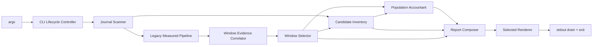

# Logical Components — stage-stats-attribution-service

## Scope and upstream applicability

present consumeの `business-logic-model.md` を既存one-shot CLIへ写像する。`performance-requirements.md`、`security-requirements.md`、`scalability-requirements.md`、`reliability-requirements.md`、`tech-stack-decisions.md`はexpected-absentで、declared NFR requirement IDはない。Requirements AnalysisとApplication Designはcontext evidenceに限定する。

## Logical component inventory

| Component | Responsibility | Failure domain | Isolation |
|---|---|---|---|
| CLI Lifecycle Controller (C-01) | argv、呼出順、exit、stdout/stderr | invocation | domain規則を再実装しない |
| Existing Journal Scanner | corpus readとpartial diagnostics | shard | read-only、repairなし |
| Existing Measured Pipeline | legacy windows/stats | legacy branch | attribution dedupを受けない |
| Window Evidence Correlator (C-01) | FIFOと同じpassでstable/ambiguous evidence | target window group | containment補完なし |
| Attribution Window Selector (C-05) | target/identity/netのexclusive分類 | window | measured populationを変更しない |
| Candidate Inventory (U-02/C-03) | dedup、Event Set、family/lifecycle rejection | candidate/envelope | writer/runtime projectionなし |
| Population Accountant (U-03/C-04) | clip/idle/union/disposition/invariant | candidateまたはpopulation | event/rendererなし |
| Report Composer (C-05) | reconciliation、statistics、outlier、reference | report transaction | accounting再実行なし |
| Semantic Renderers (C-01) | 1 modelをMarkdown/CSV/JSONへencode | selected format | format固有計算なし |

## Orchestration and dependency flow

<!-- Text fallback: CLIがcorpusを1回scanし、legacy measuredとparallel evidenceを作る。selectorの同じeligible集合をcandidate/accountantへ渡し、composerが一度reconcileして1 semantic modelをrendererへ渡す。 -->

C-01だけがorchestrationを所有する。C-05はC-04を呼ばず、rendererはC-03/C-04へ到達しない。scan referenceはC-01からC-05へ明示入力し、3rendererは同じfieldを表現する。

## Shared resources and blast radius

| Resource | Access | Owner | Safety |
|---|---|---|---|
| audit shards | read-only | scanner | path-order、unreadable count、writeなし |
| normalized rows | readonly process memory | C-01 | legacy original / attribution copyを分離 |
| maps/buckets/report | invocation-local memory | C-03〜C-05 | global cacheなし |
| stdout/stderr | terminal write | Lifecycle Controller | semantic/diagnostic分離、natural drain |
| AWS/network/database | none | none | 新規failure/cost domainなし |

candidate failureはcandidate/envelope、unreadableはshard、ambiguous identityはwindow groupへ局所化する。accounting/reconciliation invariantはreport transaction全体を止める。legacy branchはnew dedupとattribution exclusionから隔離し、append-only attribution fieldだけが新しいconsumer surfaceになる。

## Isolation and capacity decisions

- measured/attribution branchをoriginal rowsの後で分岐する。
- unique window selectionを一度確定し、同じreadonly arrayをU-02/U-03へ渡す。
- accepted/rejected/disposition IDをC-05で全単射reconcileする。
- statistics/outlier/reason matrixをC-05、format encodingをC-01に分離する。
- process外shared stateを0件とし、single-process O(n)/O(n log n)設計を維持する。
- 229 shard・136,011 row以上と各format >65,536 bytesをintegration preconditionにする。

## Decision traceability

各decisionのdeclared requirementはmissingである。contextはID代用ではない。

| Logical decision | Declared requirement | Context evidence / verification |
|---|---|---|
| 9 componentのin-process境界 | Missing (`tech-stack-decisions.md` absent) | `services.md:5-20`; deployable/resource census |
| C-01だけのorchestration | Missing | `business-logic-model.md` Service orchestration; call-order spy |
| measured/attribution分岐 | Missing | `components.md:42-50`; legacy characterization |
| unique selection共有 | Missing | Functional selection contract; identity collision fixture |
| C-05 reconciliation transaction | Missing | Cross-component reconciliation; duplicate/loss fixture |
| C-05/renderer非再計算 | Missing | Canonical report; 3format semantic parity |
| shard/candidate/window/report failure domain | Missing | `services.md:70-96`; mixed failure matrix |
| process-local shared state | Missing | `services.md:13-20`; global/write import census |
| stdout/stderr owner分離 | Missing | `requirements.md:295-297`; capture assertions |
| O(n)/O(n log n)とscale precondition | Missing | `requirements.md:299-305`; scale integration |
| AWS/network/databaseなし | Missing | accepted one-shot CLI boundary; dependency census |

## Infrastructure bridge

Infrastructure Designはscopeでskipされる。本logical inventoryは新しいprovisioning対象を0件と明示するbridgeであり、実装対象は既存Bun CLI process内moduleだけである。deployment、health endpoint、IAM policy、database schema、queue、autoscaling groupを生成しない。
