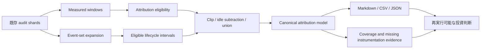

# Scope Document — CG 観測可能区間と帰属不能残余

- **Intent**: `260809-cg-attribution-stats`
- **Scope**: `self-feature`
- **Source Issue**: [#2695](https://github.com/amadeus-dlc/amadeus/issues/2695)
- **Mirror Issue**: [#2722](https://github.com/amadeus-dlc/amadeus/issues/2722)
- **Boundary ruling**: Issue #2695 に記載された範囲から縮小せず、完了条件 1〜10 を本 Intent で満たす。

## Upstream Inputs

- 正本は [intent-statement.md](../intent-capture/intent-statement.md) と Issue #2695 である。
- `feasibility-assessment` は `self-feature` の解決済み stage 構成により存在しない。実現可能性を未確認と推定せず、Issue のクロスレビュー済み規則と後続 Inception の reverse-engineering／application-design で検証する。
- `constraint-register` も存在しない。明示制約は intent statement、Issue #2695、組織・チーム・プロジェクト rules から取り込む。

## Scope Principle

この Intent の最小価値は、現行 audit が説明できる区間と説明できない残余を、推定せず再実行可能に分離することである。部分的な Bolt や proto-Unit は段階的に構築できるが、Issue #2695 の `In` と完了条件 1〜10 がすべて満たされるまで Intent 完了とはしない。

対象境界は SETTLED である。Scope Definition は境界を再交渉せず、能力間の依存、リスクに基づく順序、検証可能な完了条件を構造化する。

## Capability Inventory

| ID | SETTLED capability | Source |
|---|---|---|
| CAP-01 | `amadeus-stage-stats.ts` に観測可能区間と帰属不能残余の attribution 集計を追加する | Issue #2695 `In` |
| CAP-02 | candidate inventory を列挙し、transaction／execution／unit-pool の `Event Set` を展開する | Issue #2695 `In`・event eligibility |
| CAP-03 | 対象 stage、start、terminal、identity が決定できる interval だけを採用し、不採用理由を数える | Issue #2695 lifecycle rule |
| CAP-04 | measured population を保持し、`zero-net-attribution` と FIFO 衝突由来 `ambiguous-window-identity` を attribution から除外する | Issue #2695 population/window identity |
| CAP-05 | `[start,end)`、window clip、idle subtraction、category 内 union、全 category union を実装する | Issue #2695 区間と会計 |
| CAP-06 | coverage／帰属不能の恒等式、category／coverage／overlap 統計を決定的に算出する | Issue #2695 区間と会計・出力 |
| CAP-07 | `--stage`、`--outliers` 0〜100、既定値、usage exit 2、`n=0` 正常空レポートを提供する | Issue #2695 `In`・完了条件5 |
| CAP-08 | outlier、missing instrumentation candidates、observed fact と hypothesis の分離、methodology を出す | Issue #2695 出力 |
| CAP-09 | 1つの semantic model から Markdown／CSV／JSON を生成し、母集団・規則・除外件数を一致させる | Issue #2695 出力・完了条件8 |
| CAP-10 | 合成／実 corpus 相当テスト、後方互換性、3形式 65,536 bytes 超の producer／consumer 完走と digest parity を固定する | Issue #2695 完了条件1〜10 |

## In Scope

### Population and identity

- 既存 `scanCorpus → buildWindows → subtractIdle` の measured population と既存 stage duration 統計を維持する。
- attribution population は `netSeconds > 0` かつ一意な window identity を持つ窓だけとする。
- `zero-net-attribution`、FIFO 衝突 group、閉じない group を fail-closed に除外・診断する。
- stage slug が安全でも attribution population が0なら、`n=0`／比率 `n/a` の正常レポートを返す。

### Event eligibility and intervals

- `SENSOR_*`、`SWARM_*`、`BOLT_*`、`SUBAGENT_*`、`LOOP_MONITOR_*`、`MERGE_DISPATCH_*`、`UNIT_POOL_EVENT_SET_COMMITTED`、`EXECUTION_EVENT_SET_COMMITTED`、transaction envelope を inventory とする。
- outer row と inner `Event Set` を展開し、event 自身または同一 envelope の canonical stage 属性だけを使う。
- window containment、同一 timestamp、`Duration ms` などから stage／identity／terminal を推定しない。
- `SENSOR_FIRED → SENSOR_PASSED|FAILED|BUDGET_OVERRIDE`、execution operation、unit-pool attempt の明示 lifecycle を採用し、その他は必要属性が揃う場合だけ採る。
- duplicate start／terminal、missing start／terminal、non-positive interval を interval にせず理由別件数へ加える。

### Accounting and statistics

- integer-second 半開区間を window で clip し、既存 idle span との交差を除く。
- category 内の nested／parallel／overlap interval を union する。
- category 間は独立軸として保持し、全 category union のみを `observableSeconds` とする。
- 全適格 window で `observableSeconds + unattributableSeconds = netSeconds`、`coverage + unattributableRate = 1` を保証する。
- category duration の中央値／P95 と構成比の中央値／P95で、Issue が定める異なる母集団を守る。
- category 名を lifecycle の意味以上に「実装」「検証」等へ読み替えない。

### CLI and output

- `--stage <slug>`、既定 `code-generation`、`--outliers <N>` 0〜100、既定10、不正値 exit 2 を提供する。
- measurement ref、category、coverage、overlap、outlier、missing instrumentation、methodology を同一 semantic model に持たせる。
- outlier は帰属不能秒降順、tie は `intent → startedAt → completedAt` 昇順とする。
- observed fact と `candidateBoundary` hypothesis を別フィールドにする。
- Markdown／CSV／JSON の型表現を定め、同じ母集団・規則・除外件数を表す。

### Verification and compatibility

- 合成 fixture で identity、nested／parallel、idle、別 stage 同秒、欠落 lifecycle、FIFO 衝突、境界値を再現する。
- 実 corpus 相当で採用／不採用、coverage、帰属不能、上位 outlier を再実行可能にする。
- stage duration、sensor、model、reviewBuckets と既存 renderer 契約を append-only で維持する。
- 出力追加後の Markdown／CSV／JSON をそれぞれ 65,536 bytes 超 fixture で full capture と pipe に通し、producer／consumer exit と byte digest を検証する。JSON は `jq empty` も通す。

## Out of Scope

Issue #2695 が明記する次の項目だけを範囲外とする。

- 新規 audit event の追加または計装変更
- 帰属不能残余の実装／検証／レビュー／PR 収束等への推定配分
- 観測された特定 lifecycle の効率化施策
- モデル／ハーネス軸の帰属（Issue #2518）
- 現行 `STAGE_STARTED → STAGE_COMPLETED` window identity 自体の改修

上記以外を timeline、工数、実装都合によって Out へ移すことはスコープ変更であり、この Intent 内では行わない。

## Dependencies and Sequencing

自動裁定は `semantic-model-first` と `risk-first` を選択した。依存関係は次のとおりである。

1. measured／attribution population と window identity を固定する。
2. event inventory、stage eligibility、lifecycle pairing、interval 正規化を固定する。
3. clip／idle subtraction／union／会計恒等式を持つ canonical semantic model を固定する。
4. CLI と Markdown／CSV／JSON renderer を canonical model へ接続する。
5. parity、後方互換、実 corpus、65,536 bytes 超 consumer を収束させる。

順序内では FIFO 衝突、stage identity 欠落、nested／parallel union、恒等式を最初に赤いテストで固定する。暦日 hard deadline は置かず、P2 として完了条件 1〜10 の品質ゲートを優先する。

## Value Stream Map

利用者価値は「CG の実装時間を断定する」ことではない。観測可能時間と帰属不能残余を分離し、追加計装または後続効率化の候補を evidence に基づいて選べることである。

## Completion and Change Control

- Intent 完了は Issue #2695 の完了条件 1〜10 がすべて検証済みであることを要求する。
- [Issue #2700](https://github.com/amadeus-dlc/amadeus/issues/2700) の既存 stdout 終了経路欠陥は [PR #2702](https://github.com/amadeus-dlc/amadeus/pull/2702) と [PR #2706](https://github.com/amadeus-dlc/amadeus/pull/2706) で解消済みである。ただし新しい出力面の実サイズ検証は本 Intent の責務として残る。
- 境界の縮小、完了条件の延期、observed fact と推定の混同は approval boundary で明示的な仕様変更として扱う。
- 新規計装が必要と判明した場合は missing instrumentation candidate として別 Issue 候補へ出すが、本 Intent の既存 audit による集計責務を置換しない。
