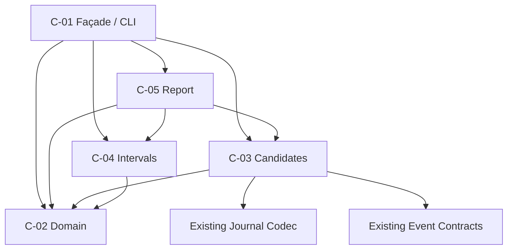
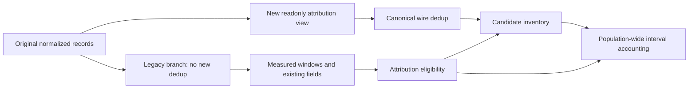

# Component Dependency — CG 観測可能区間と帰属不能残余

## Dependency policy

本依存設計は `requirements.md`、Brownfieldの `architecture.md` と `component-inventory.md`、および`components.md`のC-01〜C-06を正本とする。user storiesは未生成、team-practicesが要求するharness-neutral source、pure decision / I/O境界、循環禁止を適用する。

依存方向は **CLI façade → domain/use-case modules → value types** の一方向とする。C-02 domainは最下層、C-01だけがfilesystem/process/rendererを所有する。C-03〜C-05は相互の内部へ到達せず、public readonly valueを介して連携する。

## Dependency matrix

行がconsumer、列がproviderである。`R`はruntime import、`T`はtest-only import、`-`は依存禁止を示す。

| Consumer \ Provider | C-01 Façade | C-02 Domain | C-03 Candidates | C-04 Intervals | C-05 Report | Existing journal | Existing execution/unit contracts |
|---|---:|---:|---:|---:|---:|---:|---:|
| C-01 Façade | - | R | R | R | R | R | - |
| C-02 Domain | - | - | - | - | - | - | - |
| C-03 Candidates | - | R | - | - | - | R | R |
| C-04 Intervals | - | R | - | - | - | - | - |
| C-05 Report | - | R | R | R | - | - | - |
| C-06 Tests | T | T | T | T | T | T | T |

禁止事項:

- C-02〜C-05からC-01またはrendererへの逆依存。
- C-04からC-03へのevent/candidate実装依存。
- C-03からruntime graph projection、writer、repositoryへの依存。
- existing journalやevent contractからattribution moduleへの依存。
- rendererからC-03/C-04を直接呼ぶ横断依存。

## Acyclic graph

<!-- Text fallback: C-01はC-03/C-04/C-05/C-02へ依存する。C-05はC-03/C-04/C-02、C-03はC-02と既存journal/event contracts、C-04はC-02へ依存する。逆向きのedgeはない。 -->

topological orderは`Existing contracts / C-02 → C-03・C-04 → C-05 → C-01`でありcycleはない。

## Data flow

| Step | Producer | Value | Consumer | Mutation rule |
|---:|---|---|---|---|
| 1 | C-01 | `ScannedCorpus.records` | existing measured、C-03 | original readonly sequenceを共有、変更禁止 |
| 2a | existing measured | `MeasuredWindow[]`、legacy stats | C-01、C-05 | 現行意味を保持 |
| 2b | C-01 window evidence | `StageWindowEvidence[]` | C-05 | legacy projectionと同じpairing passから生成 |
| 3 | C-05 | `AttributionWindowSelection` | C-01、C-03、C-04 | net>0、一意identityのみ。同じimmutable集合を両moduleへ渡す |
| 4 | C-03 | `AttributionCorpus` | C-03 decoder | attribution branch内だけdedup |
| 5 | C-03 | `CandidateInventory` | C-01 | accepted/rejectedを分離。acceptedはwindowIdを推定しないflat intervals |
| 6 | C-04 | `AttributionPopulationAccounting` | C-01、C-05 | 全windowのcategory/global unionとcandidateごとに1 disposition済み。accountedだけwindow別contributionを持つ |
| 7 | C-05 | `StageAttributionReport` | C-01 | canonical semantic section |
| 8 | C-01 | encoded Markdown/CSV/JSON | stdout | drain完了までprocess終了禁止 |

## Measured / attribution branch isolation

<!-- Text fallback: original recordsは既存measured分岐へそのまま渡す。同じrecordsから別のreadonly attribution viewを作り、その分岐だけcanonical dedupしてcandidate inventoryへ渡す。 -->

この分離はFR-POP-1/3の核心である。dedup済み配列を`buildWindows`、`indexIdle`、`tallySensors`、`attributeModels`へ戻してはならない。canonical stage row duplicateを含むfixtureでこの禁止edgeを検証する。

## Shared resource inventory

| Resource | Access | Owners/consumers | Contention / safety |
|---|---|---|---|
| audit shard JSONL | read-only | C-01 journal scan | 書込みなし、path順sort、unreadable count |
| review markdown | read-only | existing C-01 collector | attributionは変更しない |
| process memory | ephemeral | C-01〜C-05 | invocation-local、global cacheなし |
| stdout/stderr | write-only terminal | C-01 shell | stdout semantic report、stderr diagnosticを分離 |
| `model-map` / runtime graph | accessなし | none | attribution sourceにしない |
| AWS/network/database | resourceなし | none | 非適用 |

共有mutable resource、lock、transaction、retryは不要である。read-only CLIなのでrollback対象のproject mutationもない。

## Contract ownership

| Contract | Single owner | Consumers |
|---|---|---|
| candidate family/category/rejection/disposition vocabulary | C-02 | C-03、C-04、C-05、renderer |
| canonical wire dedup | existing journal semanticsをC-03が消費 | C-03 only |
| family lifecycle mapping | C-03 | C-05 |
| interval algebraとpost-accounting disposition | C-04 | C-01、C-05 |
| population/statistical rules | C-05 | C-01 renderer |
| C-05 selection→C-03 decode→C-04 accounting→C-05 composeの呼出し順とtyped error→exit写像 | C-01 | operator/tests |
| CLI flags/exit ladder/stdout | C-01 | operator/tests |
| renderer schema parity | `StageStatsReport` in C-01 + C-05 section | all formats |

同じ規則を複数moduleで再実装しない。特にprimary reason precedence、outlier sort、ratio calculation、format section sortは1 ownerだけを持つ。

## Failure propagation and blast radius

| Failure source | Containment | Downstream effect | User-visible result |
|---|---|---|---|
| one malformed candidate | candidate group/envelope | intervalへ流さない | rejection count、exitは通常0 |
| unreadable shard | that shard | readable corpusで継続 | partial report + exit 1 |
| invalid argv | parse boundary | scan未実行 | usage + exit 2 |
| missing intent/stage/identity | candidate group | attribution intervalなし | closed reason count |
| window collision/zero-net | attribution window only | measured fieldは維持 | window exclusion count |
| accounting invariant violation | invocation | rendererへ不正modelを渡さない | fail-closed diagnostic + non-zero |
| renderer encoding defect | selected format invocation | other formatのsemantic modelは不変 | testでformat別に検出 |

candidate単位の不正をservice全体のfailureへ上げず、内部accounting defectをcandidate rejectionへ下げない。この分類によりblast radiusを正しく保つ。

`empty-after-idle`は内部faultではなく、C-03を通過したcandidateに対するC-04所有のpost-accounting rejectionである。C-04は全eligible windowを1回で評価し、candidateごとに`candidateId`、family、1 dispositionだけを返す。どのwindowともclipしない場合だけ`outside-window`を全体で1回、clipはあるが全windowでpositive fragmentが残らない場合だけ`empty-after-idle`を全体で1回返す。positive fragmentが複数windowに残る場合は1つの`accounted` disposition内に複数contributionを持たせる。C-05はC-03由来rejectionとの非交差性を検証してからprimary件数へ合流する。

## Ordering and determinism

- shard/path、journal record、family、reason、category、windowは明示sort keyを持つ。
- `Map` insertion orderやfilesystem列挙順をpublic output orderingの根拠にしない。
- lifecycle groupingはcanonical wire dedup後の`intent + family + identity`。
- 同秒eventはcanonical record orderで扱うが、stage/intent attributionの根拠にはしない。
- outlier tieは`intent → startedAt → completedAt`。最後まで同値ならstable window idで全順序を作るが、公開tie契約の前三項を変えない。

## Integration seams

### Existing journal seam

C-03は`readJournalRecords`ではなくC-01が既に読んだ`AttributedRecord[]`を受ける。wire field accessとcanonical key語彙だけをexisting journalからimportし、filesystem scanを重複させない。

### Existing Event Set seam

execution/unit-poolのtype vocabularyはread-only decoderのparse対象として再利用する。repository foldやruntime projectionを呼ぶとstage containment/latest-wins意味論が混入するため禁止する。

### Renderer seam

C-05がformat-neutralなarray/objectを返し、C-01 rendererが既存sectionへappendする。CSVだけの集計やMarkdownだけのreason labelを持たない。

## Test dependency strategy

- C-02〜C-05はin-process unit/PBTで直接importする。
- C-01 compatibilityは既存t486のpublic exportsでcharacterizeする。
- C-01 process boundary、filesystem、exit、pipeはt487でspawnする。
- PBT oracleは被検union実装を再利用せず、秒数恒等式や集合被覆など独立の性質を検証する。ただし同じinterval algorithmをtest側に複製しない。
- oversized fixtureは各formatのsemantic reportを増幅し、出力byte数のpreconditionとdigest parityをassertする。

## Change impact map

| Change reason | Primary files | Must not ripple to |
|---|---|---|
| new candidate family evidence | C-02/C-03 + focused tests | interval algebra、legacy measured |
| interval rule correction | C-04 + PBT | decoder、argv |
| statistic/population correction | C-05 + semantic parity tests | wire decode、filesystem |
| CLI option/exit change | C-01 + integration | domain internals |
| output representation | C-01 renderer + format test | population/accounting |

この変更理由の分離が失われ、常に2つ以上のmoduleを同じ理由で変更する状態になった場合だけ境界を再評価する。現時点で再利用目的の追加abstractionは作らない。
