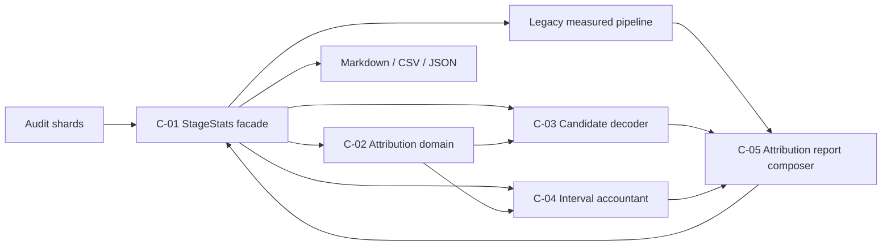

# Components — CG 観測可能区間と帰属不能残余

## 設計の基準

本設計は `requirements.md` のFR/NFR、Brownfieldの `architecture.md` と `component-inventory.md` を正本入力とする。user storiesはscopeで未生成、team-practicesはBun/TypeScript、純粋判定とI/O境界の分離、TDD、生成物非編集を要求している。

既存の単一read-only CLIとmeasured populationを維持し、新規attribution処理だけを変更理由ごとのpure moduleへ分離する。AWS service、network、database、UIは導入しない。推定規模は設計時点のsource/test行数レンジであり、実装のquotaではない。

<!-- Text fallback: audit shardsはC-01で既存measured経路と新規attribution経路へ分岐する。C-01がC-03のcandidate結果をC-04へ渡す唯一のorchestratorである。C-02のdomain契約をC-03/C-04が使用し、C-05が受領済み会計結果を合成してC-01の3rendererへ返す。 -->

## コンポーネント一覧

| ID | 予定source | 責務 | 所有しないもの | 推定規模 |
|---|---|---|---|---:|
| C-01 | `amadeus-stage-stats.ts` | CLI、filesystem scan、既存measured pipeline、最終report合成、3renderer | candidate規則、interval再計算 | 既存約1,000行 + 220〜320行変更 |
| C-02 | `amadeus-stage-attribution-domain.ts` | closed vocabulary、ブランド値、判別union、public type契約 | I/O、journal decode、集計処理 | 260〜360行 |
| C-03 | `amadeus-stage-attribution-candidates.ts` | attribution専用canonical dedup、Event Set展開、family inventory、lifecycle pairing、primary reason分類 | measured corpus変更、window containment推定 | 550〜750行 |
| C-04 | `amadeus-stage-attribution-intervals.ts` | 半開区間、clip、idle差引、category/global union、恒等式 | candidate意味、renderer | 300〜450行 |
| C-05 | `amadeus-stage-attribution-report.ts` | attribution eligibility、window/accounting集約、統計、outlier、methodology | filesystem、format固有の再集計 | 350〜500行 |
| C-06 | `t486-stage-stats.test.ts` / `t487-stage-stats.integration.test.ts` | pure/PBT、fixture、CLI、real-corpus相当、oversized pipeの証明 | 本番分岐 | unit 900〜1,300行、integration 600〜900行の増分 |

## C-01 StageStats façade / CLI

### 目的

既存consumerの唯一のentry pointを維持する。`scanCorpus → buildWindows → subtractIdle`、既存`StageStatsReport` fields、`renderMarkdown`、`renderCsv`、`serializeJson`、`main`の公開seamを壊さない。

### 責務

- `--stage`と`--outliers`を既存argv parserへ追加し、defaultを`code-generation`と10に確定する。
- filesystemから得た`ScannedCorpus.records`を二分岐する。
  - measured分岐: 現行配列を無加工で既存window/idle処理へ渡す。
  - attribution分岐: C-03へ渡し、canonical wire duplicateだけを新規分岐内で除去する。
- C-05のwindow selection→C-03 candidate decode→C-04 population accounting→C-05 report composeを唯一のorchestratorとして順に呼び、typed errorを`main`のexit 1へ伝播する。C-05のcanonical attribution sectionは成功時だけ既存reportへappend-onlyで付加する。
- 3rendererは同じreport fieldを表現するだけとし、format固有の集計を禁止する。
- stdoutをdrainしてからexit ladder 0/1/2を返す。

### Public interface

既存exportは維持する。新規の公開面は`CliOptions.stage`、`CliOptions.outliers`、`StageStatsReport.attribution`、およびtypedな`composeReportWithAttribution`に限定する。既存`composeReport`はlegacy reportを直接返す互換seamとして残し、C-02〜C-05の内部構造をfaçade経由で再exportしない。

## C-02 Attribution domain

### 目的

無効状態を型境界で分離し、candidate、window、interval、rejection、reportの共通語彙を1箇所に置く。

### 所有する契約

- `TargetStage`、`OutlierLimit`のsmart constructor。
- `AttributionWindowId`、`LifecycleIdentity`、`EventSetId`などのopaque string type。
- candidate familyとcategoryのclosed tuple。
- primary rejection reasonの固定precedence tuple。
- `DecodedCandidate`、`RejectedCandidate`、`ExplicitInterval`、`AttributionWindow`の判別union。
- `Result<T, AttributionError>`型。exception classは作らない。

### 境界

値のvalidationをbooleanで捨てず、parserが成功型または理由付きfailureを返す。domainは`node:fs`、process、renderer、audit writerをimportしない。

## C-03 Candidate decoder

### 目的

既存audit rowを無音廃棄せずcandidate inventoryへ変換し、明示証拠だけからlifecycle intervalを提案する。

### 内部サブ責務

1. **Attribution corpus view**: `journalRecordKey`相当のcanonical keyでattribution分岐だけをdedupする。dedup前後件数を保持する。
2. **Outer envelope decoder**: transaction、execution、unit-pool Event Setをparseし、schema、digest、event-set id、canonical duplicateを検査する。
3. **Family classifier**: `SENSOR_*`、`SWARM_*`、`BOLT_*`、`SUBAGENT_*`、`LOOP_MONITOR_*`、`MERGE_DISPATCH_*`とEvent Set familyをclosed inventoryへ振り分ける。
4. **Lifecycle grouper**: familyごとの明示identityでstart/terminalをgroup化し、start/terminal cardinalityを数える。
5. **Evidence evaluator**: intent、stage、identity、timestampを固定precedenceで評価する。window clipとidle差引後のreasonはC-04へ委譲する。

### Fail-closed境界

- eventまたは同一canonical envelopeのintentがwindow intentと一致しない候補は採用しない。
- stageは明示fieldまたはcanonical envelopeの`origin.stage`だけを受理する。
- window containment、同一timestamp、`Duration ms`、周辺eventはidentity証拠に使わない。
- identity groupを作れないouter failureはenvelope 1件を計数単位にする。
- canonical wire duplicateはlifecycle duplicate理由に数えない。dedup後に残る重複start/terminalだけを分類する。

## C-04 Interval accountant

### 目的

時間代数を候補解釈とreport表現から隔離し、整数秒の恒等式をpure functionで保証する。

### 責務

- `[start,end)`のpositive intervalを生成する。
- candidateを同一intent・target stageのwindowへclipする。
- 既存idle intervalとの交差を差し引き、0〜2個のfragmentへ分割する。
- 全eligible windowを単一呼出しで評価し、C-03でacceptedとなったcandidateをidentity単位で`accounted`、`outside-window`、`empty-after-idle`のいずれか1 dispositionへ分類する。`accounted`は複数window contributionを持てる。
- 同一window/categoryのintervalをsort後unionする。
- category union群のglobal union、overlap、observable、residual、rateを計算する。
- `observable + unattributable = net`と`coverage + unattributableRate = 1`を結果生成時に検査する。

### 境界

C-04はfamily名からcategoryへの対応済みintervalと全eligible windowを受け取り、event fieldを読まない。candidateごとに全windowとのclipを評価し、全てclipなしなら`outside-window`、clipはあるが全てfragmentなしなら`empty-after-idle`としてこの順に判定する。複数windowにpositive fragmentが残っても1つの`accounted` dispositionへまとめる。C-03由来rejectionは入力されないためprimary reason集合は非交差であり、rendererはC-04を直接呼ばない。

## C-05 Attribution report composer

### 目的

measured populationを変更せず、attribution populationと診断をcanonical semantic sectionへ合成する。

### 責務

- 対象stageのmeasured windowにstable internal idとFIFO collision metadataを関連付ける。
- `netSeconds <= 0`を`zero-net-attribution`、衝突groupを`ambiguous-window-identity`として除外する。
- window別category duration/share、observable、unattributable、coverage、overlapを構成する。
- duration統計はpositive集合、share統計はzeroを含むeligible全windowを母集団にする。
- outlierは`unattributableSeconds desc → intent asc → startedAt asc → completedAt asc`でsortしてN件を表示する。
- C-03のdecode/lifecycle rejectionとC-04のpost-accounting dispositionをcandidate identityで非交差検証し、family×primary reasonへ1回だけ計上する。50%超window数、terminal欠落、observed factと`candidateBoundary`仮説を分離する。
- measurement referenceとmethodologyへ母集団、採否、interval、統計規則を入れる。

## データ所有権

| データ | Owner | Immutable consumer |
|---|---|---|
| raw normalized `AttributedRecord[]` | C-01 scan | measured pipeline、C-03 |
| attribution dedup view | C-03 | C-03内部のみ |
| candidate inventory / decode-lifecycle rejection | C-03 | C-01、C-05 |
| population-wide interval fragments / unions / post-accounting disposition | C-04 | C-01、C-05 |
| attribution semantic section | C-05 | C-01 renderer |
| existing report fields | C-01 | 3renderer、既存consumer |

共有mutable stateはない。全componentは入力配列を変更せず、新しいreadonly valueを返す。

## 要件トレーサビリティ

| Requirement group | Owner components |
|---|---|
| FR-POP-1〜4 | C-01、C-03、C-05 |
| FR-EVT-1〜5 | C-02、C-03、C-04、C-05 |
| FR-INT-1〜4 | C-02、C-04 |
| FR-STAT-1〜2 | C-04、C-05 |
| FR-OUT-1〜4 | C-01、C-05 |
| FR-CLI-1〜2 / FR-COMP-1 | C-01、C-06 |
| FR-TEST-1〜3 | C-06（C-02〜C-05のpublic pure seamを駆動） |
| NFR-1〜7 | C-01〜C-06の依存方向、typed failure、read-only shell、検証集合 |

Issue #2695完了条件1〜10は`requirements.md`の直接matrixを継承し、上表のownerから外れる条件はない。

## Reuse inventory

- 再利用: `amadeus-journal.ts`のv1/v2 reader、field accessor、canonical record key/merge語彙。
- 再利用: 現行`buildWindows`、`indexIdle`、`subtractIdle`、median/P95、review/sensor/model集計、3renderer、stdout drain。
- 再利用: execution/unit-poolの既存contract typeとcanonical event-set形状。ただしruntime projectionのcontainment意味論は再利用しない。
- 再利用: `t486`のpure seam、`t487`のscratch filesystem/CLI/pipe harness、fast-check。
- 新規不要: AWS、database、queue、worker、web UI、別CLI、runtime dependency、CI job。

## 完了境界

developerはC-02〜C-05を単独unit/PBTで実装でき、C-01への配線後に既存reportと追加attribution sectionを1回のCLI integrationで検証できる。module間cycle、rendererからdomain処理への逆依存、measured分岐へのdedup逆流があれば設計違反とする。

## Review — Iteration 1

- **Verdict:** NOT-READY
- **Reviewer:** amadeus-architecture-reviewer-agent
- **Date:** 2026-08-09T14:51:18Z
- **Iteration:** 1
- **Scope decision:** none

全要件には概ねownerが割り当てられ、依存グラフにも循環はない。ただし、attribution処理のorchestrationとtyped failure伝播、およびempty-after-idleの分類契約に実装不能な不整合が残っている。

### Findings

- BLOCKER | services.mdはC-01がC-04を呼び、そのaccounting結果をC-05へ渡す順序を規定する一方、component-methods.mdのcomposeAttributionReportはaccounting結果を受け取らず、selection・inventory・idleIndexからC-05自身がC-04を呼ぶ形である。さらにC-05はAttributionResult<StageAttributionReport, AccountingInvariantError>を返すが、C-01のcomposeReportは直接StageStatsReportを返し、typed errorの伝播経路を持たない。accounting invariant違反を再現すると、developerはC-01/C-05のどちらがC-04をorchestrateするかとthrow、戻り値変更、別経路のどれでexit 1へ変換するかを推測しなければならず、正常reportを出さないfail-closed契約を一意に実装できない。orchestration ownerを1つに確定し、service sequence、dependency、両method signature、およびC-01へのerror propagationを同じ契約へ揃える必要がある。
- BLOCKER | FR-EVT-5のclosed vocabularyにあるempty-after-idleを生成するownerとデータ経路が存在しない。C-03はprimary reasonとCandidateInventory.rejectedを所有するがidleを受け取らず、C-04だけがidle差引後の空区間を判定できる一方、accountAttributionWindowはWindowAttributionのみを返してcandidate family・identity・rejection reasonを返さない。C-05はinventoryとidleを受け取るものの、accepted candidateをpost-accounting rejectionへ一度だけ再分類する契約やprecedence統合規則がない。明示identityを持つvalid interval全体がidle span内にあるfixtureでは、empty-after-idleをfamily×primary reasonへちょうど1件計上するFR-EVT-5/FR-OUT-3/FR-OUT-4を実装できない。C-04の結果にcandidate単位のdispositionを含めるなど、分類owner、計数単位、C-03由来reasonとのprecedence、C-05への受渡しを明記する必要がある。

## Review — Iteration 2

- **Verdict:** NOT-READY
- **Reviewer:** amadeus-architecture-reviewer-agent
- **Date:** 2026-08-09T14:58:30Z
- **Iteration:** 2
- **Scope decision:** none

Iteration 1の2件は修復されたが、candidateをeligible windowへ一意に受け渡す契約がなく、post-accounting dispositionを全体で一意にできない。

### Findings

- BLOCKER | Iteration 1のorchestration/typed error伝播は、C-01がC-03→C-04→C-05を所有し、composeReportWithAttributionのAttributionResultをmainがexit 1へ写像する契約へ統一された。またempty-after-idleもC-04のcandidate単位dispositionとしてC-05へ渡るよう修復された。しかしC-04はeligible windowごとに呼ばれ、各呼出しへどのExplicitLifecycleInterval[]を渡すかを決定するowner・mapping・型がない。全accepted candidateを各windowへ渡すと、同一candidateがあるwindowではaccounted、別windowではoutside-windowとなり、複数windowでは複数dispositionを生成して、C-04のcandidate identity単位でちょうど1つとC-05のcandidateId非重複検査に違反する。事前filterする場合も、CandidateInventory.acceptedはflat配列でwindowIdを持たず、C-03のdecodeCandidateInventoryが要求するwindowsはservice sequence上でC-05のselectAttributionWindowsより先に必要となるため、developerが順序と割当規則を推測しなければならない。0件・1件・複数windowと交差するcandidateについて、C-01またはC-04のどちらが全eligible window横断で一意なdispositionを決めるか、outside-windowを全体で1回だけ生成する条件、window別accountingへの受渡し型、C-03/C-05/C-04の実行順を同じ契約へ揃える必要がある。
