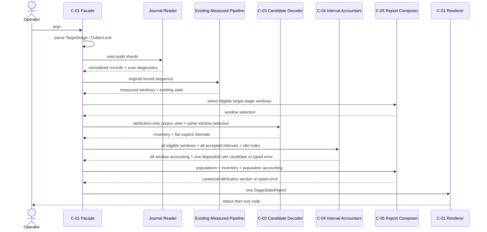

# Services — CG 観測可能区間と帰属不能残余

## Service境界

`requirements.md`、`architecture.md`、`component-inventory.md`が示す実行形は、Bunで短時間起動するread-only CLIである。user storiesは未生成、team-practicesは追加runtime dependencyと自動deployを認めない。したがって新規deployable service、AWS resource、daemon、database、queue、HTTP/gRPC API、UIは作らない。

本設計での唯一のserviceは既存 **Stage Statistics CLI Service** であり、`components.md`のC-01〜C-05は同一process内のmoduleである。moduleをmicroserviceと呼ばず、network failure、retry、eventual consistencyを持ち込まない。

## S-01 Stage Statistics CLI Service

| 項目 | 契約 |
|---|---|
| Entry | `bun packages/framework/core/tools/amadeus-stage-stats.ts` |
| Trigger | operator / test / CIからのone-shot process invocation |
| Input | `--project-dir`、`--space`、`--format`/`--json`、`--stage`、`--outliers`、audit shard/read-only artifact |
| Output | stdoutのMarkdown/CSV/JSON、stderrのusage/partial diagnostics、exit 0/1/2 |
| State | process-local readonly valuesのみ。永続書込みなし |
| Lifecycle | parse → scan → legacy measure → attribution decode/account → compose → render → drain → exit |
| Scaling | 1 process内で229 shard・136,011 row以上を逐次処理。horizontal scaling不要 |
| Failure isolation | 1 invocation内に限定。shard unreadableはpartial result、usageはreportなし、candidate不正はdiagnostic count |

## Orchestration pattern

単一processの明示的orchestrationを採用する。choreographyやevent-driven service連携は使わない。

<!-- Text fallback: operatorがCLIを起動し、CLIはjournalを一度読み、既存measured処理と新規candidate/interval処理を同一process内で順に実行する。1つのsemantic reportをrendererがstdoutへ出し、drain後にexitする。 -->

## Communication contracts

| From | To | Mode | Contract | Failure behavior |
|---|---|---|---|---|
| Operator | C-01 | synchronous process argv | validated `CliOptions` | invalidはusage + exit 2 |
| C-01 | journal reader | synchronous function/I/O | mixed v1/v2 `JournalRecord` | unreadable shardをcount、partial exit 1 |
| C-01 | legacy measured | synchronous pure function | original `AttributedRecord[]` | 既存exclusion contractを維持 |
| C-01 | C-03 | synchronous pure function | readonly attribution corpus | record不正をrejectionへ変換 |
| C-01 | C-04 | synchronous pure function | 全eligible window + C-03 accepted intervals + idle index | `AttributionPopulationAccounting`またはtyped invariant error。1 candidateにつき1 disposition、`accounted`は1件以上のwindow contributionを含む |
| C-01 | C-05 | synchronous pure function | measured/evidence/inventory + 全windowのaccounting/disposition | C-05はC-04を呼ばない。invariant failureはtyped errorのままC-01へ返す |
| C-05 | renderer | immutable semantic model | `StageAttributionReport` | renderer再計算禁止 |
| renderer | stdout | buffered string write + drain | UTF-8 full payload | premature `process.exit()`禁止 |

## Service lifecycle

### Normal completion

1. argvをtyped valueへparseする。
2. active space配下をread-only scanする。
3. measured branchを変更前の入力列で実行する。
4. C-01がC-05でtarget stageのeligible window集合を先に確定し、同じ集合をC-03とC-04へ渡す。attribution branchをcanonical dedupしてcandidateを評価するが、単一windowへのcontainment推定はしない。
5. C-01が全eligible window、全accepted interval、idle indexをC-04へ1回だけ渡す。C-04はcandidateごとに全window横断で1 dispositionとwindow別contributionを生成し、typed errorならそこで短絡する。
6. C-01が単一population会計結果をC-05へ渡し、既存fieldとattribution sectionを合成する。C-05はinterval会計を再実行しない。
7. C-01が`AttributionResult.ok`の場合だけ選択formatをstdoutへ完全に書き、自然なprocess終了でexit 0を返す。`err`はstderrのtyped diagnostic + exit 1へ写像し、stdoutへ正常reportを出さない。

### Empty attribution population

対象stageのeligible windowが0でもservice failureではない。既存stage statisticsを保持し、attribution sectionは`n=0`、nullable statistics、reason countsを出してexit 0を返す。

### Partial corpus

読めるshardで同じpipelineを完走し、`unreadableShardCount`をmeasurement referenceへ含める。stdoutを捨てずexit 1を返す。candidate payload不正はcorpus partialではなくreportable evidenceであり、それだけでexit 1へ上げない。

### Usage failure

unsafe stage slug、欠落値、範囲外outliers、未知flagはscan前に止め、usageをstderrへ出しexit 2。reportやproject fileを生成しない。

### Internal invariant failure

秒・率恒等式が破れた場合はC-04/C-05からC-01へ`AttributionResult.err(accounting-invariant)`を返す。C-01の`main`だけがtyped diagnosticをstderrへ出してexit 1へ変換し、誤った正常reportをrenderしない。candidate rejectionとinternal faultを混同しない。

## Capacity and performance posture

- current-corpus規模は少なくとも229 shard・136,011 row。外部serviceや永続cacheを追加しない。
- corpus scanは既存どおり決定的なpath順。attribution dedup map、candidate groups、interval collectionsのmemoryはrow/interval数に対してO(n)。
- interval unionはwindow/category単位のsortでO(k log k)。全corpusの全intervalを1配列へ集めない。
- 性能の具体的SLOはIssue #2695にないため、正しさを犠牲にする並列scan、sampling、approximationを設計しない。
- duplicate rowを除くためのdisk cacheやindexは作らない。process終了時に全memoryを解放する。

## Security, privacy, compliance

- 入力auditはtrust boundary外としてparseし、Markdown/CSVでは既存safe escaping、JSONではJSON escapingを用いる。
- CLIはaudit、intent state、memory、codekbを修復・更新しない。
- reportは既存eventの属性を集計するだけで、新しいsecret/PII sourceを導入しない。
- malformed payloadの本文やhash実値をerror messageへ無制限にechoせず、stable reasonとsource identityに限定する。
- AWS/IAM/network面は非適用。追加resourceがないためcostは既存ローカル/CI computeの実行時間だけである。

## API / operator experience

UIはないがCLIがuser-facing interfaceである。

- `--stage`省略時は`code-generation`、`--outliers`省略時は10とし、認知負荷を下げる。
- invalid inputは具体的なflag名、許容範囲、usageを示す。
- Markdownは人間がscanできる見出しとtable、CSVはsection型、JSONはstable fieldを提供する。
- observed factとinstrumentation hypothesisを明示ラベルで分け、利用者が推測値を測定値と誤認しないようにする。
- empty/partial/errorの各状態をsilent outputやNaNで表さない。

## Deployment and operations

既存package/release経路を再利用する。新規pipeline、deployment、AWS cost allocationは非適用。`packages/framework/core/`のsource変更は既存`bun run build`でdist/self-installへ投影するが、生成物はcommitしない。運用時にlong-running process、health check、autoscaling、backup、DRは不要である。

## Verification boundary

S-01の完了は次で証明する。

- 同じcorpus/argvの繰返しでsemantic outputが一致する。
- 既存t486/t487がgreenで、measured fieldsが非退行。
- eligible window 0/1/複数とcandidateの0/1/複数window交差fixtureで、candidate数=disposition数、`outside-window`/`empty-after-idle`はcandidateごとに最大1件、accounted contributionだけが複数windowを持てる。
- 3formatで同じpopulation/reason/statistics/outlierを持つ。
- 各formatの65,536 bytes超fixtureでproducerとpipe consumerのdigestが一致し、JSONはparse可能。
- 実行前後のtracked project filesが不変である。
