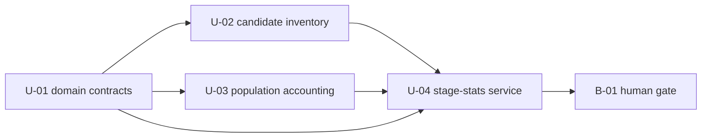

# Bolt Plan — CG 観測可能区間と帰属不能残余

上流入力（consumes全数）は `requirements.md`、`components.md`、`unit-of-work.md`、`unit-of-work-dependency.md`、`unit-of-work-story-map.md` である。本計画はIssue [#2695](https://github.com/amadeus-dlc/amadeus/issues/2695) のFR 25件、NFR 7件、完了条件1〜10を削減せず、4 Unitを1つのdeployable Boltへ割り当てる。

## Ordered Bolt sequence

| Order | Bolt | Included Units | Heuristic | Gate |
|---|---|---|---|---|
| 1 | B-01 `stage-stats-attribution-walking-skeleton` | U-01 `attribution-domain-contracts`、U-02 `candidate-evidence-inventory`、U-03 `population-interval-accounting`、U-04 `stage-stats-attribution-service` | walking-skeleton-first + risk-first | 人間によるwalking-skeleton gate |

Bolt候補はB-01だけである。`unit-of-work-dependency.md`のDAGをBolt内で次の順に実行する。

<!-- Text fallback: U-01完了後にU-02とU-03を進め、両者とU-01をU-04へ統合し、B-01の人間ゲートへ進む。 -->

U-02とU-03は相互edgeがなくDAG上は並行可能である。ただしUnit別source/test file ownershipを維持し、同一coverage出力を並行実行しない。U-04は全provider contractがGreenになってから統合する。

## Walking Skeleton

B-01は最初かつ唯一のwalking-skeleton Boltである。既存`amadeus-stage-stats.ts`のCLI façadeから、attribution-only journal view、candidate decoder、population-wide interval accountant、canonical semantic report、Markdown/CSV/JSON renderer、stdout drainまでを端から端まで通す。

単一Boltは単一Unitへの再統合を意味しない。`unit-of-work.md`が定める4つの変更理由、public seam、source/test ownershipは維持する。4 Unitを別Boltへ分けるとU-04以前は既存CLIから到達できるdeployable sliceにならず、teamのwalking-skeleton-first規則を満たさないため、gateだけを合流後に置く。

## Definition of Done

- `requirements.md`のFR-POP-1〜4、FR-EVT-1〜5、FR-INT-1〜4、FR-STAT-1〜2、FR-OUT-1〜4、FR-CLI-1〜2、FR-COMP-1、FR-TEST-1〜3を全数Greenにする。
- NFR-1〜7を`unit-of-work-story-map.md`のowner/test seamで検証し、未割当要件を0件にする。
- U-01のclosed vocabulary/smart constructor、U-02の全candidate family/Event Set/lifecycle、U-03のhalf-open/clip/idle/union/accounting PBT、U-04のfaçade/3format/real-corpus/pipe integrationを各Unit所有testで証明する。
- 既存stage duration、sensor、model、reviewBuckets、`--json` alias、format、exit ladderをappend-onlyで維持する。
- `observableSeconds + unattributableSeconds = netSeconds`、finite ratio、candidate数=disposition数を全eligible populationで満たす。
- Markdown、CSV、JSONの各出力を65,536 bytes超にし、full captureとpipe consumerのbyte digest parityを確認する。JSONは`jq empty`も通す。
- source-only boundaryを守り、generated `dist/`、self-install surface、version、tag、release、npm publishを変更しない。

## Confidence hypothesis and expected demo

**Confidence hypothesis:** 同一corpusとargvを繰り返し与えると、既存measured統計を変えず、明示intent/stage/lifecycle evidenceだけをobservableへ帰属し、残余を非負のunattributableとして、3形式で同じsemantic values・同じoutlier順・同じrejection countに再現できる。大容量pipeでも末尾まで欠落しない。

**Expected demo:** 固定corpusに `--stage code-generation --outliers 10` を適用し、(1) measuredとattribution populationの差、(2) category/global union、(3) coverage/unattributable、(4) missing instrumentation、(5)上位outlierを3形式で比較する。続いて各formatのoversized fixtureをfull captureとpipeで実行しdigest一致を示す。

## Requirement and Unit coverage

`components.md`のC-01〜C-06は `unit-of-work-story-map.md`を介してU-01〜U-04へ全数割当済みである。B-01はその4 Unitすべてを含むため、FR 25/25、NFR 7/7、Issue完了条件10/10をcoverし、別Boltへのcarry-over、defer、out-of-scope化は0件である。
