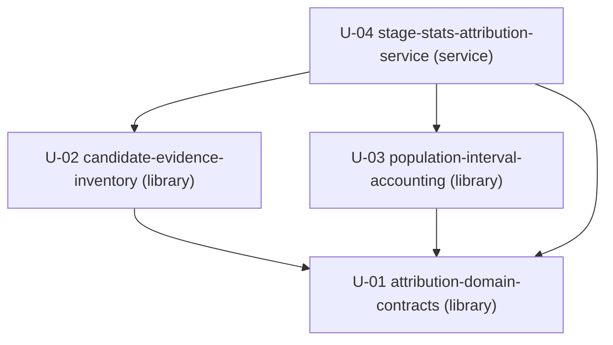

# Unit of Work Dependency — CG 観測可能区間と帰属不能残余

上流入力(consumes全数): `components.md`、`component-methods.md`、`services.md`、`component-dependency.md`、`decisions.md`、`requirements.md`。本artifactはtopologyだけを記録し、Stage 2.8のeconomic sequenceやcritical pathを決めない。

## Dependency policy

direct edgeはconsumerがproviderのpublic contractまたは実装成果を必要とする場合だけ置く。既存journal/Event Set contractsは外部既存dependencyであり新Unitにしない。4 Unit間にshared mutable state、network、database、deployment coordinationはない。

## Machine-readable DAG

```yaml
units:
  - name: attribution-domain-contracts
    kind: library
    depends_on: []
  - name: candidate-evidence-inventory
    kind: library
    depends_on: [attribution-domain-contracts]
  - name: population-interval-accounting
    kind: library
    depends_on: [attribution-domain-contracts]
  - name: stage-stats-attribution-service
    kind: service
    depends_on: [attribution-domain-contracts, candidate-evidence-inventory, population-interval-accounting]
```

## Prose DAG



矢印`A --> B`は「A depends on B」を表す。cycle検査用dependency depthは`depth 0 = {U-01}`、`depth 1 = {U-02,U-03}`、`depth 2 = {U-04}`である。このdepthは複数のvalid topological orderingが存在することの証明であり、推奨build orderではない。

## Direct dependency contracts

| Consumer | Provider | Integration point | Failure/immutability contract |
|---|---|---|---|
| U-02 | U-01 | family/category/rejection tuples、identity、`AttributionResult` | decode failureをtyped rejectionへ変換。inputを変更しない |
| U-03 | U-01 | interval/window/candidate types、accounting error | invariant failureをtyped `err`。event fieldを読まない |
| U-04 | U-01 | CLI smart constructors、semantic types、error union | usage→exit 2、internal invariant→exit 1 |
| U-04 | U-02 | `AttributionCorpus`、`CandidateInventory` | original measured recordsへdedupを逆流させない |
| U-04 | U-03 | `AttributionPopulationAccounting` | 1 candidate=1 disposition、全window accountingを再計算しない |

test evidenceもprovider ownershipに従う。U-01/U-02/U-03はそれぞれdomain/candidate/intervalの専用unit test fileを所有し、U-04は既存stage-stats unit testとintegration testだけを所有する。consumerがprovider test fileを変更するedgeは存在しない。

## Existing integration dependencies

- U-02はexisting journal codecとexecution/unit-pool Event Set contractをread-only decoderとして消費する。
- U-04はexisting `amadeus-stage-stats.ts`のscan/window/idle/statistics/renderer/CLI seamを互換利用する。
- U-01/U-03はfilesystem/process/existing repositoryへ依存しない。
- AWS、network service、database、queue、new package、generated distはdependency graph外であり追加しない。

## Parallel development opportunities

- `{candidate-evidence-inventory, population-interval-accounting}`には相互edgeがなく、`attribution-domain-contracts`のcontractを共有するだけで、source/test fileも交差しない。この集合はDAG上並行可能である。
- U-04内のMarkdown/CSV/JSON renderer fixture作成は共通semantic model contract確定後に相互独立だが、別Unitへ分割しない。
- 並行可否はtopology factであり、どのUnitまたはBoltを先にshipするかはDelivery Planningへ委ねる。

## Cycle and completeness verification

- 宣言Unit数4、重複名0、self-edge 0、unknown dependency 0。
- U-01 indegree 0、U-02/U-03はU-01だけへ依存、U-04はU-01/U-02/U-03へ依存し、U-04から戻るedgeはない。
- `component-dependency.md`の`Existing contracts / C-02 → C-03・C-04 → C-05 → C-01`をUnitへ縮約しており、新しい逆edgeを導入しない。
- 全Unitが`unit-of-work.md`でcanonical kind、responsibility、deployment、complexityを持つ。

## Topology change guard

実装中にU-02がU-03の内部へ、U-03がU-02のevent modelへ、またはU-01が上位Unitへ依存する必要が生じた場合は、便宜的なcross-importを追加せずUnit contractを再評価する。U-04が全orchestrationを所有する現DAGではその逆edgeは不要である。
