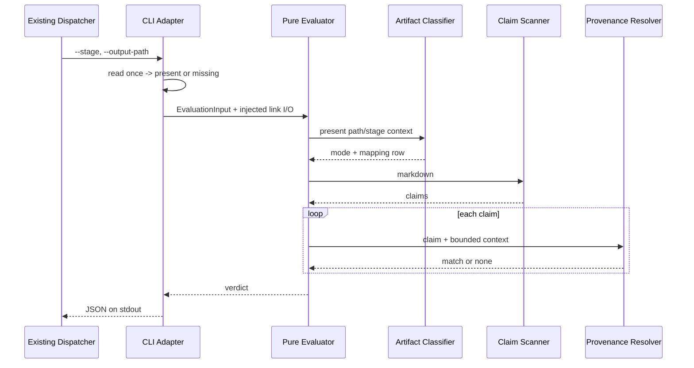

# Component Dependency — 成果物数値の provenance ガード

上流参照: `requirements.md` の機能分解、`architecture.md` のsensor lifecycle、`component-inventory.md` のschema・dispatcher・graph・tool境界。

## 依存マトリクス

`→` は行のコンポーネントが列のコンポーネントを同期利用することを示す。

| From \ To | Manifest | CLI Adapter | Evaluator | Classifier | Design Index | Scanner | Resolver | Mapping | Sweep | Existing Dispatcher |
| --- | --- | --- | --- | --- | --- | --- | --- | --- | --- | --- |
| Manifest | — | command指定 | — | — | — | — | — | — | — | dispatcherに発見される |
| CLI Adapter | — | — | → | — | — | — | — | — | — | stdout契約 |
| Evaluator | — | — | — | → | — | → | → | → | — | — |
| Classifier | — | — | — | — | — | — | — | → | — | — |
| Design Index | — | — | — | — | — | — | — | — | — | — |
| Scanner | — | — | — | — | — | — | — | — | — | — |
| Resolver | — | — | — | — | — | — | — | runtime判定時のみ → (`W`) | — | — |
| Sweep | — | — | — | — | → (`indexSweepArtifacts`) | → | → (`measureNearestProvenanceDistance`) | 生成 | — | — |
| Existing Dispatcher | manifest解決 | 同期spawn | — | — | — | — | — | — | — | — |

source依存の物理境界は単純である。新規tool moduleは既存 `amadeus-sensor-flags.ts` とBun/標準ライブラリだけへ依存し、dispatcher、graph compiler、audit実装をimportしない。Manifestはtoolのbasenameを宣言するだけである。

## runtimeデータフロー

テキスト代替: dispatcherからCLIへflagが渡り、CLIは成果物を一度だけpresent/missingへ変換する。Evaluatorはmissingをskippedへ写す。presentならClassifierがstageとrecord相対pathでGenerated Mappingを引いてproduces keyとmodeを得た後、ScannerとResolverを順に呼ぶ。合成済みverdictだけがCLIとdispatcherへ戻る。

## design-timeデータフロー

1. Design-time Artifact Indexが注入されたruntime graph snapshotのdeclared producesを安定順で読み、Mapping非依存の `SweepArtifactDescriptor` を導出する。
2. Corpus Sweepがdescriptorの既存成果物だけを読み、Scannerの固定predicateで候補を抽出する。
3. `W`未適用の `measureNearestProvenanceDistance` でMarkdown構造境界内の最短距離を全件計測し、決定的sample identityとlabelを記録する。
4. 打切りなしの距離母集団とdescriptorの `stage + record相対output pattern -> produces key` から、成果物種別×意味クラスごとに `W = max(nearest-rank p95, min + 1)` を算出する。`W < max` と他のenforcement条件を満たす組だけをenforcementとし、upper-bound saturationをmeasurement-onlyへ分類する。
5. sweep成果物を根拠の正本として保存し、path・produces key対応を含む同じmappingをreadonly TypeScript定数へ生成する。
6. enforcementを1件以上持つstage集合だけをfrontmatter配線へ反映する。
7. 統合テストがlower/upper-bound saturation、95% coverage、sweep成果物、Generated Mapping、manifest、stage集合の一致を検証する。

## 共有資源と循環依存

- 共有資源はread-onlyの成果物ファイル、Generated Mapping、既存sensor verdict schemaである。
- runtime評価はsweepもruntime graphも読まない。sweepはDesign-time Artifact Index、Scanner、`W`未適用Resolverだけに依存し、CLIのruntime fire経路、Evaluator、runtime Classifier、生成前Mappingへ依存しない。runtime Classifierは生成済みMappingだけを読むため、設計時からruntimeへの依存は一方向である。
- Renderer相当の再集計面を作らず、verdict合成はEvaluatorに一元化する。
- 新規toolからdispatcherへのimportを禁止し、`dispatcher -> tool` の一方向を維持する。
- 外部network、DB、queue、AWS resource、UI stateの依存はない。
