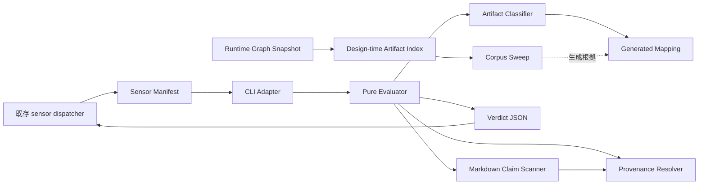

# Components — 成果物数値の provenance ガード

上流参照: `requirements.md` の FR-SEN / FR-PRED / FR-SWP、`architecture.md` の既存センサー実行構造、`component-inventory.md` の manifest 駐動 dispatcher と既存 sensor tool の棚卸し。

## 設計方針

新規の実装面は `packages/framework/core/tools/amadeus-sensor-numeric-provenance.ts` という単一tool moduleとする。以下の「コンポーネント」は別ファイルやclassではなく、このモジュール内の凝集した論理責務である。共有Markdownエンジンや汎用provenanceライブラリは作らない。

既存の `amadeus-sensor.ts` dispatcher、sensor schema、audit、graph compiler は変更せず、manifest discovery と stage frontmatter の既存拡張点を使う。

## コンポーネント一覧

| コンポーネント | 目的 | 所有する責務 | 公開面 |
| --- | --- | --- | --- |
| Numeric Provenance CLI Adapter | 既存dispatcherと純粋評価を接続 | `--stage` / `--output-path` の解釈、成果物をpresent/missing状態へ変換、verdictの標準出力、起動失敗の表現 | `main`, `fail` |
| Numeric Provenance Evaluator | 1成果物の最終判定を合成 | missing・cutoff・適用性・modeを順序付け、claimごとのfindingまたはmetricsを集約 | `evaluateNumericProvenance` |
| Markdown Claim Scanner | 固定4クラスの数値主張を抽出 | 構造境界、除外語彙、論理行、claim位置と意味クラス | evaluator経由。テストに必要な最小pure helperのみnamed export可 |
| Provenance Resolver | claim近傍の根拠を検証 | 共通受理述語による構造境界内の最短距離計測と、runtimeでの生成済み`W`以内判定 | evaluator経由。ファイル実在確認は注入依存 |
| Artifact Classifier | 成果物の処理modeを決定 | cutoff、機械除外、lightweight report、stage/produces由来mapping、enforcement / measurement-only / skipped | evaluator経由 |
| Design-time Artifact Index | Mapping生成前のsweep対象を列挙 | 注入されたruntime graph snapshotのdeclared producesから、stage・record相対output pattern・produces keyを導出 | `indexSweepArtifacts`。runtime評価からは呼ばない |
| Generated Mapping | sweep結果をruntimeへ固定投影 | `stage + record相対output pattern -> produces key`、成果物種別×意味クラスのmode、`W = max(nearest-rank p95, min + 1)`、配線stage集合 | readonly TypeScript定数 |
| Corpus Sweep | 設計時分類の再現可能な計測 | 決定的標本、ラベル、距離統計、閾値判定、mapping生成入力 | `sweepNumericProvenance`。通常のsensor fire経路からは呼ばない |
| Sensor Manifest | sensor capabilityの宣言 | id、command、advisory severity、matches | `amadeus-numeric-provenance.md` |

## 境界と所有権

- CLI Adapter はI/Oと「present/missing」への変換を所有するが、missing時を含むverdictの意味判定を所有しない。
- Evaluator は判定順序とverdict合成を所有するが、ファイルシステムへ直接アクセスしない。missing入力は最初にskipped verdictへ写す。
- Claim Scanner は候補抽出だけを所有し、provenanceの正当性や適用modeを決めない。
- Provenance Resolver は根拠受理と距離だけを所有し、claim抽出やfinding許容量を決めない。sweepは構造境界内を`W`で打ち切らず最短距離を計測し、runtime evaluatorだけが生成済み`W`以内かを判定する。
- Artifact Classifier は `stage` とrecord相対 `outputPath` からGenerated Mappingを引き、design-timeにruntime graphから導出済みのproduces keyとmodeを得る。runtime graphを直接読まず、本文内容による恣意的除外を行わない。mappingに一致しないpathは判定不能としてskippedにする。
- Design-time Artifact Index は注入されたruntime graph snapshotだけから `stage + record相対output pattern -> produces key` を導出する。Generated Mappingやruntime Artifact Classifierを入力にせず、機械除外と明示されたlightweight produces keyだけをMapping生成前に適用する。
- Corpus Sweep成果物がmappingの根拠の正本であり、Generated Mappingはruntime用の生成投影である。sweepはDesign-time Artifact Index、Scanner、`W`未適用Resolverだけを利用し、runtime Evaluator / Artifact Classifierを呼ばない。
- Manifestとstage frontmatterは配線設定であり、runtime判定ロジックを持たない。

## 相互作用図

テキスト代替: 既存dispatcherがmanifest経由でCLI Adapterを同期起動し、Adapterがpure Evaluatorへpresent/missingの成果物状態とcontextを渡す。Evaluatorはmissingならskippedを返し、presentならClassifier、Scanner、Resolver、Generated Mappingを合成する。Construction時はruntime graph snapshotをDesign-time Artifact Indexへ変換し、Corpus Sweepがそのindexからpath・produces key対応を含むmappingの根拠を生成する。この設計時経路はruntime Classifierを通らない。

## データモデル

| データ | 識別軸 | 関係 |
| --- | --- | --- |
| EvaluationInput | stage、outputPath、content (`present(markdown)` / `missing`) | missingならskipped、presentなら0個以上のNumericClaimを抽出 |
| NumericClaim | class、line、column、normalizedText | 1 claimに0または1 ProvenanceMatchを対応 |
| ProvenanceMatch | kind、evidence、distance | claimの近傍窓と構造境界内だけで成立 |
| ArtifactPolicy | stage、record相対output pattern、produces key、claim class | Generated Mappingの1行へ対応 |
| SweepArtifactDescriptor | stage、record相対output pattern、produces key、artifact path | runtime graph snapshotからMapping非依存で導出 |
| NumericProvenanceVerdict | pass、skipped、findings、metrics、reason | 1 EvaluationInputにつき1件 |
| SweepReport | UTF-8 canonical JSON tupleのSHA-256 sample identity、labels、distance stats、mapping | Generated Mappingと配線stage集合の生成根拠 |

永続データストアは設けない。runtime入力は既存成果物ファイル、runtime出力はdispatcherが既存auditへ記録するverdictである。

## Review — Iteration 1

- **Verdict:** NOT-READY
- **Reviewer:** amadeus-architecture-reviewer-agent
- **Date:** 2026-08-10T11:41:19Z
- **Iteration:** 1
- **Scope decision:** none

Wの算式とlower/upper-bound saturationの分類結果は成果物間で一致するが、Wを生成するsweepがW依存Resolverを再利用する循環契約のため、距離母集団を推測なしに計測できない。

### Findings

- BLOCKER | `component-methods.md`の`resolveProvenance`はGenerated Mappingの`W`以内だけを探索する一方、`component-dependency.md`はCorpus Sweepが同Resolverを再利用して最短provenance距離を集計し、その結果からGenerated Mappingの`W`を生成すると定義している。生成前のWがResolver実行に必要となる循環依存であり、既存Wによる打切りはp95/maxとupper-bound saturation分類を歪める。Sweep用には構造境界内をWで打ち切らず最短距離を返す契約、または探索上限を明示注入できる共通predicate seamを定義する必要がある。
- FOLLOW-UP | `component-dependency.md`の依存表ではScannerがMappingの`W`へ依存するが、`components.md`ではScannerは候補抽出のみを所有し、`component-methods.md`の`scanNumericClaims(markdown)`にもMapping入力がない。実行契約に合わせてこの依存を除去するか、Wを必要とする責務とinterfaceを明記すべきである。

## Review — Iteration 2

- **Verdict:** NOT-READY
- **Reviewer:** amadeus-architecture-reviewer-agent
- **Date:** 2026-08-10T11:45:07Z
- **Iteration:** 2
- **Scope decision:** none

W未適用の距離計測seamとScanner→Mapping誤依存は修正されたが、Sweep→Classifier→Generated Mappingの間接循環が依存表に残り、設計時分類を一意に実装できない。

### Findings

- BLOCKER | `component-dependency.md`の依存表はSweepがClassifierを同期利用すると定義する一方、`component-methods.md`の`classifyArtifact(context, mapping)`はGenerated Mappingを必須入力とし、そのMapping自体をSweepが生成する。本文の「sweepは生成前Mappingへ依存しない」と矛盾し、W/mode生成に間接循環が残る。Sweepからruntime Classifierへの依存を除き、runtime graphのdeclared producesからpath/produces keyを導出するdesign-time seamを明示するか、生成前Mappingを要求しない別classifier契約を定義する必要がある。
