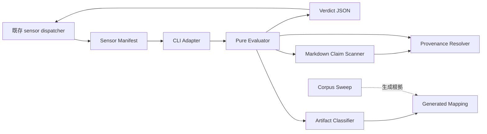

# Components — 成果物数値の provenance ガード

上流参照: `requirements.md` の FR-SEN / FR-PRED / FR-SWP、`architecture.md` の既存センサー実行構造、`component-inventory.md` の manifest 駐動 dispatcher と既存 sensor tool の棚卸し。

## 設計方針

新規の実装面は `packages/framework/core/tools/amadeus-sensor-numeric-provenance.ts` という単一tool moduleとする。以下の「コンポーネント」は別ファイルやclassではなく、このモジュール内の凝集した論理責務である。共有Markdownエンジンや汎用provenanceライブラリは作らない。

既存の `amadeus-sensor.ts` dispatcher、sensor schema、audit、graph compiler は変更せず、manifest discovery と stage frontmatter の既存拡張点を使う。

## コンポーネント一覧

| コンポーネント | 目的 | 所有する責務 | 公開面 |
| --- | --- | --- | --- |
| Numeric Provenance CLI Adapter | 既存dispatcherと純粋評価を接続 | `--stage` / `--output-path` の解釈、成果物をpresent/missing状態へ変換、verdictの標準出力、起動失敗の表現 | `main`, `fail` |
| Numeric Provenance Evaluator | 1成果物の最終判定を合成 | missing・cutoff・適用性・modeを順序付け、claimごとのfindingまたはmetricsを集約 | `evaluateNumericProvenance` |
| Markdown Claim Scanner | 固定4クラスの数値主張を抽出 | 構造境界、除外語彙、論理行、claim位置と意味クラス | evaluator経由。テストに必要な最小pure helperのみnamed export可 |
| Provenance Resolver | claim近傍の根拠を検証 | コマンドtoken、測定ref、SHA、許可root内の相対リンク解決 | evaluator経由。ファイル実在確認は注入依存 |
| Artifact Classifier | 成果物の処理modeを決定 | cutoff、機械除外、lightweight report、stage/produces由来mapping、enforcement / measurement-only / skipped | evaluator経由 |
| Generated Mapping | sweep結果をruntimeへ固定投影 | `stage + record相対output pattern -> produces key`、成果物種別×意味クラスのmode、`W`、配線stage集合 | readonly TypeScript定数 |
| Corpus Sweep | 設計時分類の再現可能な計測 | 決定的標本、ラベル、距離統計、閾値判定、mapping生成入力 | `sweepNumericProvenance`。通常のsensor fire経路からは呼ばない |
| Sensor Manifest | sensor capabilityの宣言 | id、command、advisory severity、matches | `amadeus-numeric-provenance.md` |

## 境界と所有権

- CLI Adapter はI/Oと「present/missing」への変換を所有するが、missing時を含むverdictの意味判定を所有しない。
- Evaluator は判定順序とverdict合成を所有するが、ファイルシステムへ直接アクセスしない。missing入力は最初にskipped verdictへ写す。
- Claim Scanner は候補抽出だけを所有し、provenanceの正当性や適用modeを決めない。
- Provenance Resolver は近傍内の根拠受理だけを所有し、claim抽出やfinding許容量を決めない。
- Artifact Classifier は `stage` とrecord相対 `outputPath` からGenerated Mappingを引き、design-timeにruntime graphから導出済みのproduces keyとmodeを得る。runtime graphを直接読まず、本文内容による恣意的除外を行わない。mappingに一致しないpathは判定不能としてskippedにする。
- Corpus Sweep成果物がmappingの根拠の正本であり、Generated Mappingはruntime用の生成投影である。sweepはruntime graphのdeclared producesから `stage + record相対output pattern -> produces key` を機械生成する。
- Manifestとstage frontmatterは配線設定であり、runtime判定ロジックを持たない。

## 相互作用図

テキスト代替: 既存dispatcherがmanifest経由でCLI Adapterを同期起動し、Adapterがpure Evaluatorへpresent/missingの成果物状態とcontextを渡す。Evaluatorはmissingならskippedを返し、presentならClassifier、Scanner、Resolver、Generated Mappingを合成する。Corpus SweepはConstruction時だけruntime graphからpath・produces key対応を含むmappingの根拠を生成する。

## データモデル

| データ | 識別軸 | 関係 |
| --- | --- | --- |
| EvaluationInput | stage、outputPath、content (`present(markdown)` / `missing`) | missingならskipped、presentなら0個以上のNumericClaimを抽出 |
| NumericClaim | class、line、column、normalizedText | 1 claimに0または1 ProvenanceMatchを対応 |
| ProvenanceMatch | kind、evidence、distance | claimの近傍窓と構造境界内だけで成立 |
| ArtifactPolicy | stage、record相対output pattern、produces key、claim class | Generated Mappingの1行へ対応 |
| NumericProvenanceVerdict | pass、skipped、findings、metrics、reason | 1 EvaluationInputにつき1件 |
| SweepReport | sample identity、labels、distance stats、mapping | Generated Mappingと配線stage集合の生成根拠 |

永続データストアは設けない。runtime入力は既存成果物ファイル、runtime出力はdispatcherが既存auditへ記録するverdictである。

## Review — Iteration 1

- **Verdict:** NOT-READY
- **Reviewer:** amadeus-architecture-reviewer-agent
- **Date:** 2026-08-10T10:08:45Z
- **Iteration:** 1
- **Scope decision:** none

既存dispatcherへの一方向依存、同期CLI、advisory verdict、sweepからの生成mappingという大枠に循環依存はなく、ADRも選択肢・帰結・可逆性を備えています。ただし、runtime成果物分類の入力供給経路とファイル不在時のエラー所有境界が成果物間で閉じておらず、要件どおりに実装するには設計判断が残ります。

### Findings

- BLOCKER | runtime graph由来のproduces artifact keyをArtifact Classifierへ供給する経路が定義されていません。FR-PRED-4はbasenameだけでなくruntime graphのproduces keyによる軽量報告判定を必須とし、components.mdとcomponent-methods.mdもClassifier入力としてproduces keyを挙げています。一方、同期CLIの入力は`--stage`と`--output-path`だけ、EvaluationInputはstage・outputPath・markdownだけ、EvaluationDepsはファイル実在確認だけであり、services.mdは追加引数を禁止し、component-dependency.mdは新規toolがgraph compilerをimportしないとしています。Generated Mappingにもstage/artifact keyから実ファイルを解決する契約がありません。Adapterがgraphを読むのか、sweep生成mappingへpath対応を固定するのか、その所有者・依存・失敗時verdictを決めなければ、produces keyによるskipと成果物種別別modeを実装できません。
- BLOCKER | ファイル不在時のfail-open verdictを生成する所有境界が矛盾しています。components.mdとADR-3はCLI AdapterがI/Oを所有してMarkdownを読んだ後にEvaluatorへ渡す設計ですが、component-methods.mdのエラー表はファイル不在をEvaluator／Classifierの責務とし、EvaluationInputには読込失敗状態がありません。さらにADR-3はこの所有者をFunctional Designへ未決定のまま委ねています。FR-SEN-3／NFR-2が要求する`pass: true, skipped: true`を、読込前にAdapterが返すのか、空Markdown等でEvaluatorへ伝えるのかを境界契約として一意に定める必要があります。誤って`fail`へ流すと既存dispatcherでは起動エラーとなり、明示要件に違反します。

## Review — Iteration 2

- **Verdict:** READY
- **Reviewer:** amadeus-architecture-reviewer-agent
- **Date:** 2026-08-10T10:12:48Z
- **Iteration:** 2
- **Scope decision:** none

iteration 1の2件のBLOCKERは解消済みです。produces keyはdesign-time sweepでruntime graphの宣言からGenerated Mappingへ固定投影され、runtimeでは--stageと--output-pathだけで一意に分類できます。ファイル不在とENOENTはCLI Adapterがmissingへ変換し、Evaluatorがskipped verdictを合成する責務境界に統一されています。5成果物間の公開面、依存方向、データフロー、ADRに重大な矛盾はなく、具体的な循環依存も確認されませんでした。

### Findings

- None
