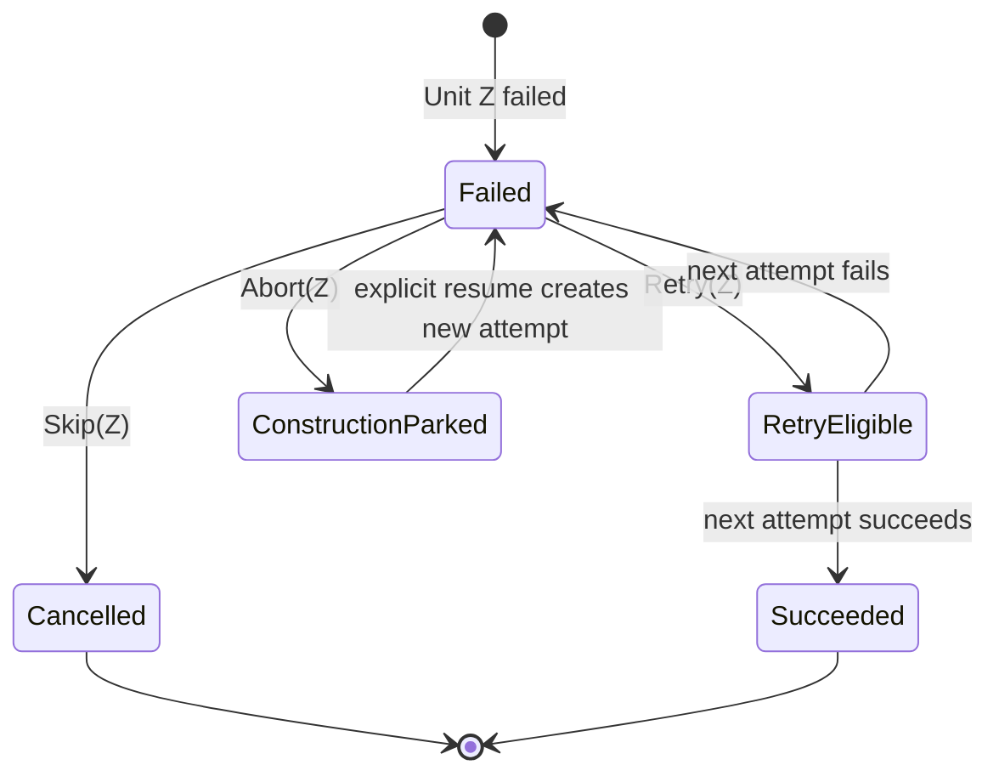

# Business Logic Model — issue-2833-failure-transition

入力: [`unit-of-work.md`](../../../inception/units-generation/unit-of-work.md)、[`unit-of-work-story-map.md`](../../../inception/units-generation/unit-of-work-story-map.md)、[`requirements.md`](../../../inception/requirements-analysis/requirements.md)、[`components.md`](../../../inception/application-design/components.md)、[`component-methods.md`](../../../inception/application-design/component-methods.md)、[`services.md`](../../../inception/application-design/services.md)。

## Evidence Projection

1. current intent / stage のcanonical audit sequenceを読む。
2. event identityで完全重複を除去する。
3. Unit pool terminal outcomeを結果正本、`BOLT_FAILED`をhalt/ruling、`SWARM_BATON_RETURNED`をbatch closureとして、intent/stage/unit/attempt/batchでjoinする。
4. 必須key欠落、曖昧attempt、同一UnitKey・同一seqの矛盾を診断へ集約する。診断が1件でもあれば`ProjectionResult.ok=false`。
5. 正常なら各Unitの最新terminal outcomeと、original batch順・同順内slug順のunresolved failure queueを返す。

## Failure Decision State Machine

- RetryはZの新attemptだけをeligibleにし、succeeded/cancelled siblingを再dispatchしない。
- SkipはZのcurrent attemptをcancelledにし、他failed siblingを個別裁定待ちで保持する。
- Abortは全parallel Task帰還後にConstructionをparkし、siblingの既存outcomeと未実行Unitを変更しない。
- 明示resumeはstale Abortを上書きせず、新correlation attemptを追記する。

## Directive Selection

| Projection | Next directive |
|---|---|
| diagnosticsあり | `error`、cursor不変 |
| unresolved failure Z | Retry / Skip / Abort裁定待ち |
| Retry Z | swarm=retry相関付き既存`invoke-swarm`、solo=`run-stage`、Zだけ |
| Skip Z | Zをselectorから除外し、他eligibleへ継続 |
| Abort | engine-owned `parked`、stage未完了 |
| 全Unit succeeded/cancelled | existing stage gate |

Stop hookは変更せず、既存`parked`終端を利用する。`report --result failed`は遷移入口にせず、exit 0 + error directiveの既存境界を保つ。

### Retry Dispatch Amendment

- swarm Retryは`resolve-failure`内でattemptを先行acquireしない。既存`invoke-swarm`へprepared batchとretry対象Unitのoptional相関を載せ、conductorはdriver resolution / worktree `prepare`を再実行せず、既存poolの`acquire`が返すpermitをnative dispatchして直後に`confirm-dispatch`する。
- retry相関がない初回`invoke-swarm`は従来どおりresolve → prepare → acquireを行う。optional fieldの有無だけで分岐し、`reason`文字列を解析しない。
- solo Retryは既存`BOLT_STARTED`から明示solo batch / attempt identityを発行し、同じkeyを`BOLT_FAILED`とterminal writerへthreadする。soloをUnit Poolへ移植しない。
- 新directive kind、新event family、新workflow stateは追加しない。

## Concurrency and Recovery

- 同一入力snapshotへのprojectionはstable orderingで決定的。
- audit read途中失敗は部分projectionを返さずerror。
- evidence/worktreeはRetry/Skip/Abortで削除しない。
- same-hunkまたはevent writer変更が必要なら、U1 ownership内か確認し、設計外なら停止する。

## Review — Iteration 1

- **Verdict:** READY
- **Reviewer:** amadeus-architecture-reviewer-agent
- **Date:** 2026-08-10T14:37:21Z
- **Iteration:** 1
- **Scope decision:** none

FR-OUT1〜10を、決定論的なaudit projection、Unit Z単位のRetry/Skip、Construction全体のAbort、兄弟Unit保持、fail-closed diagnosticsへ具体化できています。intent/stage/unit/attempt/batchによる相関、canonical sequenceとevent identityによる重複排除、stale attempt排除、stable unresolved queueにより、swarm・solo・複数失敗を一貫して処理可能です。公開join rules、Unit境界、既存terminal gate・Stop hook・evidence/worktree・autonomyの不変条件も維持され、列挙されたTDDシナリオから実装可能な粒度に達しています。

### Findings

- None
