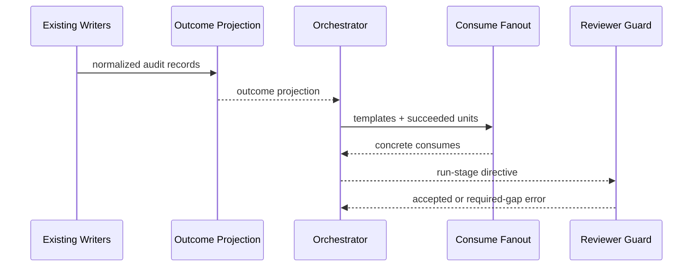

# Component Dependencies

入力: [`requirements.md`](../requirements-analysis/requirements.md)、CodeKB [`architecture.md`](../../../../codekb/amadeus/architecture.md)、[`component-inventory.md`](../../../../codekb/amadeus/component-inventory.md)。

## Dependency Matrix

| From | C1 Projection | C2 Fanout | C3 Integration | C4 Reviewer Guard | C5 Writers |
|---|---:|---:|---:|---:|---:|
| C1 Projection | — | 0 | 0 | 0 | reads normalized output |
| C2 Fanout | type-only outcome view | — | 0 | 0 | 0 |
| C3 Integration | calls | calls | — | emits directive | reads via audit adapter |
| C4 Reviewer Guard | 0 | 0 | consumes directive | — | 0 |
| C5 Writers | 0 | 0 | 0 | 0 | — |

`0` は依存なし。依存方向は C5→audit adapter→C1→C3→directive→C4、および C2→C3。循環はない。

## Data Flow

テキスト代替: writerの監査をprojectionがfoldし、orchestratorがsucceeded Unitをfanoutへ渡す。生成directiveをreviewer guardが検証する。

## Unit / Bolt Dependency Shape

- U1 #2833 Failure Transition は projection と failure-selector配線を1 vertical Unitとして所有する。
- U2 #2834 Consume Fanout は fan-out / reviewer guard と consume-resolution配線を1 vertical Unitとして所有する。
- U1/U2は技術依存なしで同一swarm batch実装可能。共有fileはsemantic region別ownershipで分離し、PR収束時は#2833を先にgateする。#2834のrebase/updateは実競合またはbranch protection要求時だけ行う。
- 横断 acceptance は独立Unit/PRにせず、既存Build and Test stageの検証集合として実行する。

## Shared Resources

stage graph、audit shard、intent stateはread-only input。新しいstoreやlockは追加しない。audit writer変更が必要ならU1に閉じ、U3と同時編集しない。
