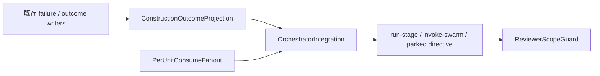

# Components — per-unit directive projection

入力: [`requirements.md`](../requirements-analysis/requirements.md)、CodeKB [`architecture.md`](../../../../codekb/amadeus/architecture.md)、[`component-inventory.md`](../../../../codekb/amadeus/component-inventory.md)。

## Component Map

テキスト代替: 既存 writer が監査へ事実を書き、OutcomeProjection が Unit outcome をfoldする。ConsumeFanout は effective producer population を concrete path へ変換する。OrchestratorIntegration が両結果から次 directive を決め、ReviewerScopeGuard が required input の fail-open を防ぐ。

## C1: ConstructionOutcomeProjection

- 目的: intent / stage / Unit / attempt・batch 相関で既存監査証跡をfoldし、最新の durable outcome と未解決 halt decision、または相関不能診断を判別 union で返す。
- 所有: event decoding、相関、stale evidence 除外、`succeeded | failed | cancelled`、Abort由来 suspension 判定。
- 非所有: audit write、state checkbox、Stop hook、worktree cleanup。
- 配置: `packages/framework/core/tools/` の新しい pure module。I/O を受け取らず、正規化済み record 配列を入力とする。

## C2: PerUnitConsumeFanout

- 目的: producer-owned artifact template と effective producer population から決定的な concrete consume path を生成する。
- 所有: Unit eligibility、N×M 展開、順序、重複排除、placeholder 不残存 invariant。
- 非所有: filesystem access、stage graph compile、directive emission。
- 配置: `packages/framework/core/tools/` の新しい pure module。

## C3: OrchestratorIntegration

- 既存 `amadeus-orchestrate.ts` の adapter。監査 reader / stage graph / disk presence を C1・C2 へ渡し、`invoke-swarm`、`run-stage`、`parked`、`error` を選ぶ。
- failed / pending Unitが残る consumer 発行は error、Abort projection は parked、Retry は Unit Z のみ再 eligible、Skip は cancelled Unitを selector / fan-out から除外する。
- 共有 seam の変更はこのcomponentだけに閉じ、#2833 と #2834 の2つのvertical Unitへそれぞれのpure logicと配線を同居させる。両Unitは同一swarm batchで実装するが、`amadeus-orchestrate.ts` のsemantic ownershipをfailure selector面とconsume resolution面に分け、別PRを維持する。

## C4: ReviewerScopeGuard

- 既存 `amadeus-reviewer-runtime.ts` の scope adapter。
- concrete `consumes` は全件 read scopeへ保持し、`consumes_absent.expected:false` があれば required input gap として review開始前に拒否する。
- cancelled Unit は fan-out候補外なので absent gapには変換しない。

## C5: DurableEvidenceWriters（既存・変更最小）

- `amadeus-bolt.ts` / `amadeus-swarm.ts` / Unit pool runtime の既存 event writer。
- C1の必須 join key は `intentUuid`、`stageSlug`、`unitSlug`、`attemptId`、swarm時の`batchId`、canonical audit `seq`、event identityである。各 decision/outcome event がこの集合を直接持つか、同一監査内の不変参照から一意joinできることを実装前に証明する。不足fieldは同じ既存event familyへ必ず追加し、曖昧joinを許可しない。新event familyや新workflow stateは作らない。

## Ownership Boundaries

| Component | Source ownership | Test ownership |
|---|---|---|
| C1 | outcome fold module | pure transition table tests |
| C2 | fan-out module | 7 consumer / 19 edge table tests |
| C3 | orchestrator adapter（#2833 failure selector面 / #2834 consume resolution面） | swarm / non-swarm integration tests、7 consumer directive tests |
| C4 | reviewer runtime | scope fail-open regression tests |
| C5 | existing writers | correlation field compatibility tests |

## Review — Iteration 1

- **Verdict:** NOT-READY
- **Reviewer:** amadeus-architecture-reviewer-agent
- **Date:** 2026-08-10T14:04:03Z
- **Iteration:** 1
- **Scope decision:** none

依存DAGと3 ADRは整合するが、durable outcomeの失敗表現とUnit単位裁定の公開契約が不足し、決定的な実装ができない。

### Findings

- BLOCKER | C1の署名はOutcomeProjectionを直接返す一方、本文はpure componentが判別unionで失敗を返すと規定しており、Unit相関が欠落したrecordは必須UnitKey.unitを持つUnitOutcomeEntryにも格納できないため、FR-OUT-1のcorrelation failureを診断付きでfail-closedにする表現経路が存在しない。
- BLOCKER | resolveFailureTransitionの戻り値は動作名だけで対象Unit・attempt・batchを返さず、Skip適用契約も示さないため、複数failedをbatch順にUnit Zごとに裁定し、siblingsを保持してresume対象を再構成するFR-OUT-1を副作用や未定義の暗黙状態なしには実装できない。
- BLOCKER | CodeKB上の既存BOLT_FAILED／SWARM_BATON_RETURNEDにはselector readerがないのに、C5は相関fieldを不足する場合に限り追加としか定めていない。必須join key、attempt/batch識別、sequenceの生成元・同値衝突規則、Retry/Skip/Abort裁定との対応eventが未確定で、ADR1が主張するcrash-deterministicな監査projectionとauditable correlationを保証できない。
- FOLLOW-UP | C2のplaceholder不残存は{unit-name}だけを指すと明記し、上流要件が維持を求めるlegitimate placeholderを置換・拒否しない規則とテストを追加する必要がある。
- NIT | 提示されたDAGではC1/C2からC3、C3からC4への一方向依存であり、具体的な循環依存は確認されなかった。U3を唯一のamadeus-orchestrate所有者とする並行境界およびU4 E2E後続化も整合している。

## Review — Iteration 2

- **Verdict:** READY
- **Reviewer:** amadeus-architecture-reviewer-agent
- **Date:** 2026-08-10T14:05:04Z
- **Iteration:** 2
- **Scope decision:** none

Iteration 1の3 BLOCKERは、診断可能なprojection union、対象Unitを含む裁定union、決定的な監査event相関契約によってすべて閉包された。

### Findings

- None

## User-approved Amendment — 2026-08-10

Delivery Planning で旧共有U3の複数Issue単一PR衝突を検出した。最初の「Issue別に直列分割」案も1 Issueをpure/integrationへ分けるためamendment reviewでNOT-READYとなった。ユーザーは最終的に「並行実装＋#2833先行ゲート」を選択した。#2833/#2834をそれぞれ1 vertical Unit・1 PRとし、C3のsemantic ownershipをfailure selector面とconsume resolution面に分ける。公開 interface と component DAG は変更しない。
