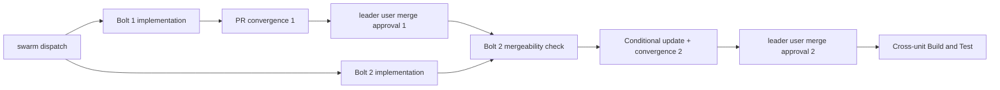

# Bolt Plan

入力: [`requirements.md`](../requirements-analysis/requirements.md)、[`components.md`](../application-design/components.md)、[`unit-of-work.md`](../units-generation/unit-of-work.md)、[`unit-of-work-dependency.md`](../units-generation/unit-of-work-dependency.md)、[`unit-of-work-story-map.md`](../units-generation/unit-of-work-story-map.md)。Stories / mockups / team-practices は本 scope で非実行。

## Ordered Bolt Sequence

### Bolt 1 — issue-2833-failure-transition

- **Unit:** `issue-2833-failure-transition` (`library`)
- **Walking skeleton:** Yes。P1/S2-CRITICAL のengine停止遷移を public `next` / Stop boundaryまで通す。
- **Construction execution:** Bolt 2と同じ swarm batchで実装するが、convergence / approval / merge伺いは本Boltを先行する。
- **Definition of Done:** U1内でTDD Red→Green、swarm/non-swarm Retry/Skip/Abort、multiple failure Unit Z、autonomous Abort→parked、Stop hook 1回、evidence/worktree保持、`report failed` exit0 errorをfocused testsで証明する。Stop hook/new stateを変更しない。PR作成後にconvergence loopを完了する。
- **Confidence hypothesis:** Abort裁定がdurable selector inputとなれば、同じ`invoke-swarm`/`run-stage`の再提示ループは最初の`next`で止まり、既存Stop hookが`parked`を終端として許可する。
- **Expected demo:** fixture intentでfailure→Abort→`next`=`parked`→Stop hook 1回allow。RetryはZだけ再提示、SkipはZだけcancelled。
- **PR boundary:** #2833だけ。#2834 consume-resolution変更、工程記録、generated surfacesを含めない。

### Bolt 2 — issue-2834-consume-fanout

- **Unit:** `issue-2834-consume-fanout` (`library`)
- **Walking skeleton:** No。
- **Construction execution:** Bolt 1と同じ swarm batchで実装可能。ただしBolt 1 gate前に本Boltの承認を先行させない。Bolt 1着地後もmergeableなら現headを維持し、実競合またはbranch protectionが最新baseを要求する場合だけrebase/updateしてconvergenceを再確認する。
- **Definition of Done:** U2内でTDD Red→Green、7 consumer / 19 edge、multiple/zero/missing/cancelled/failed/pending Unit、presence split、reviewer scope、`t116`/`t186` placeholder round-trip、upstream sensor不変をfocused testsで証明する。PR作成後にconvergence loopを完了する。
- **Confidence hypothesis:** effective producer populationをconsumer emit時に展開すれば、全concrete required inputsがflat directive/reviewer scopeへ入り、legitimate placeholder契約を壊さずsilent dropを閉じられる。
- **Expected demo:** 2 succeeded Unit × required artifactsのconcrete path、cancelled除外、missingは`consumes_absent.expected:false`、unknown populationはerror、unresolved`{unit-name}` 0件。
- **PR boundary:** #2834だけ。#2833 failure selector、Stop hook、工程記録、generated surfacesを含めない。

## Construction and Merge Gates

AIはPRをmergeしない。各PR URLとconvergence結果をparent leader worktreeへ報告し、明示承認を待つ。

## Success Criteria

- 2 Unit / 2 Bolt / 2 PR、各PRは1 Issueだけを含む。
- Bolt 1 gateをBolt 2より先に完了する。
- 両UnitのRed/Green証拠、focused/full quality gates、source-only boundaryがgreen。
- 横断Build and Testで両Issueのpublic seamを同時検証し、PRを追加しない。
