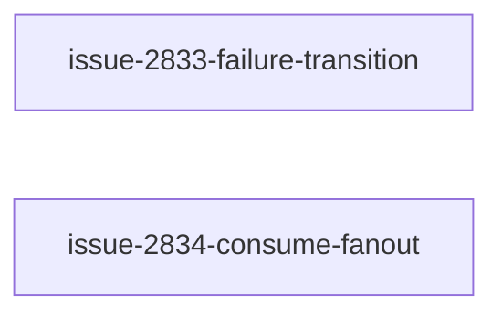

# Unit of Work Dependency

入力: [`components.md`](../application-design/components.md)、[`component-methods.md`](../application-design/component-methods.md)、[`services.md`](../application-design/services.md)、[`component-dependency.md`](../application-design/component-dependency.md)、[`decisions.md`](../application-design/decisions.md)、[`requirements.md`](../requirements-analysis/requirements.md)。

## Dependency DAG



U1 and U2 have no technical dependency and are eligible for the same Construction swarm batch. They edit different semantic regions of the shared entrypoint. Delivery Planning, not this topology, controls PR convergence and gate timing.

```yaml
units:
  - name: issue-2833-failure-transition
    kind: library
    depends_on: []
  - name: issue-2834-consume-fanout
    kind: library
    depends_on: []
```

## Integration Points

| From | To | Contract | Shared-file rule |
|---|---|---|---|
| U1 internal | outcome projection → failure selector | `ProjectionResult` / `FailureTransition` | #2833 PR内で実装+配線を完結 |
| U2 internal | fan-out → consume resolution / reviewer | `ConsumeFanoutResult` / absent guard | #2834 PR内で実装+配線を完結 |
| U1 / U2 | shared `amadeus-orchestrate.ts` | semantic-region ownership | 同時実装、U1先行gate。U2 updateは実競合/protection要求時のみ |
| Both | Build and Test | public directive / Stop / placeholder acceptance | 新しい横断Unit/PRを作らない |

U1/U2 の public contract は [`component-methods.md`](../application-design/component-methods.md)、audit join は [`decisions.md`](../application-design/decisions.md) ADR-1、fan-out semantics は ADR-2、共有 entrypoint 所有は ADR-3 に従う。

## Parallel Development Opportunities

- `{issue-2833-failure-transition, issue-2834-consume-fanout}` は同一 batch で swarm 実行可能である。各Unitは1 Issueのpure logic・adapter・testをend-to-end所有する。
- 共有entrypointはU1がfailure selector/halt/park、U2がconsume resolutionを所有する。workerが同じhunk変更の必要を検出した場合、勝手に境界を広げず停止してconductorへ報告する。
- 横断acceptanceはBuild and Test stageで直列実行する。U1/U2のPR本文・変更集合へ相手Issueの実装を混ぜない。
- audit shard / coverage output は merge・検証時に単独 owner が直列処理し、並行書き込みを行わない。

## Acyclicity and PR Boundary

2 nodes / 0 edges で循環なし。1 Issue = 1 Unit = 1 Bolt = 1 PR。P1のU1をwalking-skeletonとして先にgateし、U2の実装は並行してよいが承認を先行させない。これは2026-08-10のユーザー裁定による今回intent限定のwalking-skeleton単独実行例外である。
