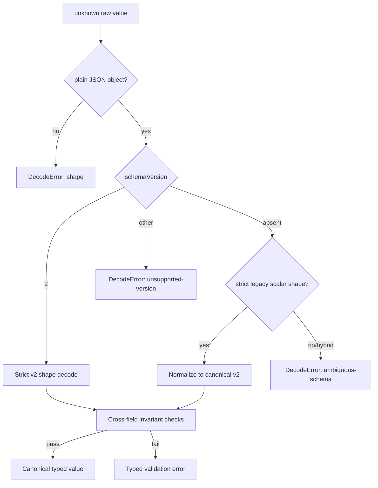

# Business Logic Model — election-canonical-schema

## Context and boundary

本設計は [unit-of-work](../../../inception/units-generation/unit-of-work.md)、[unit-of-work-story-map](../../../inception/units-generation/unit-of-work-story-map.md)、[requirements](../../../inception/requirements-analysis/requirements.md)、[components](../../../inception/application-design/components.md)、[component-methods](../../../inception/application-design/component-methods.md)、[services](../../../inception/application-design/services.md) のU1 contractを詳細化する。純粋なdecode/encode/canonicalizationのみを所有し、tally、filesystem、CLI、record proseは所有しない。

## Decode pipeline

すべてのexternal/disk inputは同じpipelineを通す。

判別は一回だけ行い、v2 decode失敗後にlegacyへfallbackしない。`schemaVersion:2`を宣言した入力はv2として成功するか拒否されるかのどちらかである。

## Election decode algorithm

1. top-level objectと許可field集合を検査する。
2. v2は `schemaVersion=2`, `electionId`, `kind`, `questions`, `voters` を要求する。
3. `questions` が非空、各 `questionId` が非空かつwhitespace-onlyでない、同一Election内でexact-match一意であることを検査する。v2 authoringではlegacy decode専用予約ID `legacy-question`を拒否する。
4. 各questionの`text`と非空`choices`を検査する。choice `internalNo` はintegerでquestion内一意、labelはstring、descriptionはoptional stringとする。
5. voterは非空string配列かつexact-match一意とする。
6. legacyはscalar `question`/`choices`を1件のquestionへ持ち上げ、`questionId="legacy-question"`を補う。
7. canonical outputはdefinitionのquestion順とchoice順を保存する。IDやlabelをtrim/lowercaseしない。

ComplexityはQ=questions、C=全choices、V=votersとしてO(Q+C+V)、補助memory O(Q+C+V)。一意性はSetで検査し、全組合せ比較をしない。

## Ballot decode algorithm

1. `schemaVersion`とkind (`original | amend`)を判別し、共通identity、voter kind、timestampsを検査する。
2. v2 `responses[]` は非空で、questionId exact-match一意とする。
3. 各responseのquestionがElectionに存在し、choiceInternalNoがそのquestionに存在し、GoAが1〜8 integerであることを検査する。
4. GoA 2/3/6はnon-empty reservationを要求する。それ以外は`string | null`だけを許す。rationaleも`string | null`。
5. originalは呼出元が渡す`targetQuestionIds`とresponsesのID集合が完全一致することを要求する。
6. amendはref shapeとidentityを検査し、responsesがtarget集合のnon-empty subsetであることを許す。target外・established questionは拒否する。
7. legacy scalar choice/GoA/reservation/rationaleを`legacy-question` response 1件へ持ち上げる。

Decodeはballot内容を並べ替えず、canonical encode時だけdefinition順へ整列する。receipt orderingやamend supersessionはU2の責務である。

## Tally decode algorithm

1. v2は `schemaVersion=2`, `runId`, `targetQuestionIds`, `results`, `preservedResultDigest`, `talliedAt` を検査する。
2. resultはdefinitionの全question IDをちょうど1件ずつ覆い、unknown/duplicate IDなし、definition順へcanonicalize可能であることを要求する。
3. establishedはwinnerがquestion choiceに存在し、choiceCountsが全choicesを重複なく覆い、countがnon-negative integer、GoA countsがnon-negative integerであることを検査する。
4. holdはclosed `HoldReason`とGoA countsを検査する。
5. targetQuestionIdsは一意かつdefinition subsetで、hold→target/preservedの整合はU2/U3が検査する。
6. legacy scalar resultは`legacy-question` resultへ持ち上げ、runIdをdomain `amadeus-election-legacy-tally:v1`とcanonical scalar payloadから決定的に生成する。
7. legacy global `hold` stateはcanonical `partial` lifecycleへ写像するが、state persistence自体はU3が所有する。

## Canonical encoding

- encoderの入力はvalidated canonical valueだけとする。
- top-levelとnested field順をschemaで固定し、optional fieldはabsentとnullを区別する。
- question/results/countsはdefinition順、responsesはdefinition順、votersはdefinition順を使う。
- new writesは常に`schemaVersion:2`を含む。legacy shapeを再出力しない。
- `JSON.stringify`は既に順序固定したplain dataへだけ適用し、Map/Setやambient insertion orderを直接serializeしない。

## Established result digest

1. resultsから`kind="established"`だけを選ぶ。
2. definition順へ並べ、questionId、winner、choiceCounts、GoA countsを固定field順のplain dataへ変換する。
3. projectのcanonical identity helperへdomain `amadeus-election-established-results:v1`とdataを渡す。
4. `sha256:<hex>`を返す。

hold result、runId、timestamps、file path、record proseはdigestへ含めない。これによりhold-only rerun前後でpreserve対象だけを比較できる。

## Error model

`DecodeError`は少なくとも `shape | unsupported-version | ambiguous-schema | unknown-field | duplicate-id | missing-reference | invalid-value | coverage-mismatch` を持ち、JSON pathと期待contractを付ける。同一入力は同じ最初のerror category/pathを返す。decoderは一部canonical valueを返さない。

## Verification scenarios

- legacy definition/ballot/tallyを繰り返しdecodeして同じcanonical bytes/runId/digest。
- v2 multi-question round-tripでsemantic equality。
- hybrid (`schemaVersion:2` + scalar `question`) とunknown versionを拒否。
- question IDの空/whitespace/duplicate、question内choice重複、response unknown/duplicate/coverage不足を拒否。
- 同じinternalNoを別questionで使う入力は受理。
- question順を変えるとcanonical sequenceは変わるが、同じIDの文字列は変更されない。

## Review — Iteration 1

- **Verdict:** READY
- **Reviewer:** amadeus-architecture-reviewer-agent
- **Date:** 2026-08-13T11:53:25Z
- **Iteration:** 1
- **Scope decision:** none

### Findings

- None. 初回確認で見つかった予約IDのv2利用禁止とresult完全被覆は修正済み。schema判別、validation precedence、canonical ordering、legacy identity、digest boundaryが相互に整合する。

### Validation Tool Results

| Tool | Result | Interpretation |
|---|---|---|
| required-sections | PASS: 3成果物すべてH2 2件以上 | 必須構造を満たす |
| upstream-coverage | PASS: 3成果物すべて6 upstreamを参照 | unit/context追跡に欠落なし |
| answer-evidence | PASS: evidence-present | E-OC1証跡あり |
| question-budget | PASS: 5 / Standard ceiling 8 | 予算内 |
| relative-link check | PASS: 4 Markdown files | 壊れた参照なし |

### Summary

開発者がlegacy/v2判別、entity shape、error、canonical encode/digestを推測せず実装でき、U2/U3との責務境界も明確であるため READY とする。
